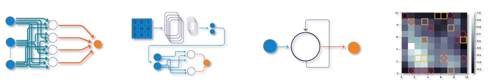

# Boltzmann Machine 이해하기

## 1. Boltzmann Machine 시작

이번 강의에서는 새로운 딥러닝 모델인 **Boltzmann Machine**을 배운다.

Boltzmann Machine은 기존에 배운 ANN, CNN, RNN보다 더 복잡한 모델이다.

또한 온라인에서 쉽게 찾기 어려운 고급 내용이기 때문에 직관적으로 이해하는 것이 중요하다.

------

## 2. 지금까지 배운 딥러닝 모델

지금까지 배운 모델은 다음과 같다.

- ANN
- CNN
- RNN
- SOM

ANN, CNN, RNN은 주로 **지도학습 모델**이다.

SOM은 **비지도학습 모델**이다.

하지만 이 네 가지 모델에는 공통점이 있다.

-> **모두 방향이 있는 모델이다.**

------

## 3. Directed Model

Directed Model은 정보가 이동하는 방향이 정해진 모델이다.

예를 들어 ANN은

**Input Layer → Hidden Layer → Output Layer**

방향으로 데이터가 흐른다.

CNN도 마찬가지로

**Convolution → Pooling → Flattening → ANN**

순서로 데이터가 이동한다.

RNN은 Hidden Layer가 자기 자신으로 되돌아가는 구조가 있지만, 그래도 시간 흐름에 따라 방향성이 존재한다.

SOM 역시 입력 데이터가 출력 맵의 노드로 연결되는 방향이 있다.

즉, 기존 모델들은 대부분 데이터가 흘러가는 방향이 정해져 있다.

------

## 4. Boltzmann Machine의 가장 큰 특징

Boltzmann Machine은 기존 모델과 다르다.

가장 큰 특징은 **Undirected Model** 이라는 점이다.

Undirected Model은 연결에 방향이 없는 모델이다.

즉, 화살표가 한쪽 방향으로만 가는 것이 아니라 연결이 양방향으로 작동한다.

그래서 Boltzmann Machine에서는 노드들이 서로 영향을 주고받는다.

------

## 5. Boltzmann Machine의 구조

Boltzmann Machine에는 크게 두 종류의 노드가 있다.

- Visible Node
- Hidden Node

Visible Node는 우리가 실제로 관측할 수 있는 값이다.

Hidden Node는 우리가 직접 관측하지 못하는 숨겨진 값이다.

하지만 Boltzmann Machine 입장에서는 Visible Node와 Hidden Node를 크게 구분하지 않는다.

모든 노드를 하나의 시스템을 구성하는 요소로 본다.

------

## 6. 기존 신경망과 다른 점

Boltzmann Machine은 기존 신경망과 비교했을 때 크게 세 가지가 다르다.

### ① Output Layer가 없다

일반적인 신경망은 마지막에 Output Layer가 있다.

하지만 Boltzmann Machine에는 명확한 출력층이 없다.

왜냐하면 Boltzmann Machine은 어떤 값을 바로 예측해서 출력하는 모델이 아니기 때문이다.

대신 시스템 전체의 상태를 모델링한다.

------

### ② 모든 노드가 서로 연결될 수 있다

Boltzmann Machine은 특정 층끼리만 연결되는 구조가 아니다.

모든 노드가 서로 연결될 수 있다.

그래서 입력층, 은닉층, 출력층처럼 명확하게 층을 나누는 구조와 다르다.

------

### ③ 연결에 방향이 없다

일반적인 신경망은 데이터가 한 방향으로 이동한다.

하지만 Boltzmann Machine은 연결이 양방향이다.

즉, 한 노드가 다른 노드에 영향을 줄 수 있고, 반대로 다른 노드도 다시 영향을 줄 수 있다.

------

## 7. Visible Node를 보는 것이 중요하다

Boltzmann Machine을 이해할 때 가장 중요한 포인트는 **Visible Node도 서로 연결되어 있다는 점**이다.

처음 보면 이상하게 느껴질 수 있다.

왜냐하면 일반적인 신경망에서는 입력 데이터는 이미 정해진 값이기 때문이다.

입력 데이터는 고정되어 있으므로 입력끼리 연결할 필요가 없어 보인다.

하지만 Boltzmann Machine에서는 다르다.

Boltzmann Machine은 단순히 입력을 받는 모델이 아니라, 데이터를 생성하는 모델이다.

------

## 8. Generative Model

Boltzmann Machine은 **Generative Model**, 즉 생성 모델이다.

이 모델은 입력값을 받아서 출력값만 계산하는 것이 아니라, 시스템의 여러 상태를 스스로 만들어낸다.

즉, **가능한 상태들을 생성하고, 그 상태가 얼마나 자연스러운지 판단한다.**

그래서 Boltzmann Machine은 결정론적 모델이라기보다 확률적 모델에 가깝다.

------

## 9. 원자력 발전소 예시

Boltzmann Machine을 이해하기 위해 원자력 발전소를 예로 들 수 있다.

원자력 발전소에는 여러 상태 값이 있다.

예를 들면

- 격납 용기 내부 온도
- 터빈 회전 속도
- 펌프 내부 압력
- 전기 출력량

이런 값들은 우리가 직접 측정할 수 있다.

그래서 이런 값들은 Visible Node에 해당한다.

------

하지만 측정하지 못하는 값들도 있다.

예를 들면

- 바람의 속도
- 특정 위치의 토양 습도
- 냉각탑 벽의 두께
- 공기 중 습도

이런 값들은 직접 측정하지 않거나 측정하기 어려운 값이다.

그래서 Hidden Node에 해당한다.

------

## 10. Boltzmann Machine이 하는 일

Boltzmann Machine은 이 모든 값들을 하나의 시스템으로 본다.

즉, 측정 가능한 값과 측정 불가능한 값이 서로 영향을 주고받는다고 생각한다.

모델은 여러 상태를 만들어본다.

예를 들어

- 온도가 높은 상태
- 펌프 압력이 낮은 상태
- 바람이 강한 상태
- 습도가 높은 상태

같은 여러 조합을 생성한다.

그리고 이런 상태들이 실제 시스템에서 가능한 상태인지 학습한다.

------

## 11. 학습 방식

Boltzmann Machine은 훈련 데이터를 통해 시스템의 정상적인 상태를 학습한다.

예를 들어 원자력 발전소의 정상 작동 데이터가 있다면, 모델은 그 데이터를 보면서

- 어떤 값들이 서로 관련 있는지
- 어떤 조합이 자연스러운지
- 어떤 상태가 정상적인지

를 학습한다.

즉, 단순히 정답을 맞히는 것이 아니라 시스템 전체의 패턴을 배우는 것이다.

------

## 12. 비지도학습에 적합한 이유

Boltzmann Machine은 비지도학습에 잘 어울린다.

예를 들어 원자력 발전소의 사고를 예측하고 싶다고 하자.

지도학습을 하려면 정상 데이터와 사고 데이터가 모두 필요하다.

하지만 실제로는 원자력 발전소 사고 데이터가 많지 않다.

사고가 자주 일어나면 안 되기 때문이다.

그래서 사고 데이터를 많이 모아서 지도학습을 하는 것은 현실적으로 어렵다.

------

이럴 때 Boltzmann Machine은 정상 상태만 학습해도 도움이 된다.

정상 상태를 잘 학습하면 정상에서 벗어난 이상 상태를 감지할 수 있기 때문이다.

즉, **정상 패턴을 학습하고, 그 패턴에서 벗어나면 이상으로 판단한다.**

------

## 13. 왜 Output Layer가 없을까?

Boltzmann Machine에는 Output Layer가 없다.

그 이유는 특정 정답을 출력하는 모델이 아니기 때문이다.

일반적인 신경망은 **입력 → 예측값 출력** 구조이다.

하지만 Boltzmann Machine은 **시스템의 상태를 표현하고 생성하는 모델**이다.

그래서 출력층이 없어도 된다.

------

## 14. 왜 모든 노드가 연결될까?

Boltzmann Machine에서는 모든 값들이 서로 관련될 수 있다고 본다.

예를 들어 원자력 발전소에서 터빈 속도와 공기 습도가 관련 없을 것 같아도, 모델 입장에서는 관계가 있을 가능성을 열어둔다.

관계가 강한지 약한지는 학습을 통해 가중치로 결정된다.

즉, 사람이 미리 연결 관계를 정하는 것이 아니라 모델이 데이터로부터 관계를 학습한다.

------

## 15. 왜 방향이 없을까?

Boltzmann Machine에서는 Visible Node와 Hidden Node가 모두 시스템의 일부이다.

모델 입장에서는 어떤 노드가 입력이고 어떤 노드가 출력인지가 중요하지 않다.

중요한 것은 전체 시스템의 상태이다.

그래서 연결이 한쪽 방향으로만 흐르지 않고 양방향으로 작동한다.

------

## 16. 핵심 정리

- Boltzmann Machine은 기존 신경망과 구조가 다르다.
- ANN, CNN, RNN, SOM은 방향이 있는 모델이다.
- Boltzmann Machine은 방향이 없는 모델이다.
- Boltzmann Machine에는 Output Layer가 없다.
- Visible Node와 Hidden Node가 있다.
- Visible Node는 관측 가능한 값이다.
- Hidden Node는 관측하지 못하는 숨겨진 값이다.
- Boltzmann Machine은 단순 예측 모델이 아니라 생성 모델이다.
- 여러 가능한 시스템 상태를 생성하고 학습한다.
- 정상 상태를 학습하면 이상 상태를 감지하는 데 사용할 수 있다.

------

## 17. 추가

Boltzmann Machine을 쉽게 말하면 **시스템 전체의 정상적인 상태를 배우는 모델**이다.

일반적인 신경망처럼 **입력 → 정답 출력**을 하는 모델이 아니라,

**이 시스템에서 어떤 상태가 자연스러운가?**를 학습하는 모델이다.

그래서 사고 데이터가 부족한 상황에서도 정상 데이터를 기반으로 이상 상황을 감지하는 데 사용할 수 있다.
