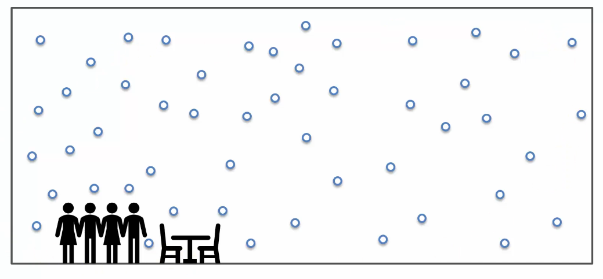
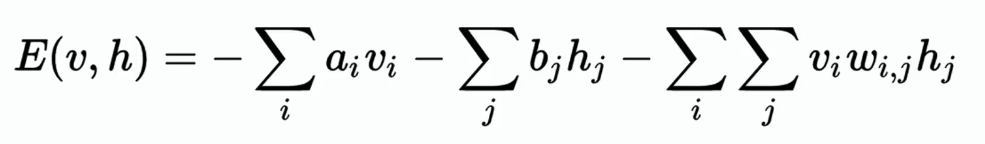
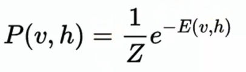

# Energy-Based Model 이해하기

## 1. Energy-Based Model이란?

이번 강의에서는 **Energy-Based Model**, 줄여서 **EBM**에 대해 배운다.

Energy-Based Model은 Boltzmann Machine을 실제로 사용하는 데 반드시 필요한 개념은 아니다.

하지만 Boltzmann Machine을 더 깊게 이해하려면 알아두는 것이 좋다.

특히 Boltzmann Machine이 왜 **Energy**, 즉 에너지 개념을 사용하는지 이해할 수 있다.

------

## 2. 왜 Boltzmann Machine이라고 부를까?

Boltzmann Machine이라는 이름은 **Boltzmann Distribution**에서 왔다.

Boltzmann Distribution은 물리학에서 나온 확률 분포이다.

Boltzmann Machine은 여러 가지 가능한 시스템 상태를 생성하고, 그 상태가 얼마나 자연스러운지 판단한다.

이때 상태의 확률을 계산하는 데 Boltzmann Distribution 개념이 사용된다.

------

## 3. Boltzmann Distribution의 핵심

Boltzmann Distribution은 어떤 시스템이 특정 상태에 있을 확률을 설명한다.

여기서 중요한 것은 **에너지가 높을수록 확률은 낮아진다**는 점이다.

반대로 말하면, **에너지가 낮을수록 그 상태가 나타날 확률은 높아진다**

는 뜻이다.

즉, 시스템은 보통 에너지가 낮은 안정적인 상태를 선호한다.

------

## 4. 에너지와 확률의 관계

Energy-Based Model에서 에너지와 확률은 반대 관계이다.

- 에너지가 낮은 상태 → 확률이 높음
- 에너지가 높은 상태 → 확률이 낮음

즉, 모델은 가능한 여러 상태 중에서 에너지가 낮은 상태를 더 자연스러운 상태로 본다.

이 개념이 Boltzmann Machine의 핵심이다.

------

## 5. 방 안의 공기 예시

방 안에 공기가 있다고 생각해보자.

우리가 평소에 보는 공기는 방 전체에 골고루 퍼져 있다.

그런데 이론적으로는 공기 분자들이 방 한쪽 구석에만 몰릴 수도 있다.

하지만 실제로는 그런 일이 거의 일어나지 않는다.

왜냐하면 공기 분자들이 한쪽에 몰린 상태는 에너지가 매우 높은 상태이기 때문이다.

------

공기 분자들이 골고루 퍼져 있는 상태는 에너지가 낮고 안정적인 상태이다.

그래서 확률적으로도 이 상태가 훨씬 더 자주 나타난다.

즉, **공기가 방 전체에 퍼져 있는 이유는 그 상태가 가장 자연스럽고 에너지가 낮은 상태이기 때문이다.**

------

## 6. 잉크와 기름 예시

물에 잉크를 떨어뜨리면 잉크는 물속으로 골고루 퍼진다.

잉크가 별 모양이나 눈꽃 모양으로 퍼질 수도 있지만, 그런 상태는 확률이 매우 낮다.

잉크가 골고루 퍼지는 상태가 더 낮은 에너지 상태이기 때문이다.

------

반대로 물에 기름을 떨어뜨리면 기름은 물속에 골고루 퍼지지 않고 표면에서 작은 덩어리처럼 뭉친다.

이 경우에는 기름이 뭉쳐 있는 상태가 그 시스템에서 더 낮은 에너지 상태이기 때문이다.

즉, 시스템마다 낮은 에너지 상태의 모습은 다를 수 있다.

------

## 7. Boltzmann Machine에서의 에너지

Boltzmann Machine에서도 에너지 개념이 사용된다.

하지만 여기서 말하는 에너지는 물리적인 열에너지 같은 의미라기보다, 모델이 특정 상태를 얼마나 자연스럽게 보는지를 나타내는 값이다.

Boltzmann Machine은 학습을 통해 가중치를 조정한다.

그리고 이 가중치들이 각 상태의 에너지를 결정한다.

------

## 8. 가중치와 에너지

Boltzmann Machine에서 에너지는 노드들 사이의 연결 가중치와 관련이 있다.

가중치가 학습되면 모델은 어떤 상태가 낮은 에너지 상태인지 알게 된다.

즉,

- 학습 전: 어떤 상태가 좋은 상태인지 모름
- 학습 후: 데이터에 맞는 낮은 에너지 상태를 알게 됨

이렇게 볼 수 있다.

------

## 9. 모델이 학습한다는 의미

Boltzmann Machine이 학습한다는 것은 단순히 정답을 외우는 것이 아니다.

모델은 데이터를 보면서 어떤 상태 조합이 자연스러운지 학습한다.

예를 들어 정상적인 데이터가 많이 들어오면 모델은 그 정상 상태를 낮은 에너지 상태로 만들려고 한다.

반대로 비정상적이거나 부자연스러운 상태는 높은 에너지 상태가 된다.

------

## 10. 학습 후 모델의 동작

학습이 끝나면 Boltzmann Machine은 가능한 여러 상태 중에서 낮은 에너지 상태를 찾으려고 한다.

즉, 시스템은 계속해서 **더 안정적이고 자연스러운 상태** 를 찾는 방향으로 움직인다.

이것이 Energy-Based Model의 기본 동작 방식이다.

------

## 11. RBM의 에너지 함수

- 'a', 'b' : 시스템 편향을 나타내는 상수
- 'v' : 가시적 노드
- 'h' : 은닉 노드
- 'w' : 무게

강의에서는 RBM의 에너지 함수도 간단히 소개된다.

RBM은 Restricted Boltzmann Machine의 줄임말이다.

RBM의 에너지는 Visible Node, Hidden Node, Bias, Weight를 이용해 계산된다.

여기서 중요한 것은 에너지 함수가 결국 가중치와 연결되어 있다는 점이다.

즉, 모델이 가중치를 학습하면 각 상태의 에너지 계산 방식도 함께 정해진다.

------

## 12. 확률은 에너지로부터 나온다

Boltzmann Machine에서는 어떤 상태가 나타날 확률이 그 상태의 에너지에 의해 결정된다.

에너지가 낮으면 그 상태가 나타날 확률이 높아진다.

에너지가 높으면 그 상태가 나타날 확률이 낮아진다.

즉, **확률을 직접 정하는 것이 아니라 에너지를 통해 확률이 결정된다.**

------

## 13. 일반 신경망과 다른 점

일반적인 신경망은 보통

**입력 → 계산 → 출력**

구조로 동작한다.

하지만 Energy-Based Model은 특정 입력에 대한 출력값을 바로 계산하는 방식이 아니다.

대신 여러 가능한 상태에 대해 에너지 값을 부여한다.

그리고 그중에서 낮은 에너지 상태를 더 좋은 상태로 본다.

------

## 14. 왜 중요한가?

Energy-Based Model은 Boltzmann Machine을 이해하는 데 중요한 배경이 된다.

Boltzmann Machine은 단순히 값을 예측하는 모델이 아니라, 시스템의 가능한 상태들을 생성하고 평가하는 모델이다.

이때 평가 기준이 바로 **Energy**이다.

그래서 Boltzmann Machine을 이해하려면 에너지와 확률의 관계를 이해하는 것이 중요하다.

------

## 15. 핵심 정리

- Energy-Based Model은 상태에 에너지 값을 부여하는 모델이다.
- Boltzmann Machine은 Boltzmann Distribution에서 이름이 왔다.
- 에너지가 낮은 상태는 확률이 높다.
- 에너지가 높은 상태는 확률이 낮다.
- 시스템은 보통 낮은 에너지 상태를 선호한다.
- Boltzmann Machine에서 에너지는 가중치와 관련된다.
- 학습은 자연스러운 상태를 낮은 에너지로 만드는 과정이다.
- Boltzmann Machine은 가능한 상태를 생성하고, 에너지로 평가한다.

------

## 16. 추가

Energy-Based Model을 쉽게 말하면 **상태의 자연스러움을 에너지로 표현하는 모델**이다.

모델이 보기에 자연스러운 상태는 낮은 에너지를 가진다.

모델이 보기에 부자연스러운 상태는 높은 에너지를 가진다.

그래서 Boltzmann Machine은 데이터의 정답을 직접 맞히는 모델이라기보다, 어떤 상태가 더 그럴듯한지를 학습하는 모델이라고 볼 수 있다.
