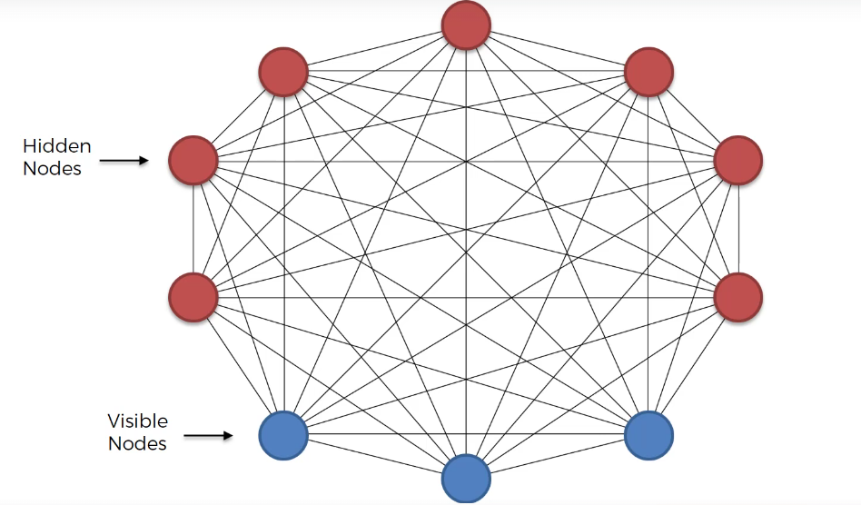
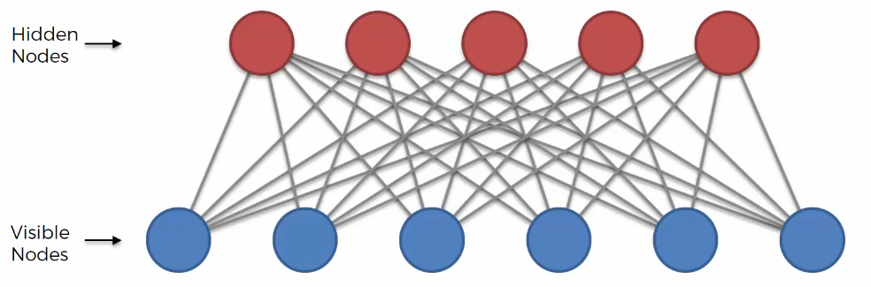
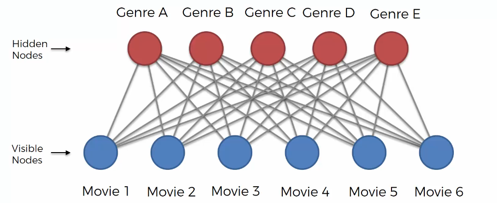
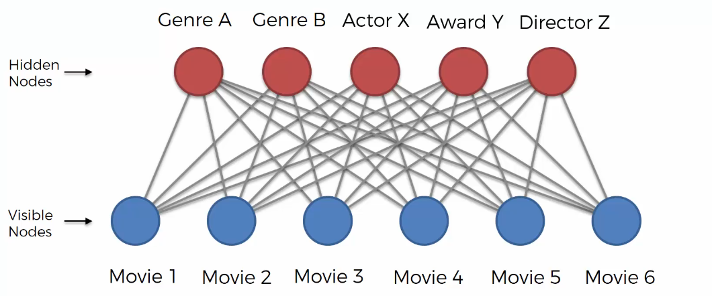
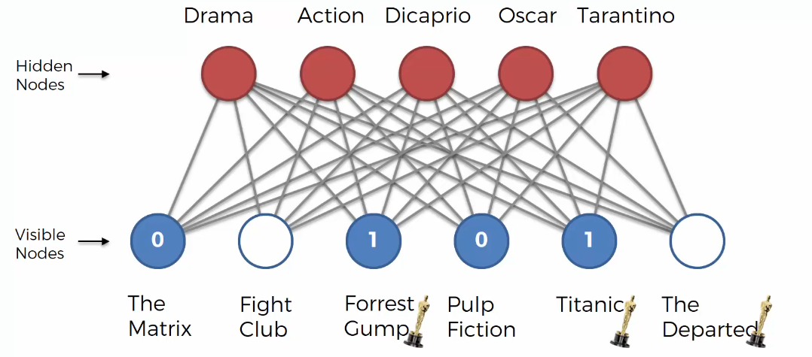
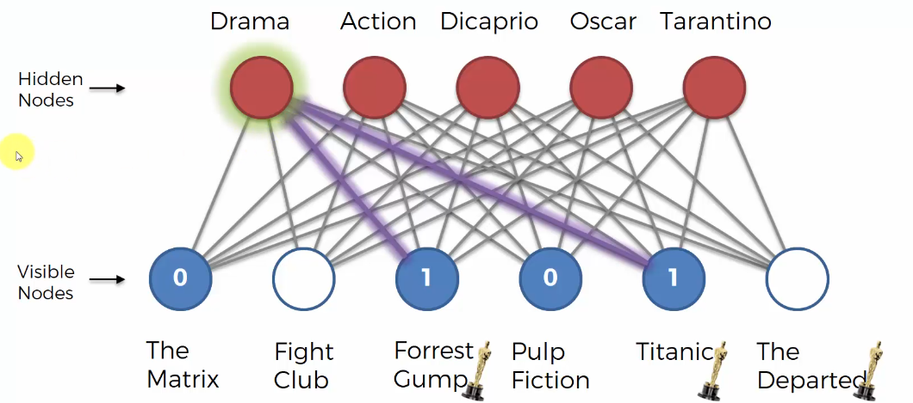
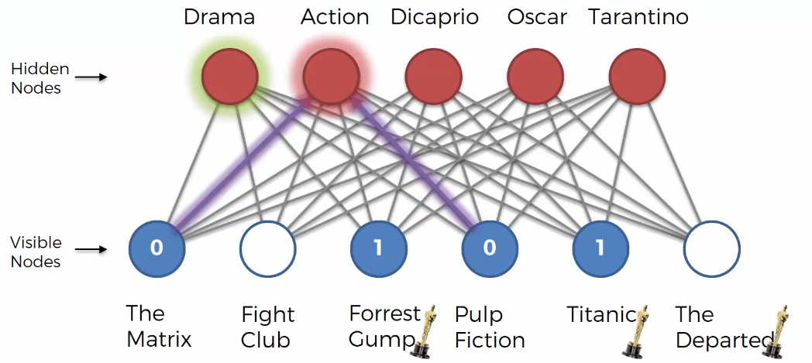
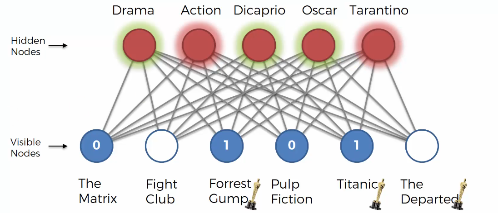
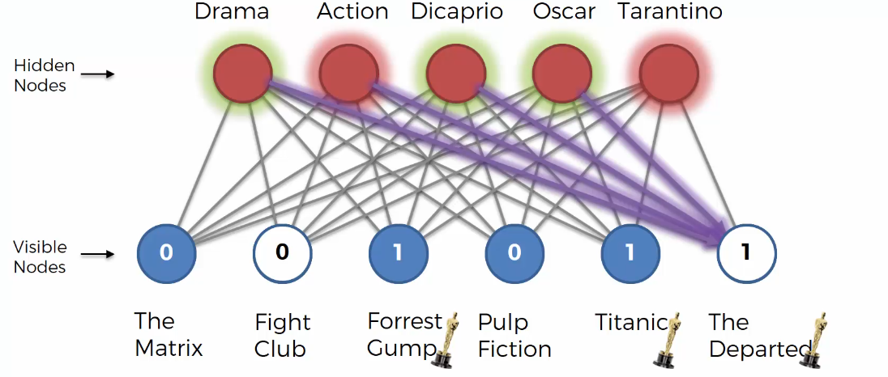

# Restricted Boltzmann Machine 이해하기

## 1. Restricted Boltzmann Machine이란?

이번 강의에서는 **Restricted Boltzmann Machine**, 줄여서 **RBM**을 배운다.

RBM은 기존 Boltzmann Machine을 더 쉽게 계산할 수 있도록 만든 모델이다.

기존 Boltzmann Machine은 모든 노드가 모든 노드와 연결된다.

이론적으로는 강력하지만 실제로 계산하기에는 너무 복잡하다.

그래서 일부 연결을 제한한 구조가 등장했는데, 그것이 바로 RBM이다.

------

## 2. 기존 Boltzmann Machine의 문제

기존 Boltzmann Machine은 모든 노드가 서로 연결되어 있다.

즉,

- Visible Node끼리 연결됨
- Hidden Node끼리 연결됨
- Visible Node와 Hidden Node도 연결됨

이런 구조이다.

문제는 노드 수가 많아질수록 연결 수가 매우 빠르게 증가한다는 점이다.

그래서 실제로 구현하고 학습시키기가 어렵다.

------

## 3. RBM이 등장한 이유

RBM은 기존 Boltzmann Machine의 계산 문제를 해결하기 위해 등장했다.

RBM에서 Restricted는 “제한된”이라는 뜻이다.

즉, 모든 연결을 허용하지 않고 일부 연결을 제한한다.

이 제한 덕분에 기존 Boltzmann Machine보다 훨씬 계산하기 쉬워진다.

------

## 4. RBM의 구조

RBM은 크게 두 층으로 구성된다.

- Visible Layer
- Hidden Layer

Visible Layer는 입력 데이터가 들어오는 층이다.

Hidden Layer는 입력 데이터 안에 숨겨진 특징을 학습하는 층이다.

RBM의 핵심 제한은 다음과 같다.

- Visible Node끼리는 연결되지 않음
- Hidden Node끼리는 연결되지 않음
- Visible Node와 Hidden Node 사이만 연결됨

------

## 5. RBM도 방향이 없는 모델이다

RBM은 연결이 제한되어 있지만 여전히 Boltzmann Machine 계열이다.

그래서 연결에 방향이 없다.

즉,

**Visible Node → Hidden Node** 방향으로만 가는 것이 아니라,

**Visible Node ↔ Hidden Node** 처럼 양방향으로 작동한다.

이 점은 일반적인 신경망과 다르다.

------

## 6. RBM은 생성 모델이다

RBM도 Boltzmann Machine처럼 **Generative Model**, 즉 생성 모델이다.

입력을 받아서 단순히 정답을 출력하는 모델이 아니다.

대신 시스템의 상태를 학습하고, 그 상태를 다시 재구성할 수 있다.

추천 시스템에서는 사용자의 영화 취향 상태를 학습하고, 아직 보지 않은 영화에 대한 선호를 예측할 수 있다.

------

## 7. 영화 추천 시스템 예시

강의에서는 RBM을 영화 추천 시스템 예시로 설명한다.

예를 들어 영화가 6개 있다고 하자.

- The Matrix
- Fight Club
- Forrest Gump
- Pulp Fiction
- Titanic
- The Departed

그리고 사용자들이 각 영화에 대해 좋아요 또는 싫어요를 남긴 데이터가 있다.

- 1 → 좋아함
- 0 → 싫어함
- 빈칸 → 아직 보지 않음

RBM은 이 데이터를 바탕으로 사용자의 취향을 학습한다.

------

## 8. RBM이 학습하는 것

RBM은 영화 제목이나 장르 이름을 직접 아는 것이 아니다.

입력으로 받는 것은 단순히 1과 0으로 된 평가 데이터이다.

하지만 많은 사용자의 평가 패턴을 보면서 영화들 사이의 숨겨진 공통 특징을 찾는다.

예를 들어 어떤 사용자들이 3번, 4번, 6번 영화를 비슷하게 평가한다면 RBM은 이 영화들 사이에 어떤 공통 특징이 있다고 판단한다.

------

## 9. Hidden Node의 역할

Hidden Node는 입력 데이터 속에 숨어 있는 특징을 표현한다.

추천 시스템에서는 Hidden Node가 다음과 같은 특징을 담당할 수 있다.

- 장르
- 특정 배우
- 특정 감독
- 수상 여부
- 영화 분위기

하지만 중요한 점은 RBM이 실제로 “이건 장르다”, “이건 배우다”라고 아는 것은 아니다.

그냥 데이터 패턴을 보고 비슷한 평가를 만드는 숨겨진 특징을 학습하는 것이다.

------

## 10. CNN과 비슷한 점

강의에서는 RBM의 특징 학습이 CNN과 비슷하다고 설명한다.

CNN은 이미지에서 가장자리, 선, 모양 같은 특징을 자동으로 찾는다.

RBM도 마찬가지로 사용자 평가 데이터에서 숨겨진 취향 특징을 자동으로 찾는다.

즉, 사람이 직접 특징을 알려주지 않아도 모델이 데이터 안에서 특징을 찾아낸다.

------

## 11. 사용자의 영화 평가 예시

어떤 사용자가 다음과 같이 평가했다고 하자.

- The Matrix → 싫어함
- Fight Club → 아직 안 봄
- Forrest Gump → 좋아함
- Pulp Fiction → 싫어함
- Titanic → 좋아함
- The Departed → 아직 안 봄

이제 RBM은 이 사용자가 아직 보지 않은 영화인

- Fight Club
- The Departed

를 좋아할지 예측해야 한다.

------

## 12. Forward Pass

먼저 RBM은 Visible Node에 사용자의 영화 평가 데이터를 넣는다.

그다음 Hidden Node들이 활성화된다.

예를 들어 이 사용자가 Forrest Gump와 Titanic을 좋아했다면 Drama 특징이 활성화될 수 있다.

반대로 The Matrix와 Pulp Fiction을 싫어했다면 Action 특징은 부정적으로 활성화될 수 있다.

즉, Hidden Node는 이 사용자의 취향 특징을 표현한다.

------

## 13. Hidden Node 활성화 예시

강의에서는 다음과 같은 특징을 예로 든다.

- Drama
- Action
- DiCaprio
- Oscar
- Tarantino

이 사용자는 Forrest Gump와 Titanic을 좋아했다.

그래서 Drama 특징은 긍정적으로 활성화된다.

Titanic을 좋아했기 때문에 DiCaprio 특징도 긍정적으로 활성화될 수 있다.

Forrest Gump와 Titanic이 Oscar 관련 영화라면 Oscar 특징도 긍정적으로 활성화된다.

반면 Pulp Fiction을 싫어했기 때문에 Tarantino 특징은 부정적으로 활성화될 수 있다.

------

## 14. Backward Pass

Hidden Node가 활성화되면 RBM은 다시 Visible Node를 재구성한다.

즉, 사용자의 취향 특징을 바탕으로 영화 평가를 다시 만들어보는 것이다.

이 과정을 통해 아직 평가하지 않은 영화에 대한 값을 예측할 수 있다.

여기서 중요한 것은 이미 평가한 영화가 아니라 아직 보지 않은 영화의 재구성 값을 보는 것이다.

------

## 15. Fight Club 예측

Fight Club은 Action 특징과 관련이 있다고 볼 수 있다.

그런데 이 사용자는 The Matrix와 Pulp Fiction을 싫어했다.

둘 다 Action 쪽 특징과 관련이 있다면 Action 특징은 부정적으로 활성화된다.

따라서 RBM은 이 사용자가 Fight Club을 좋아하지 않을 가능성이 높다고 예측한다.

즉, **Fight Club 추천 결과 → No** 가 된다.

------

## 16. The Departed 예측

The Departed는 Drama, Action, DiCaprio, Oscar 특징과 관련될 수 있다.

이 사용자는 Drama 영화인 Forrest Gump와 Titanic을 좋아했다.

또 Titanic을 좋아했기 때문에 DiCaprio 특징도 긍정적으로 작용할 수 있다.

Oscar 관련 영화도 좋아했다면 Oscar 특징도 긍정적으로 작용한다.

물론 Action 특징은 부정적일 수 있지만, 다른 긍정적인 특징들이 더 많다면 The Departed는 좋아할 가능성이 높다고 예측할 수 있다.

즉, **The Departed 추천 결과 → Yes** 가 된다.

------

## 17. RBM 학습의 핵심

RBM은 사용자의 평가 데이터를 보고 영화들 사이의 숨겨진 특징을 학습한다.

그리고 그 특징을 바탕으로 아직 평가하지 않은 영화에 대한 선호를 예측한다.

즉, RBM은 **사용자 평가 데이터 → 숨겨진 취향 특징 학습 → 안 본 영화 선호 예측** 방식으로 동작한다.

------

## 18. RBM에서 중요한 점

RBM은 사람이 직접 영화의 장르나 배우 정보를 알려주지 않아도 된다.

모델은 단순히 1과 0으로 된 평가 데이터만 보고 숨겨진 패턴을 찾는다.

그래서 RBM은 추천 시스템에 사용할 수 있다.

특히 사용자와 아이템 사이의 숨겨진 관계를 찾는 데 유용하다.

------

## 19. 핵심 정리

- RBM은 Restricted Boltzmann Machine의 줄임말이다.
- 기존 Boltzmann Machine은 모든 노드가 서로 연결되어 계산이 어렵다.
- RBM은 같은 층 내부 연결을 제거해서 계산을 쉽게 만든다.
- Visible Node끼리는 연결되지 않는다.
- Hidden Node끼리도 연결되지 않는다.
- Visible Node와 Hidden Node 사이만 연결된다.
- RBM은 방향이 없는 모델이다.
- RBM은 생성 모델이다.
- 추천 시스템에 사용할 수 있다.
- Hidden Node는 데이터 속 숨겨진 특징을 학습한다.
- 학습 후에는 안 본 영화에 대한 선호를 예측할 수 있다.

------

## 20. 추가

RBM을 쉽게 말하면 **사용자의 취향을 숨겨진 특징으로 정리하는 모델**이다.

사용자가 어떤 영화를 좋아하고 싫어했는지를 보고 그 사람의 취향을 Hidden Node에 표현한다.

그리고 그 취향을 바탕으로 아직 보지 않은 영화도 좋아할지 예측한다.

즉, RBM은 **평가 데이터 안에 숨어 있는 취향 패턴을 찾아서 추천에 활용하는 모델** 

b 이라고 이해하면 된다.
