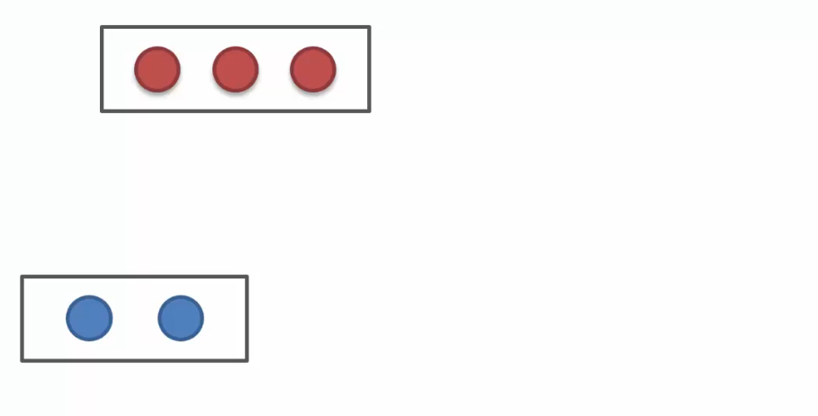
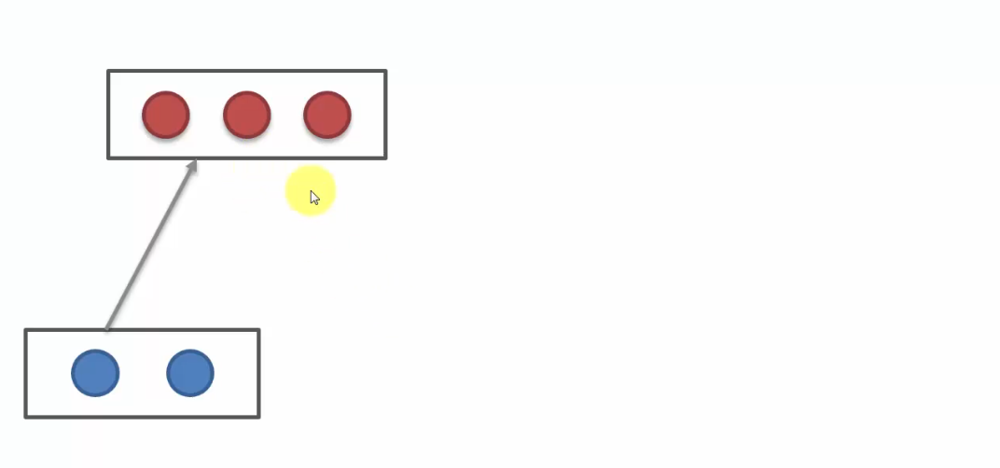
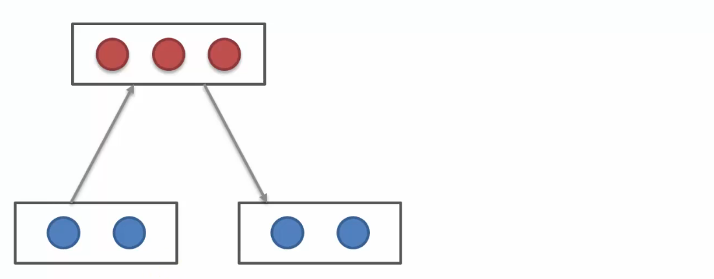
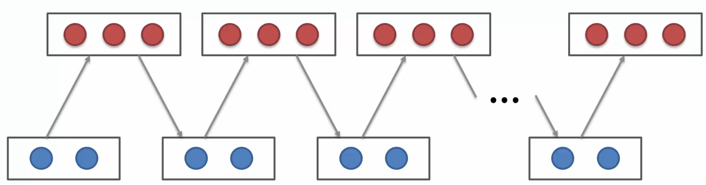
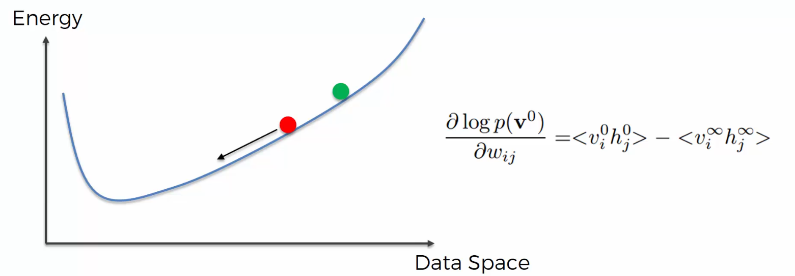
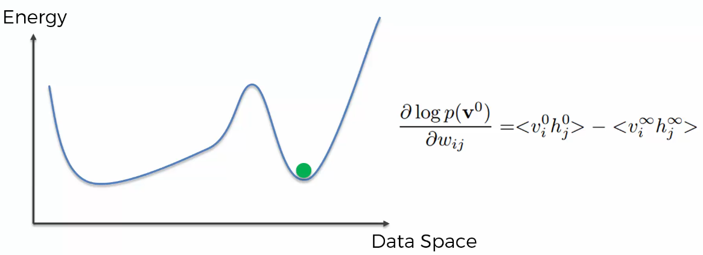

# Contrastive Divergence 이해하기

## 1. Contrastive Divergence란?

이번 강의에서는 **Contrastive Divergence**에 대해 배운다.

Contrastive Divergence는 **Restricted Boltzmann Machine, RBM이 학습할 수 있게 해주는 알고리즘**이다.

즉, RBM이 단순히 데이터를 통과시키는 것이 아니라 가중치를 조정하면서 데이터의 패턴을 배우게 만드는 방법이다.

------

## 2. 왜 Contrastive Divergence가 필요할까?

기존 신경망에서는 가중치를 학습할 때 보통 **Gradient Descent**와 **Backpropagation**을 사용했다.

일반적인 신경망은 방향이 있다.

예를 들면, **Input → Hidden → Output** 방향으로 데이터가 흐른다.

그래서 출력값과 정답의 차이를 계산하고, 그 오차를 뒤로 전파하면서 가중치를 조정할 수 있다.

------

하지만 RBM은 다르다.

RBM은 **방향이 없는 모델**이다.

즉, **Visible Layer ↔ Hidden Layer**처럼 양방향으로 연결되어 있다.

그래서 일반적인 Backpropagation 방식으로 가중치를 조정하기 어렵다.

이 문제를 해결하기 위해 사용하는 방법이 **Contrastive Divergence**이다.

------

## 3. RBM의 기본 흐름

RBM은 크게 두 층으로 구성된다.

- Visible Layer : 파란색
- Hidden Layer : 빨간색

Visible Layer에는 입력 데이터가 들어간다.

Hidden Layer는 입력 데이터의 숨겨진 특징을 표현한다.

처음에는 가중치가 랜덤하게 설정되어 있다.

그래서 처음부터 좋은 결과가 나오지는 않는다.

------

## 4. Forward Pass

먼저 입력값이 Visible Layer에 들어간다.

그다음 이 값들이 가중치를 통해 Hidden Layer로 전달된다.

즉, **Visible Layer → Hidden Layer**

방향으로 계산된다.

이 과정을 통해 Hidden Node들의 값이 만들어진다.

------

## 5. Backward Pass

그다음 Hidden Layer의 값을 이용해서 다시 Visible Layer를 복원한다.

즉, **Hidden Layer → Visible Layer** 방향으로 다시 계산한다.

이 과정을 **Reconstruction**, 즉 재구성이라고 한다.

RBM은 입력값을 보고 다시 원래 입력값과 비슷하게 복원하려고 한다.

------

## 6. 왜 복원값이 원래 입력과 다를까?

중요한 점은 복원된 Visible Layer 값이 처음 입력값과 완전히 같지 않다는 것이다.

처음 보면 이상하게 느껴질 수 있다.

왜냐하면 Forward Pass와 Backward Pass에서 같은 가중치를 사용하기 때문이다.

그런데도 값이 달라진다.

------

그 이유는 Hidden Node 하나가 Visible Node 하나만 보고 만들어지는 것이 아니기 때문이다.

각 Hidden Node는 여러 Visible Node의 영향을 받아 만들어진다.

그리고 다시 Visible Node를 복원할 때도 여러 Hidden Node의 영향을 받는다.

즉, 값들이 서로 섞이기 때문에 복원된 값은 원래 입력과 달라질 수 있다.

------

## 7. 재구성 과정의 의미

RBM은 입력값을 그대로 외우는 모델이 아니다.

입력 데이터를 Hidden Layer로 압축하듯 표현하고, 다시 그 Hidden Layer를 바탕으로 입력을 복원한다.

이때 원래 입력과 복원된 입력의 차이를 보고 가중치를 조정한다.

즉, **원래 입력과 복원 입력의 차이를 줄이는 방향으로 학습한다.**

------

## 8. Gibbs Sampling

RBM에서는 다음 과정이 반복될 수 있다.

1. Visible Layer에서 Hidden Layer 계산
2. Hidden Layer에서 Visible Layer 재구성
3. 다시 Visible Layer에서 Hidden Layer 계산
4. 다시 Hidden Layer에서 Visible Layer 재구성

이렇게 계속 왕복하면서 새로운 상태를 샘플링하는 과정을 **Gibbs Sampling**이라고 한다.

------

## 9. Gibbs Sampling이 하는 일

Gibbs Sampling은 RBM이 여러 가능한 상태를 만들어보는 과정이다.

처음 입력에서 시작해서 Hidden Layer를 만들고, 다시 Visible Layer를 복원하고, 또 다시 Hidden Layer를 만드는 과정을 반복한다.

이 과정을 반복하면 시스템은 점점 더 낮은 에너지 상태로 이동하려고 한다.

------

## 10. 에너지 관점에서 보기

RBM은 Energy-Based Model이다.

즉, 특정 상태가 얼마나 자연스러운지를 에너지 값으로 표현한다.

- 낮은 에너지 상태 → 자연스러운 상태
- 높은 에너지 상태 → 부자연스러운 상태

RBM은 학습을 통해 훈련 데이터가 낮은 에너지 상태가 되도록 가중치를 조정한다.

------

## 11. 에너지 곡선과 가중치

RBM에서 에너지 곡선의 모양은 가중치에 의해 결정된다.

가중치가 바뀌면 어떤 상태가 낮은 에너지를 가지는지도 바뀐다.

즉, RBM이 학습한다는 것은 단순히 숫자만 바꾸는 것이 아니라 에너지 곡선의 모양을 바꾸는 것이다.

------

## 12. 학습의 목표

RBM의 목표는 훈련 데이터가 낮은 에너지 위치에 오도록 만드는 것이다.

처음에는 가중치가 랜덤이다.

그래서 훈련 데이터가 에너지 곡선에서 좋은 위치에 있지 않을 수 있다.

하지만 학습을 반복하면 훈련 데이터가 점점 더 낮은 에너지 상태가 되도록 가중치가 조정된다.

------

## 13. Contrastive Divergence의 핵심 아이디어

Contrastive Divergence는 원래 입력값과 재구성된 입력값을 비교한다.

그리고 그 차이를 이용해 가중치를 조정한다.

쉽게 말하면, **원래 데이터는 더 낮은 에너지로 만들고, 복원된 잘못된 데이터는 더 높은 에너지로 만드는 방식**이다.

이렇게 하면 모델이 훈련 데이터를 더 자연스러운 상태로 보게 된다.

------

## 14. CD-k란?

Contrastive Divergence에서는 Gibbs Sampling을 몇 번 반복할지 정할 수 있다.

이때 사용하는 표현이 **CD-k**이다.

예를 들어

- CD-1 → Gibbs Sampling 1번
- CD-3 → Gibbs Sampling 3번
- CD-5 → Gibbs Sampling 5번

처럼 이해하면 된다.

k가 클수록 더 많이 반복하지만 계산량도 많아진다.

------

## 15. Hinton의 Shortcut

원래는 Gibbs Sampling을 계속 반복해서 수렴할 때까지 기다려야 한다.

하지만 이 과정은 시간이 오래 걸린다.

그래서 Geoffrey Hinton은 굳이 끝까지 반복하지 않아도 된다고 보았다.

특히 **CD-1**, 즉 한 번만 왕복해도 가중치를 어느 방향으로 조정해야 하는지 충분히 알 수 있다고 설명한다.

이것이 강의에서 말하는 **Hinton의 Shortcut**이다.

------

## 16. CD-1 과정

CD-1은 다음과 같이 진행된다.

1. 원래 입력값을 Visible Layer에 넣는다
2. Hidden Layer 값을 계산한다
3. Hidden Layer를 이용해 Visible Layer를 재구성한다
4. 원래 입력과 재구성 입력을 비교한다
5. 그 차이를 이용해 가중치를 조정한다

즉, 한 번의 Forward Pass와 Backward Pass만으로 학습 방향을 잡는 방식이다.

------

## 17. Gradient Descent와의 차이

Gradient Descent는 정해진 손실 함수의 최소점을 찾는 방식이다.

반면 Contrastive Divergence는 에너지 곡선 자체를 조정한다.

즉, 단순히 곡선 위에서 내려가는 것이 아니라 훈련 데이터가 낮은 위치에 오도록 곡선의 모양을 바꾸는 것이다.

이 점이 일반적인 신경망 학습과 다르다.

------

## 18. RBM 학습을 쉽게 말하면

RBM은 처음에 입력 데이터를 제대로 복원하지 못한다.

하지만 원래 입력과 복원 입력의 차이를 보면서 가중치를 조금씩 조정한다.

그 결과 훈련 데이터는 점점 더 낮은 에너지 상태가 된다.

즉, 모델이 훈련 데이터를 더 자연스럽고 가능성 높은 상태로 인식하게 된다.

------

## 19. 핵심 정리

- Contrastive Divergence는 RBM을 학습시키는 알고리즘이다.
- RBM은 방향이 없는 모델이라 일반적인 Backpropagation을 쓰기 어렵다.
- 입력값을 Hidden Layer로 보내고 다시 Visible Layer로 복원한다.
- 원래 입력과 복원 입력은 보통 같지 않다.
- 이 차이를 이용해 가중치를 조정한다.
- Gibbs Sampling은 Visible과 Hidden을 반복적으로 오가는 과정이다.
- RBM은 낮은 에너지 상태를 선호한다.
- 학습은 훈련 데이터를 낮은 에너지 상태로 만드는 과정이다.
- CD-1은 한 번의 왕복만으로 가중치 조정 방향을 잡는 방법이다.

------

## 20. 추가

Contrastive Divergence를 쉽게 말하면 **RBM이 입력 데이터를 잘 복원하도록 가중치를 고치는 방법**이다.

조금 더 정확히 말하면, **훈련 데이터는 낮은 에너지 상태로 만들고, 재구성된 잘못된 데이터는 상대적으로 높은 에너지 상태로 만드는 과정**이다.

그래서 RBM은 학습을 반복할수록 훈련 데이터의 패턴을 더 잘 표현하게 된다.
