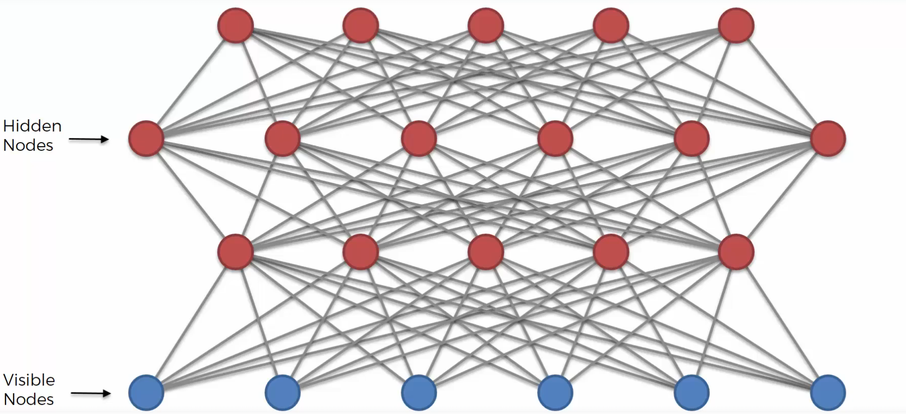

# Deep Belief Network 이해하기

## 1. Deep Belief Network란?

이번 강의에서는 **Deep Belief Network**, 줄여서 **DBN**에 대해 배운다.

DBN은 여러 개의 **Restricted Boltzmann Machine, RBM**을 쌓아서 만든 모델이다.

즉, **RBM 여러 개를 층층이 쌓은 깊은 신경망**

이라고 이해하면 된다.

------

## 2. DBN의 기본 구조

DBN은 여러 RBM을 위로 쌓는 구조이다.

예를 들어

- 첫 번째 RBM
- 두 번째 RBM
- 세 번째 RBM

이렇게 여러 개의 RBM이 연결된다.

여기서 첫 번째 RBM의 Hidden Layer가 두 번째 RBM의 Input Layer가 된다.

그리고 두 번째 RBM의 Hidden Layer가 세 번째 RBM의 Input Layer가 된다.

즉, **RBM의 Hidden Layer → 다음 RBM의 Input Layer**

로 이어지는 구조이다.

------

## 3. RBM을 쌓는다는 의미

RBM 하나는 입력 데이터에서 숨겨진 특징을 학습한다.

DBN은 이런 RBM을 여러 개 쌓는다.

그래서 아래층에서는 기초적인 특징을 학습하고,

위층으로 갈수록 더 추상적인 특징을 학습할 수 있다.

즉, DBN은 데이터의 특징을 단계적으로 깊게 학습하는 구조이다.

------

## 4. DBN의 방향성

Boltzmann Machine과 RBM은 기본적으로 방향이 없는 모델이다.

하지만 DBN에서는 모든 연결이 완전히 방향 없는 것은 아니다.

DBN은 보통 상위 두 개 층은 방향이 없고, 그 아래층의 연결은 방향이 있는 구조를 가진다.

즉,

- Top Layer 쪽 → Undirected
- 아래쪽 Layer들 → Directed

구조라고 볼 수 있다.

------

## 5. 왜 구조가 복잡할까?

DBN은 단순한 신경망이 아니다.

RBM의 비지도학습 구조와 깊은 신경망 구조가 결합되어 있기 때문이다.

그래서 일반적인 ANN이나 CNN보다 개념적으로 훨씬 복잡하다.

강의에서도 DBN은 매우 고급 주제이기 때문에 자세한 수학까지는 다루지 않는다.

------

## 6. DBN이 중요한 이유

DBN은 2000년대에 Deep Learning에 대한 관심을 다시 살리는 데 중요한 역할을 했다.

당시 깊은 신경망은 학습이 어렵다는 문제가 있었다.

하지만 Hinton과 연구진이 DBN과 RBM 기반 학습 방법을 제안하면서 깊은 구조의 모델도 효과적으로 학습할 수 있다는 가능성을 보여주었다.

그래서 DBN은 딥러닝 역사에서 중요한 모델이다.

------

## 7. DBN 학습 방법

DBN을 학습할 때는 대표적으로 두 가지 개념이 나온다.

- Greedy Layer-Wise Training
- Wake-Sleep Algorithm

이 두 가지는 DBN을 이해할 때 자주 등장하는 학습 방식이다.

------

## 8. Greedy Layer-Wise Training

Greedy Layer-Wise Training은 층을 하나씩 차례대로 학습하는 방식이다.

먼저 첫 번째 RBM을 학습한다.

그다음 첫 번째 RBM의 Hidden Layer 출력을 두 번째 RBM의 입력으로 사용한다.

그리고 두 번째 RBM을 학습한다.

이런 식으로 위로 올라가면서 RBM을 하나씩 학습한다.

------

## 9. 왜 Greedy라고 부를까?

여기서 Greedy는 전체 네트워크를 한 번에 최적화하는 것이 아니라 현재 층을 먼저 학습한다는 의미이다.

즉, **한 층씩 차례대로 최선을 다해 학습하는 방식**이라고 볼 수 있다.

그래서 DBN에서는 각 RBM을 순서대로 학습한 뒤 전체 네트워크 구조를 만든다.

------

## 10. 방향성 설정

처음 RBM을 학습할 때는 연결이 방향이 없는 형태로 학습된다.

RBM은 기본적으로 **Visible Layer ↔ Hidden Layer** 처럼 양방향 구조이기 때문이다.

하지만 RBM들을 모두 학습한 후에는 DBN 구조에 맞게 일부 연결의 방향성을 설정한다.

강의에서는 상위 두 층을 제외한 연결은 아래 방향으로 동작하도록 만든다고 설명한다.

------

## 11. Wake-Sleep Algorithm

DBN에서 또 하나 중요한 개념은 **Wake-Sleep Algorithm**이다.

이 알고리즘은 이름 그대로 Wake 단계와 Sleep 단계로 나뉜다.

쉽게 말하면,

- Wake 단계 → 아래에서 위로 학습
- Sleep 단계 → 위에서 아래로 학습

이라고 이해하면 된다.

------

## 12. Wake 단계

Wake 단계에서는 입력 데이터가 아래층에서 위층으로 올라간다.

즉, 실제 데이터를 기반으로 위쪽 Hidden Layer들이 활성화된다.

이 과정에서 모델은 데이터를 어떻게 표현할지 학습한다.

------

## 13. Sleep 단계

Sleep 단계에서는 반대로 위층에서 아래층으로 내려온다.

즉, 모델이 내부적으로 생성한 표현을 바탕으로 아래쪽 데이터를 다시 만들어보는 과정이다.

이 과정에서 생성 방향의 연결을 학습한다.

------

## 14. Wake-Sleep의 의미

Wake-Sleep Algorithm은 DBN이 데이터를 위로 인식하는 방향과 아래로 생성하는 방향을 함께 학습하도록 돕는다.

즉, **데이터를 이해하는 방향과 데이터를 만들어내는 방향을 모두 학습하는 방식**이라고 볼 수 있다.

------

## 15. DBN을 실제로 쓰려면?

강의에서는 DBN을 깊게 다루지는 않는다.

왜냐하면 DBN은 매우 고급 주제이고, 실제로 사용하려면 논문과 수학적 배경을 더 공부해야 하기 때문이다.

특히 DBN을 직접 설계하려면 구조, 학습 방식, 수식에 대한 이해가 필요하다.

------

## 16. 참고할 만한 논문

강의에서는 DBN을 더 공부하고 싶다면
몇 가지 논문을 참고하라고 말한다.

대표적으로

- Hinton의 Deep Belief Network 관련 논문
- Bengio의 Greedy Layer-Wise Training 관련 논문
- Hinton의 Wake-Sleep Algorithm 관련 논문

이 언급된다.

이 논문들은 DBN의 구조와 학습 방식을 이해하는 데 도움이 된다.

------

## 17. 핵심 정리

- DBN은 Deep Belief Network의 줄임말이다.
- DBN은 여러 RBM을 쌓아서 만든 모델이다.
- 첫 번째 RBM의 Hidden Layer가 다음 RBM의 Input Layer가 된다.
- 아래층은 기본 특징을 학습하고, 위층은 더 추상적인 특징을 학습한다.
- DBN은 딥러닝 역사에서 중요한 모델이다.
- DBN은 2000년대 딥러닝 관심을 다시 살리는 데 기여했다.
- 대표 학습 방법으로 Greedy Layer-Wise Training이 있다.
- Greedy Layer-Wise Training은 RBM을 한 층씩 학습하는 방식이다.
- Wake-Sleep Algorithm은 위로 학습하고 아래로 다시 생성하는 방식이다.
- DBN은 고급 주제라 실제 사용하려면 논문을 추가로 공부해야 한다.

------

## 18. 추가

DBN을 쉽게 말하면 **RBM을 여러 층으로 쌓아서 더 깊은 특징을 학습하는 모델**이다.

RBM 하나가 데이터의 숨겨진 특징을 찾는다면, DBN은 그 특징 위에 또 다른 특징을 쌓아 더 복잡하고 추상적인 표현을 학습한다.

즉, **단순 특징 → 중간 특징 → 고급 특징**처럼 데이터를 단계적으로 이해하는 구조라고 보면 된다.
