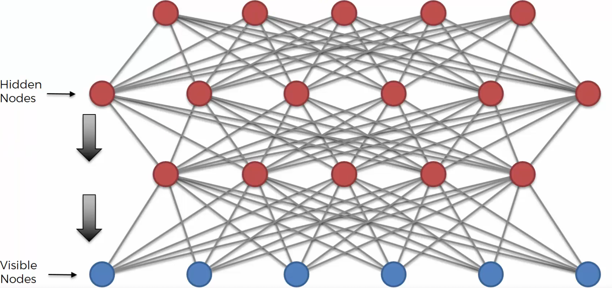

# Deep Boltzmann Machine 이해하기

## 1. Deep Boltzmann Machine이란?

이번 강의에서는 **Deep Boltzmann Machine**, 줄여서 **DBM**을 배운다.

DBM은 DBN처럼 Boltzmann Machine 계열의 고급 딥러닝 모델이다.

다만 강의에서는 DBM을 깊게 다루지는 않는다.

이유는 DBM이 매우 복잡하고 수학적으로도 어려운 고급 주제이기 때문이다.

------

## 2. DBM을 배우는 이유

DBM은 이 강의의 핵심 실습 범위를 벗어난다.

하지만 Deep Belief Network, DBN처럼 딥러닝을 공부하다 보면 한 번쯤 마주칠 수 있는 개념이다.

그래서 이번 강의에서는 DBM이 무엇인지, DBN과 어떤 차이가 있는지만 간단히 정리한다.

------

## 3. DBN과 DBM은 다르다

가장 먼저 알아야 할 점은 **DBN과 DBM은 같은 모델이 아니라는 것**이다.

이름이 비슷하고, 둘 다 RBM과 관련이 있어서 헷갈릴 수 있다.

하지만 구조적으로 차이가 있다. 핵심 차이는 **연결의 방향성** 이다.

------

## 4. DBN 복습

DBN은 **Deep Belief Network**의 줄임말이다.

DBN은 여러 개의 RBM을 쌓아서 만든다.

처음에는 RBM들을 층별로 학습한다.

그 후 학습이 끝나면 상위 두 층을 제외한 나머지 연결은 방향이 있는 연결로 만든다.

즉, DBN은 일부 연결이 **Directed**, 즉 방향성을 가진다.

------

## 5. DBN의 구조적 특징

DBN에서는 아래쪽 층들의 연결이 보통 한 방향으로 작동한다.

강의에서는 상위 두 층을 제외하고 나머지 층 사이의 연결은 방향을 가진다고 설명한다.

즉,

- 위쪽 일부 층 → 방향 없음
- 아래쪽 층들 → 방향 있음

이런 구조라고 볼 수 있다.

------

## 6. DBM의 구조

DBM은 DBN과 다르다.

DBM에서는 연결의 방향성을 제거하지 않는다.

즉, 네트워크가 가진 **undirected connection**, 방향 없는 연결을 그대로 유지한다.

그래서 DBM은 여러 층으로 깊어지더라도 연결이 기본적으로 양방향 구조를 가진다.

------

## 7. DBM의 핵심 특징

DBM의 핵심은 깊은 구조를 가지면서도
Boltzmann Machine의 방향 없는 연결 특성을 유지한다는 점이다.

즉, **깊은 구조 + 방향 없는 연결**

이 DBM의 핵심이다.

그래서 DBM은 Deep Boltzmann Machine이라고 불린다.

------

## 8. DBN과 DBM의 가장 큰 차이

DBN과 DBM의 가장 큰 차이는 다음과 같다.

DBN은 학습 후 일부 연결이 방향성을 가진다.

반면 DBM은 연결이 계속 방향 없는 상태로 유지된다.

즉,

**DBN → 일부 연결이 directed**
**DBM → 연결이 undirected**

라고 이해하면 된다.

------

## 9. 왜 이 차이가 중요할까?

연결 방향성은 모델이 정보를 처리하는 방식에 영향을 준다.

DBN은 일부 층에서 정보가 특정 방향으로 흐른다.

하지만 DBM은 층 사이의 정보가 양방향으로 오갈 수 있다.

즉, 위층과 아래층이 서로 영향을 주고받는 구조라고 볼 수 있다.

------

## 10. DBM의 장점

강의에서는 DBM이 더 복잡하고 정교한 특징을 추출할 수 있다고 설명한다.

즉, DBM은 DBN보다 더 복잡한 표현을 학습할 가능성이 있다.

그래서 더 어려운 문제나 복잡한 데이터 구조를 다룰 때 활용될 수 있다고 언급한다.

------

## 11. DBM의 한계

하지만 DBM은 매우 복잡하다.

구조도 어렵고, 학습 과정도 단순하지 않다.

그래서 일반적인 기초 딥러닝 강의에서 자세히 다루기에는 범위가 넓다.

실제로 DBM을 사용하려면 논문과 수학적 배경을 추가로 공부해야 한다.

------

## 12. 참고할 만한 논문

강의에서는 DBM을 더 공부하고 싶다면
Ruslan Salakhutdinov의 **Deep Boltzmann Machines** 논문을 참고하라고 말한다.

이 논문은 Jeffrey Hinton도 함께 참여한 논문이다.

Hinton은 Boltzmann Machine, RBM, DBN 분야에서 매우 중요한 연구자이기 때문에 DBM을 공부할 때 좋은 출발점이 될 수 있다.

------

## 13. 핵심 정리

- DBM은 Deep Boltzmann Machine의 줄임말이다.
- DBM은 Boltzmann Machine 계열의 고급 모델이다.
- DBN과 DBM은 같은 모델이 아니다.
- DBN은 여러 RBM을 쌓은 구조이다.
- DBN은 학습 후 일부 연결이 방향성을 가진다.
- DBM은 방향 없는 연결을 유지한다.
- DBM의 핵심은 깊은 구조와 undirected connection이다.
- DBM은 더 복잡한 특징을 추출할 가능성이 있다.
- 하지만 매우 고급 주제라 추가적인 논문 공부가 필요하다.

------

## 14. 추가

DBM을 쉽게 말하면 **깊게 쌓은 Boltzmann Machine 구조**이다.

DBN과 비슷하게 여러 층을 가지지만, DBN처럼 연결 방향을 바꾸지 않고
Boltzmann Machine 특유의 양방향 연결을 유지한다.

즉, **DBN은 깊은 신뢰망이고, DBM은 깊은 방향 없는 Boltzmann 구조** 라고 이해하면 된다.
