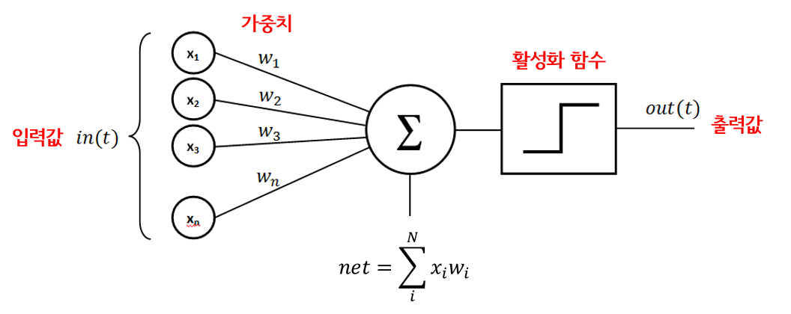

인공 신경망의 가장 기본 단위인 **뉴런(Neuron)**의 구조와 작동 원리를 핵심 위주로 정리함.

------

### 1. 생물학적 뉴런 vs 인공 뉴런

- **모방의 이유:** 인간의 뇌는 지구상에서 가장 뛰어난 학습 메커니즘임. 이를 기계로 재현하여 고도의 지능을 구현하는 것이 목표임.
- **구조적 유사성:**
  - **가지 돌기(Dendrites):** 신호를 받아들이는 '수신기' 역할을 하며, 인공 신경망에서는 **입력값**에 해당함.
  - **축삭 돌기(Axon):** 처리된 신호를 내보내는 '발신기' 역할을 하며, 인공 신경망에서는 **출력값**에 해당함.
  - **시냅스(Synapse):** 뉴런과 뉴런 사이의 연결 지점임. 인공 신경망에서는 이 연결선에 **가중치**가 부여됨.

------

### 2. 인공 뉴런(노드)의 내부 작동 3단계

뉴런 하나 내부에서는 다음과 같은 일이 순차적으로 일어남.

1. **가중 합산(Weighted Sum):** 모든 입력값에 각각의 가중치를 곱한 뒤 모두 더함. 
2. **활성화 함수(Activation Function) 적용:** 합산된 값이 특정 기준을 넘는지, 혹은 어떤 형태로 변환할지 결정함. (예: 신호를 보낼지 말지 결정하는 스위치 역할)
3. **신호 전달:** 활성화 함수를 거친 최종 결과값을 다음 뉴런으로 출력함.

------

### 3. 주요 구성 요소 상세

**① 입력값 (Input Value)**

- **성격:** 데이터셋의 **행(Row) 하나**에 들어있는 독립 변수들임. (예: 나이, 잔액 등)

- **전처리(중요):** 신경망이 잘 학습하려면 모든 입력값을 비슷한 범위로 맞춰야 함.

  - **표준화(Standardization):** 평균 0, 분산 1로 만듦.

  - **정규화(Normalization):** 최소 0 ~ 최대 1 사이 값으로 변환함.

    | **구분**        | **정규화 (Min-Max)**                   | **표준화 (Standardization)**        |
    | --------------- | -------------------------------------- | ----------------------------------- |
    | **범위**        | 항상 0 ~ 1 사이                        | 제한 없음 (대부분 -3 ~ 3 사이)      |
    | **중심**        | 데이터에 따라 다름                     | **평균 0**으로 고정                 |
    | **이상치 영향** | **매우 큼** (학습 방해 가능)           | **적음** (상대적으로 안전함)        |
    | **추천 상황**   | 픽셀 데이터(0~255) 등 범위가 명확할 때 | 일반적인 정형 데이터 학습 시 선호됨 |

**② 가중치 (Weights)**

- **역할:** 어떤 입력 신호가 중요하고 덜 중요한지 결정함.
- **학습의 본질:** 딥러닝이 '학습한다'는 것은 오차를 줄이기 위해 이 **가중치들을 계속해서 미세하게 조정**해 나가는 과정을 의미함.

**③ 출력값 (Output Value)**

- **연속적 값:** 부동산 가격 예측 같은 회귀 문제.
- **이진 분류:** 예/아니오(0 또는 1) 결정.
- **다중 분류:** 여러 카테고리 중 하나를 선택(이 경우 출력 뉴런이 여러 개가 됨).

------

### 4. 핵심 요약

- 뉴런 하나는 힘이 약하지만, 수많은 뉴런이 **시냅스(연결)**를 통해 협업하면 복잡한 패턴을 학습할 수 있음.
- 입력 데이터는 반드시 **표준화/정규화** 과정을 거쳐야 효율적인 처리가 가능함.
- 모든 과정은 데이터 한 행(관측치 하나)을 기준으로 동시에 일어남.

------

