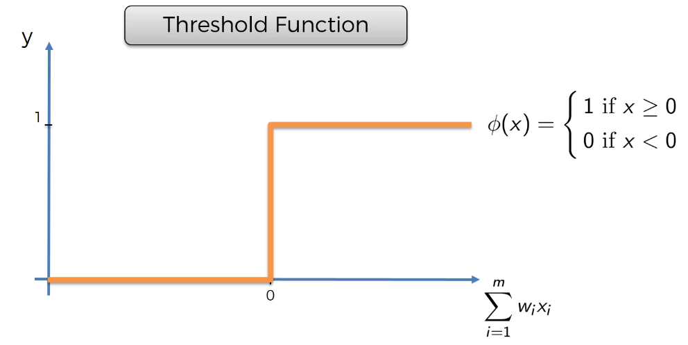
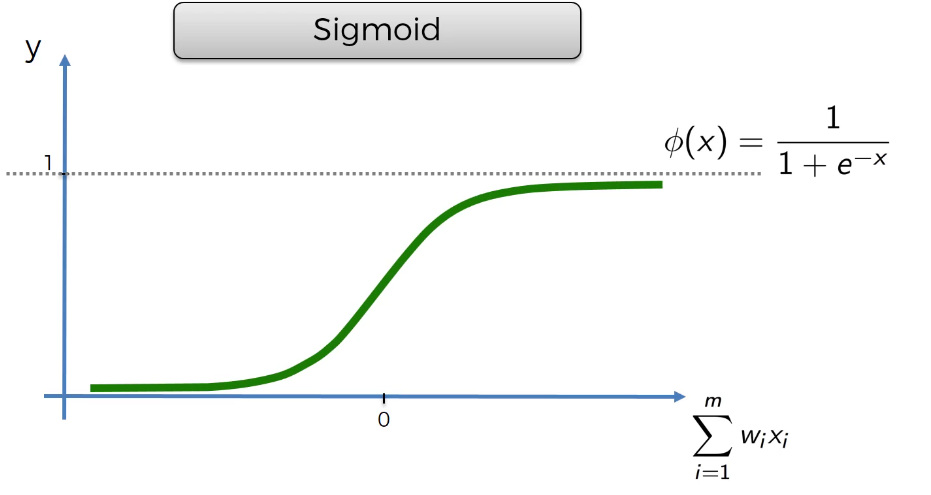
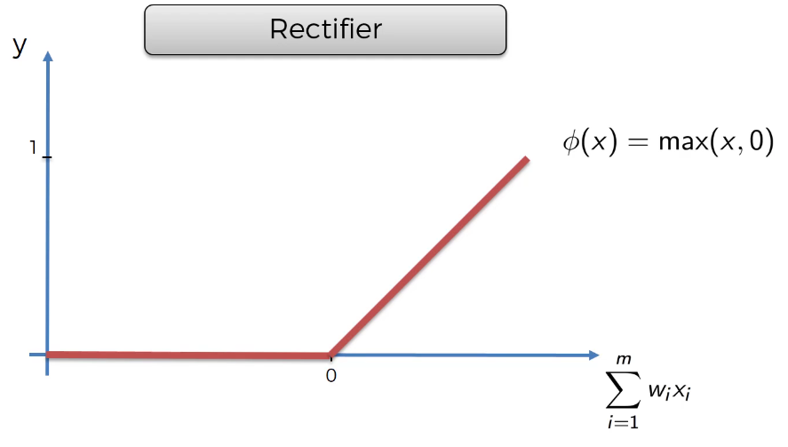
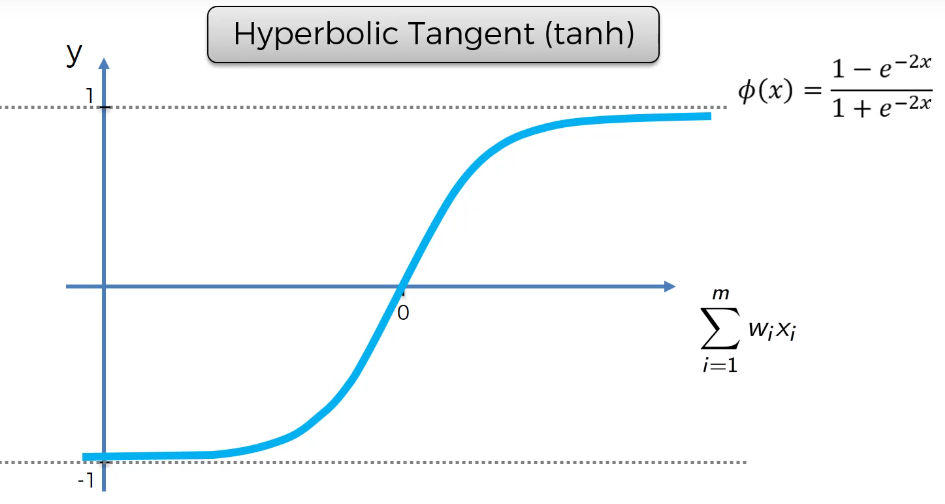

## 1. 뉴런과 활성화 함수 개념

- 하나의 뉴런은
  **입력값 → 가중합 계산 → 활성화 함수 적용 → 다음 뉴런으로 전달** 구조로 동작함
- 여기서 중요한 것은
  -> **활성화 함수가 최종 출력값을 결정한다는 점**

------

##  2. 주요 활성화 함수 4가지

### ① Threshold (임계값 함수)

- 입력값 < 0 → **0**
- 입력값 ≥ 0 → **1**
- 특징:
  - 매우 단순 (Yes/No 형태)
  - 출력이 딱 0 또는 1만 가능
  - 유연성이 부족

------

### ② Sigmoid 함수

​	

- 수식: 1 / (1 + e^(-x))
- 출력 범위: **0 ~ 1**
- 특징:
  - 부드러운 곡선 형태
  - 확률 해석 가능 (특히 출력층에서 사용)
  - 로지스틱 회귀에서도 사용됨

------

### ③ ReLU (Rectifier 함수)

- 입력값 < 0 → **0**
- 입력값 ≥ 0 → **x 그대로**
- 특징:
  - 가장 많이 사용되는 함수
  - 계산이 간단하고 효율적
  - 딥러닝에서 핵심 역할

------

### ④ Tanh (쌍곡탄젠트 함수)

- 출력 범위: **-1 ~ 1**
- 특징:
  - Sigmoid와 유사하지만 음수도 표현 가능
  - 일부 상황에서 더 좋은 성능

------

##  3. 언제 어떤 함수를 쓰는가?

###  이진 분류 (0 or 1)

- 사용 가능:
  - Threshold → 바로 0/1 출력
  - Sigmoid → 확률로 출력 후 해석

------

### 일반적인 신경망 구조

- **Hidden Layer (은닉층)**

  -> ReLU 사용

- **Output Layer (출력층)**

  -> Sigmoid 사용 (확률 예측)

------

##  4. 핵심 정리

- 활성화 함수는 **뉴런의 출력 형태를 결정하는 핵심 요소**
- 대표 4가지:
  - Threshold → 단순한 이진 출력
  - Sigmoid → 확률 표현
  - ReLU → 가장 많이 사용
  - Tanh → -1~1 범위 표현
- 실전에서는:
  -> **Hidden Layer = ReLU / Output Layer = Sigmoid** 조합이 매우 일반적

------

##  5. 추가

0과 1의 의미 = 이게 맞냐/ 아니냐를 표현하는 가장 단순한 결과값

sigmoid에서는 0~1 사이 값이 나오는데

- 0.9 → 거의 1 (맞을 확률 높음)

- 0.2 → 거의 0 (아닐 확률 높음)

모델이 얼마나 확신하는지를 표현하고 그걸 기반으로 학습이 가능해진다.