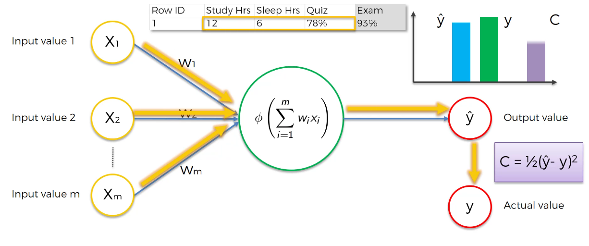
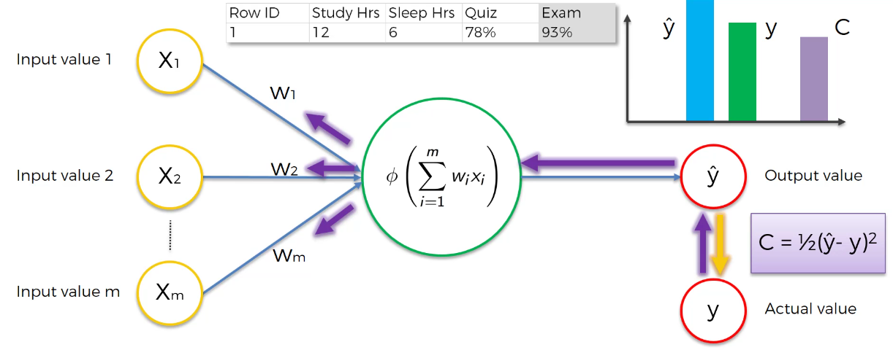
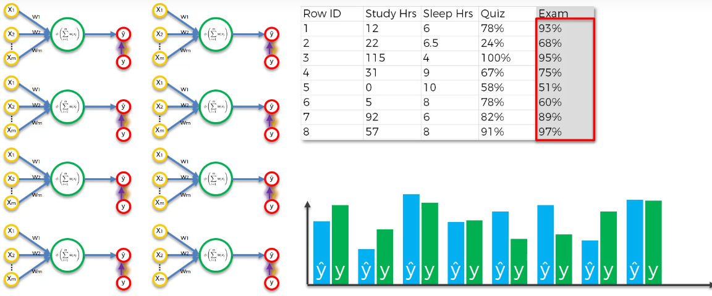

# 1. 두 가지 접근 방식 

## ① 기존 프로그래밍 

- 사람이 직접 규칙을 다 짜줌
- 예:
  - 귀가 뾰족 → 고양이
  - 귀가 늘어짐 → 개

👉 문제: 경우의 수가 많아지면 설계가 매우 어려움

------

## ② 신경망 (Neural Network)

- 규칙을 사람이 만들지 않음
- 대신:
  - 입력 데이터 + 정답을 주면
  - 스스로 패턴을 학습함

👉 핵심: **정답을 보고 스스로 규칙을 만든다"**

------

# 2. 퍼셉트론 (기본 구조)

- 가장 단순한 신경망
- 구조:

```
입력 → 가중치 곱 → 활성화 함수 → 출력
```

여기서 중요한 개념:

- **y** : 실제 정답
- **ŷ**  : 모델이 예측한 값

------

# 3. 학습의 핵심 흐름  

신경망은 아래 과정을 반복하면서 학습함

## Step 1. 입력 넣기

- 예: 공부시간, 수면시간, 중간고사 점수

## Step 2. 예측값 생성

- 신경망이 ŷ (예측값) 출력

## Step 3. 정답과 비교

- 실제 값 y와 비교

## Step 4. 오차 계산



- 대표적으로:
  - (y - ŷ)² 형태 사용

👉 의미:

- 오차가 크면 → 틀린 것
- 오차가 작으면 → 잘 맞춘 것

------

## Step 5. 가중치 업데이트



- 오차를 줄이기 위해
- **가중치(W)를 조금씩 수정**

👉 핵심:

-  **가중치**만 수정할 수 있음

------

## Step 6. 반복 (Iteration)

- 같은 데이터를 계속 넣으면서 반복

👉 결과:

- 점점 ŷ가 y에 가까워짐

------

# 4. 한 행 데이터 vs 데이터 셋

## ① 한 개 데이터 (단순 이해용)

- 하나의 입력으로 계속 반복 학습
- 오차가 0에 가까워질 때까지 반복

------

## ② 데이터셋 (실제 상황)

데이터가 여러 개면:

- 한 번에 전체 데이터를 다 사용

👉 이 과정을 **Epoch**라고 함

------

# 5. Epoch 개념

- **1 Epoch = 전체 데이터 한 번 학습**

예:

- 데이터 100개 → 1 epoch = 100번 입력

👉 학습은 여러 epoch 반복



------

# 6. 중요한 포인트 

## ① 모든 데이터는 같은 가중치를 공유

- 데이터마다 따로 가중치 있는 게 아님
- 하나의 모델이 전체 데이터를 학습

------

## ② 목표는 하나

👉 **Cost Function 최소화**

- 오차를 최소로 만드는 것이 목표

------

## ③ 최종 상태

- 최적의 가중치 찾으면 학습 종료
- 이후 새로운 데이터 예측 가능

------

# 7. 전체 과정 한 줄 정리

👉 입력 → 예측 → 정답 비교 → 오차 계산 → 가중치 수정 → 반복

------

# 8. 핵심 키워드 정리

- 퍼셉트론: 가장 기본 신경망
- y: 실제값
- ŷ: 예측값
- Cost Function: 오차
- Weight: 학습 대상
- Epoch: 전체 데이터 1회 학습
- Backpropagation: 오차를 뒤로 전달해서 가중치 수정

------

# 9. 진짜 중요한 직관

👉 신경망은 결국 이렇게 생각하면 됨:

"틀린 만큼 조금씩 고쳐가면서 점점 맞춘다"