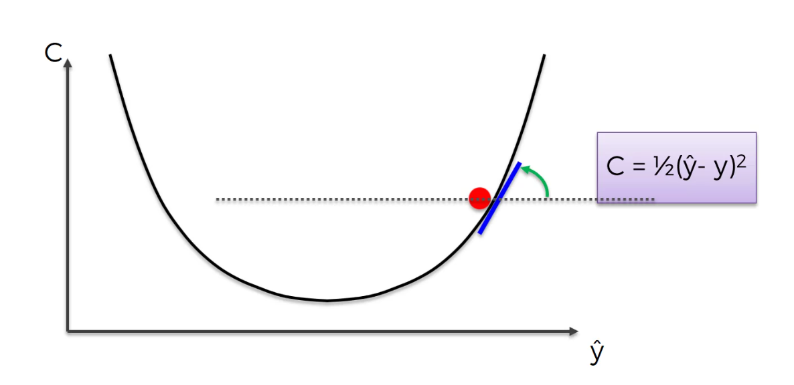
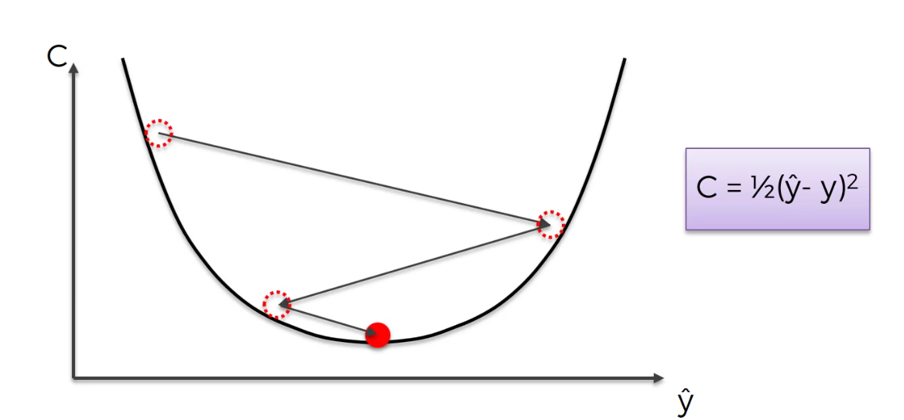

# 1. 왜 Gradient Descent가 필요한가?

이전 내용:

- 신경망은 **오차(Cost Function)를 줄이도록 가중치 수정**해야 함

👉 문제:
**가중치를 어떻게 바꿔야 할까?**

------

## ❌ 방법 1: 모든 가중치 확인 (Brute Force)

- 모든 가중치 조합을 다 시도
- 예: 가중치 25개, 각각 1000개 경우

👉 경우의 수:

- 1000²⁵ = 10⁷⁵

👉 슈퍼컴퓨터로도:

- 약 10⁵⁰년 걸림

👉 결론:
**절대 불가능**

------

# 2. 경사하강법

👉 핵심 아이디어:

"어느 방향으로 가면 오차가 줄어드는지 보고, 그쪽으로 조금씩 이동"

------

# 3. 직관적으로 이해하기 (중요)

## 산 위에 있다고 생각하면 됨

- 우리는 **가장 낮은 지점(최소값)**을 찾고 싶음
- 현재 위치에서:

👉 질문:

- "어느 방향이 아래쪽인가?"

👉 행동:

- 그 방향으로 조금 이동

👉 반복:

- 계속 반복하면 결국 바닥(최소값)에 도달

------

# 4. 동작 과정

## Step 1. 현재 위치에서 기울기 확인

- 기울기 = slope
- 미분을 통해 구함

------

## Step 2. 이동 방향 결정

- 기울기 < 0 → 오른쪽으로 이동
- 기울기 > 0 → 왼쪽으로 이동

👉 핵심:
**항상 "내려가는 방향"으로 이동**

------

## Step 3. 조금 이동

- 한 번에 많이 이동하면 위험
- 조금씩 이동

------

## Step 4. 반복

- 계속 반복 → 최소값 도달

------

# 5. 전체 흐름 정리

👉 현재 위치 → 기울기 계산 → 내려가는 방향 찾기 → 이동 → 반복

------

# 6. 왜 빠른가?

## Brute Force vs Gradient Descent

| 방법             | 특징                       |
| ---------------- | -------------------------- |
| Brute Force      | 모든 경우 다 탐색 (불가능) |
| Gradient Descent | 방향만 보고 이동           |

👉 핵심 차이:

- Brute Force: "전부 해보기"
- GD: "좋은 방향만 따라가기"

------

# 7. 실제 모습 

실제로는 부드럽게 내려가는 게 아니라
👉 **지그재그 형태로 이동**

이유:

- 한 번에 완벽한 방향을 못 찾기 때문

------

# 8. 핵심 개념 정리

- Gradient: 기울기 (방향 정보)
- Descent: 내려간다 (최소값으로 이동)
- 목적: Cost Function 최소화

------

# 9. 한 줄 핵심 정리

👉 "오차가 줄어드는 방향으로 조금씩 이동하는 알고리즘