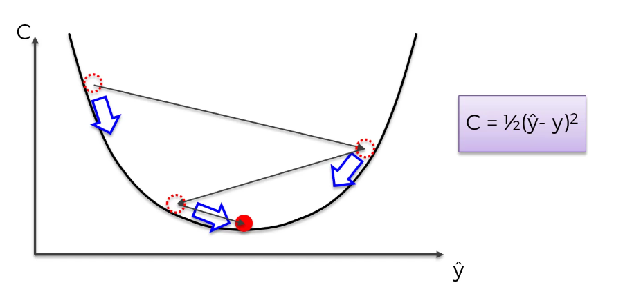
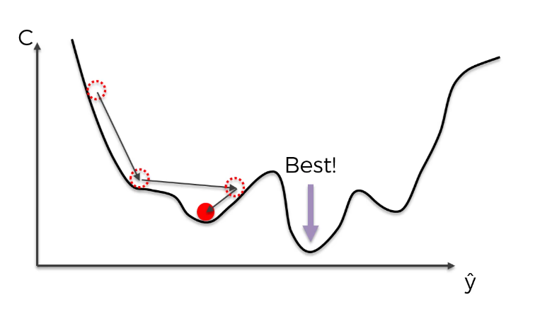

# 1. Gradient Descent 복습 

- 목표: **Cost Function 최소화**
- 방법:
  - 기울기(gradient)를 보고
  - 내려가는 방향으로 이동

👉 문제:

- 이 방식은 **convex 함수(한 개의 최소값)**일 때 잘 동작함

------

# 2. Convex vs Non-convex

## Convex 함수

- 하나의 최소값만 존재
- Gradient Descent → 정확한 최적값 찾음



## Non-convex 함수

- 최소값이 여러 개 존재
- 잘못된 최소값(local minimum)에 빠질 수 있음

👉 결과:

- 최적이 아닌 모델이 될 수 있음




------

# 3. 해결 방법 → 확률적 경사하강법 (SGD)

👉 핵심 아이디어:

- 데이터를 한 번에 다 쓰지 말고
- **하나씩 사용하면서 계속 업데이트**

------

# 4. Batch Gradient Descent

## 방식

- 모든 데이터 사용 후
- 한 번 가중치 업데이트

## 특징

- 안정적 (결과 일정)
- 계산 무거움
- 느림

------

# 5. 확률적 경사하강법 (SGD)

## 방식

- 데이터 1개 → 바로 업데이트
- 반복

## 특징

- 빠름
- 메모리 효율 좋음
- 결과가 랜덤함

------

# 6. Batch vs SGD 핵심 차이

| 항목        | Batch GD | SGD   |
| ----------- | -------- | ----- |
| 데이터 처리 | 전체     | 1개씩 |
| 업데이트    | 한 번    | 매번  |
| 속도        | 느림     | 빠름  |
| 결과        | 일정     | 랜덤  |
| 계산량      | 큼       | 작음  |

------

# 7. SGD의 중요한 특징

## ① 흔들림(Noise)

- 업데이트가 계속 바뀜
- 경로가 불안정

## ② 장점

- 다양한 경로 탐색 가능
- 더 좋은 해를 찾을 가능성 증가

------

# 8. Mini-batch Gradient Descent

👉 중간 방식

- 여러 개 데이터를 묶어서 처리

예:

- 32개 / 64개씩

## 장점

- 속도 + 안정성 둘 다 확보

👉 실제로 가장 많이 사용됨

------

# 9. 핵심 구조 정리

## Batch

```
전체 데이터 → Cost 계산 → 업데이트
```

## SGD

```
데이터 1개 → Cost 계산 → 업데이트 → 반복
```

## Mini-batch

```
데이터 일부 → Cost 계산 → 업데이트 → 반복
```

------

# 10. 한 줄 핵심 정리

👉 SGD는
**데이터를 하나씩 사용해 빠르게 업데이트하는 경사하강법 방식**

