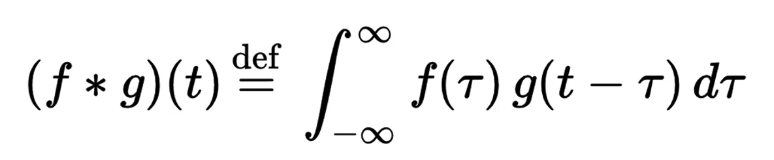
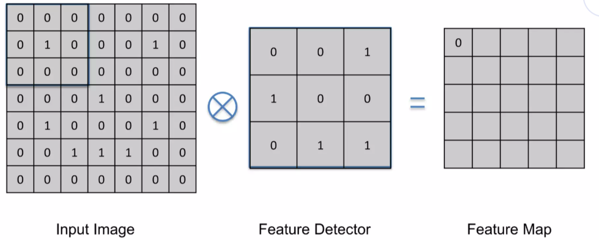
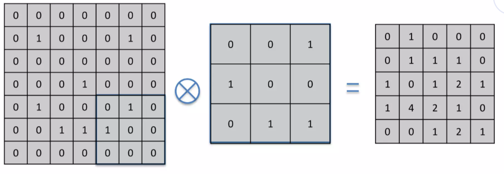
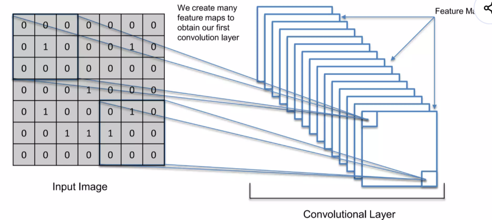

# CNN Step 1: Convolution (합성곱) 

이전 글에서 CNN은
👉 **이미지에서 특징을 추출해서 판단하는 모델**이라고 했다.

그럼 이제 그 첫 번째 단계인
👉 **Convolution이 실제로 무엇을 하는지** 이해해보자.

------

# 1. Convolution이란 무엇인가?

Convolution은 수학적으로는 함수의 결합 연산이지만,

CNN에서는 훨씬 단순하게 이해하면 된다.

👉 **이미지를 훑으면서 특정 패턴(특징)을 찾는 과정**

------

👉 한 줄 정리
→ “이미지에서 특징을 찾아내는 작업”

------

# 2. Convolution의 핵심 구성 요소

Convolution은 크게 3가지로 구성된다.

- 입력 이미지 (Input Image)
- 필터 (Filter / Feature Detector)
- 출력 결과 (Feature Map)

------

## ✔ 필터(Filter)란?

필터는 보통 작은 행렬(예: 3×3) 형태이며,
👉 **특정 패턴을 찾기 위한 기준**이다.

이 필터는 다음과 같은 이름으로도 불린다.

- Filter
- Kernel
- Feature Detector

👉 모두 같은 의미이다

------

# 3. Convolution이 실제로 하는 일

Convolution은 다음과 같은 방식으로 진행된다.

------

## ① 필터를 이미지 위에 올린다

- 이미지의 일부 영역(예: 3×3)을 덮는다

------

## ② 같은 위치끼리 곱한다

- 이미지 값 × 필터 값
- 이걸 모든 위치에 대해 수행

------

## ③ 결과를 모두 더한다

👉 하나의 숫자가 만들어짐

------

## ④ 한 칸 이동하고 반복

이 과정을 이미지 전체에 대해 반복한다.

------

👉 한 줄 정리
→ “작은 창으로 이미지를 훑으면서 계산한다”

------

# 4. Stride (이동 간격)

필터가 움직이는 간격을 **Stride**라고 한다.

- Stride = 1 → 한 칸씩 이동
- Stride = 2 → 두 칸씩 이동

------

👉 특징

- Stride가 클수록
  → 결과 이미지 크기 ↓
- Stride가 작을수록
  → 더 많은 정보 유지

------

👉 한 줄 정리
→ “얼마나 촘촘하게 훑을지 결정한다”

------

# 5. Feature Map (결과)

Convolution의 결과로 나오는 것이
👉 **Feature Map**이다

다양한 필터를 적용하여 여러 Feature Map을 얻는다

------

### ✔ Feature Map의 의미

- 특정 필터가
  👉 **이미지에서 어디에 반응했는지 보여주는 지도**

------

예를 들어

- 값이 크다 → 특징이 잘 발견됨
- 값이 작다 → 특징이 없음

------

👉 핵심

- 완전히 일치하면 값이 크게 나온다
- 즉, **패턴이 있는 위치를 강조한다**

------

👉 한 줄 정리
→ “특징이 어디 있는지 표시한 결과”

------

# 6. 왜 이미지 크기가 줄어들까?

Convolution을 수행하면
👉 출력 이미지 크기가 줄어든다

------

### ✔ 이유

- 필터가 이미지 경계를 완전히 덮을 수 없기 때문
- 이동하면서 계산 가능한 영역만 사용

------

👉 결과

- 계산량 감소
- 처리 속도 증가

------

👉 한 줄 정리
→ “불필요한 정보 줄이고 효율 높인다”

------

# 7. 정보가 사라지는 걸까?

이미지 크기가 줄어들면
👉 정보가 손실되는 것처럼 보인다

하지만 실제로는

👉 **중요한 특징만 남기고 나머지를 제거하는 과정**이다

------

### ✔ 핵심 포인트

- 모든 픽셀은 중요하지 않다
- 특징만 중요하다

👉 사람도 똑같이 처리한다

------

# 8. 왜 Feature Map이 여러 개일까?

CNN에서는 하나의 필터만 쓰지 않는다.

👉 여러 개의 필터를 사용한다

------

### ✔ 이유

각 필터는 서로 다른 특징을 찾는다

예:

- 엣지(선)
- 패턴
- 질감

------

👉 결과

- 필터마다 하나의 Feature Map 생성
- 여러 Feature Map이 쌓임

------

👉 한 줄 정리
→ “각기 다른 특징을 따로따로 찾는다”

------

# 9. 실제 필터의 예 (직관)

필터에 따라 결과가 달라진다.

예:

- Sharpen → 선명하게
- Blur → 흐리게
- Edge Detect → 윤곽선 강조

👉 즉, 필터는
👉 **“어떤 특징을 찾을지” 결정하는 도구**이다

------

# 10. Convolution의 진짜 핵심

Convolution의 목적은 단순히 계산이 아니다.

👉 핵심은 이것이다:

- 중요한 특징을 찾고
- 그 위치를 기록하고
- 불필요한 정보는 제거한다

------

그리고 중요한 점 하나 더

👉 CNN은 사람이 정의한 특징이 아니라
👉 **스스로 중요한 특징을 학습한다**

------

# 11. 핵심 요약

- 필터를 이용해 이미지에서 특징을 찾는다
- 결과는 Feature Map으로 표현된다
- 여러 필터를 사용하여 다양한 특징을 추출한다
- 이미지 크기를 줄이면서 효율을 높인다

------

# 🎯 한 줄 정리

👉 **“Convolution은 필터를 이용해 이미지에서 중요한 특징을 찾아내는 과정이다.”**
