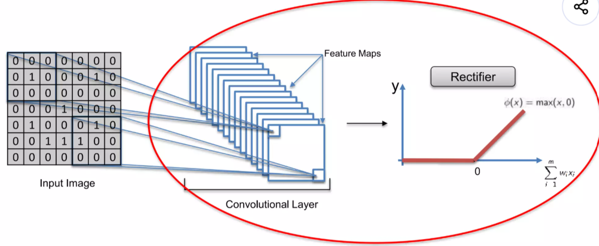

# 🧠 CNN Step 1-b: ReLU (Rectified Linear Unit) 

Convolution 단계에서는
👉 이미지에서 특징을 추출했다.

하지만 이 단계만으로는 충분하지 않다.
👉 **추출된 정보를 더 잘 활용하기 위한 추가 과정이 필요하다**

그 역할을 하는 것이 바로
👉 **ReLU (Rectified Linear Unit)**이다.



------

# 1. ReLU란 무엇인가?

ReLU는 아주 단순한 함수이다.

- 0보다 작은 값 → 0으로 만든다
- 0보다 큰 값 → 그대로 유지한다

------

👉 한 줄 정리
→ “음수는 버리고, 양수만 남긴다”

------

# 2. ReLU는 왜 필요한가?

ReLU를 사용하는 가장 중요한 이유는
👉 **비선형성(Non-linearity)을 추가하기 위해서이다**

------

## ✔ 왜 비선형성이 필요할까?

이미지는 매우 복잡한 데이터이다.

- 다양한 색상
- 다양한 경계
- 여러 물체가 섞여 있음

👉 이런 데이터는 **선형(linear) 방식으로는 제대로 표현할 수 없다**

------

하지만 Convolution 과정은
👉 수학적으로 보면 선형 연산이다

그래서 그대로 두면
👉 모델이 단순한 형태밖에 학습하지 못한다

------

👉 따라서

👉 **ReLU를 통해 선형 구조를 깨고, 더 복잡한 패턴을 학습할 수 있게 만든다**

------

👉 한 줄 정리
→ “복잡한 패턴을 학습하기 위해 선형성을 깨준다”

------

# 3. ReLU가 실제로 하는 일

Convolution을 거친 결과에는
양수와 음수가 모두 존재한다.

------

### ✔ 예시

- 양수 → 의미 있는 특징
- 음수 → 덜 중요한 정보

------

ReLU를 적용하면

- 음수 → 0으로 제거
- 양수 → 그대로 유지

------

👉 결과

👉 **중요한 특징만 남고, 불필요한 정보는 제거된다**

------

👉 한 줄 정리
→ “중요한 특징만 강조한다”

------

# 4. 직관적으로 이해하기

이미지를 밝기 기준으로 생각해보자.

- 밝은 부분 → 중요한 특징
- 어두운 부분 → 덜 중요한 정보

------

Convolution 결과에서는
밝기 변화가 점진적으로 나타날 수 있다.

예:

- 밝음 → 회색 → 어두움

이런 흐름은 일종의 “선형적인 변화”이다.

------

하지만 ReLU를 적용하면

👉 **어두운 부분(음수)이 사라지면서**

- 갑작스러운 변화 발생
- 즉, **비선형 구조가 만들어진다**

------

👉 결과

👉 모델이 더 복잡한 패턴을 구분할 수 있게 된다

------

# 5. Convolution + ReLU 관계

ReLU는 독립적인 단계라기보다는
👉 **Convolution 바로 다음에 붙는 과정**이다

------

흐름은 이렇게 된다:

```id="reluk3"
Convolution → ReLU
```

------

👉 의미

- Convolution → 특징 추출
- ReLU → 특징 정리

------

👉 한 줄 정리
→ “특징을 찾고 → 정리하는 과정”

------

# 6. ReLU의 장점

ReLU는 단순하지만 매우 강력하다.

------

### ✔ 장점

- 계산이 매우 빠름
- 중요한 정보만 남김
- 학습 성능 향상

------

👉 그래서 대부분의 CNN에서 기본으로 사용된다

------

# 7. 핵심 요약

- ReLU는 음수를 제거하는 함수이다
- 비선형성을 추가하여 모델 성능을 높인다
- Convolution 결과를 정리하는 역할을 한다

------

# 🎯 한 줄 정리

👉 **“ReLU는 불필요한 값을 제거하고, 복잡한 패턴 학습을 가능하게 만드는 비선형 함수이다.”**

