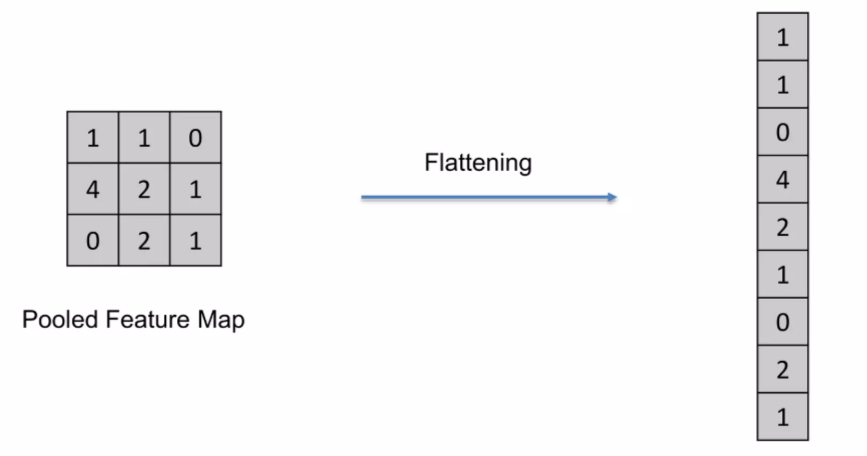
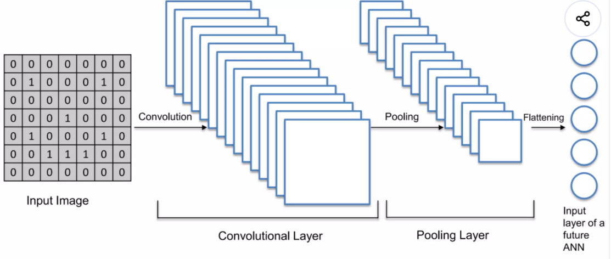

# 🧠 CNN Step 3: Flatten (Flattening) 쉽게 이해하기

지금까지 CNN의 흐름을 보면

- Convolution → 특징을 찾고
- ReLU → 중요한 정보만 남기고
- Pooling → 정보를 압축했다

이제 마지막으로 남은 것은
👉 **이 정보를 가지고 “판단”을 하는 단계**이다.

그 전에 반드시 필요한 과정이 바로
👉 **Flatten (Flattening)**이다.

------

# 1. Flatten이란 무엇인가?

Flatten은 매우 단순한 작업이다.

👉 **2차원 데이터를 1차원으로 펼치는 과정**



------

예를 들어

```id="flat1"
[ [1, 2],
  [3, 4] ]
```

이 데이터를

```id="flat2"
[1, 2, 3, 4]
```

이렇게 바꾸는 것이다.

------

👉 한 줄 정리
→ “2차원 데이터를 1차원으로 펼친다”

------

# 2. Flatten이 필요한 이유

Pooling까지 끝난 데이터는
👉 여전히 “이미지 형태(2D)”이다

------



하지만 이후 단계에서는
👉 **일반 신경망(Artificial Neural Network)**을 사용한다

문제는

👉 일반 신경망은
👉 **1차원 입력만 받는다**

------

그래서

👉 **Flatten을 통해 데이터를 벡터 형태로 변환해야 한다**

------

👉 한 줄 정리
→ “신경망에 넣기 위해 형태를 바꾼다”

------

# 3. Flatten의 실제 동작

Flatten은 매우 단순하다.

👉 그냥 데이터를 “줄 세우는 것”

------

### ✔ 과정

- 행(row) 기준으로 하나씩 꺼냄
- 순서대로 이어 붙임

------

👉 결과

👉 하나의 긴 벡터 생성

------

# 4. Feature Map이 여러 개일 때

CNN에서는 보통
👉 Feature Map이 여러 개 존재한다

------

이 경우 Flatten은

👉 **모든 Feature Map을 하나로 이어 붙인다**

------

예:

```id="flat3"
Feature Map 1 → 펼침
Feature Map 2 → 펼침
Feature Map 3 → 펼침
```

👉 전부 연결 → 하나의 긴 벡터

------

👉 결과

👉 **엄청 긴 입력 벡터 생성**

------

# 5. Flatten 이후 흐름

Flatten이 끝나면
👉 이 벡터가 그대로 다음 단계로 넘어간다

------

```id="flatflow"
Convolution → ReLU → Pooling → Flatten → Fully Connected
```

------

👉 의미

- Flatten → 데이터 준비
- Fully Connected → 실제 판단

------

👉 한 줄 정리
→ “판단을 위해 데이터를 준비하는 단계”

------

# 6. Flatten의 핵심 역할

Flatten은 계산을 하는 단계가 아니다.

👉 **형태만 바꾸는 단계이다**

------

하지만 매우 중요한 이유는

👉 CNN의 “특징 추출” 부분과
👉 “분류” 부분을 연결해주는 역할을 하기 때문이다

------

👉 쉽게 말하면

- 앞부분 → 이미지 처리
- 뒷부분 → 판단

👉 Flatten → 그 둘을 연결하는 다리

------

# 7. 핵심 요약

- Flatten은 2D 데이터를 1D로 변환하는 과정이다
- Fully Connected Layer에 입력하기 위해 필요하다
- 여러 Feature Map을 하나로 합친다
- 계산이 아니라 구조 변환 단계이다

------

# 🎯 한 줄 정리

👉 **“Flatten은 이미지 형태의 데이터를 신경망에 입력할 수 있도록 펼쳐주는 과정이다.”**
