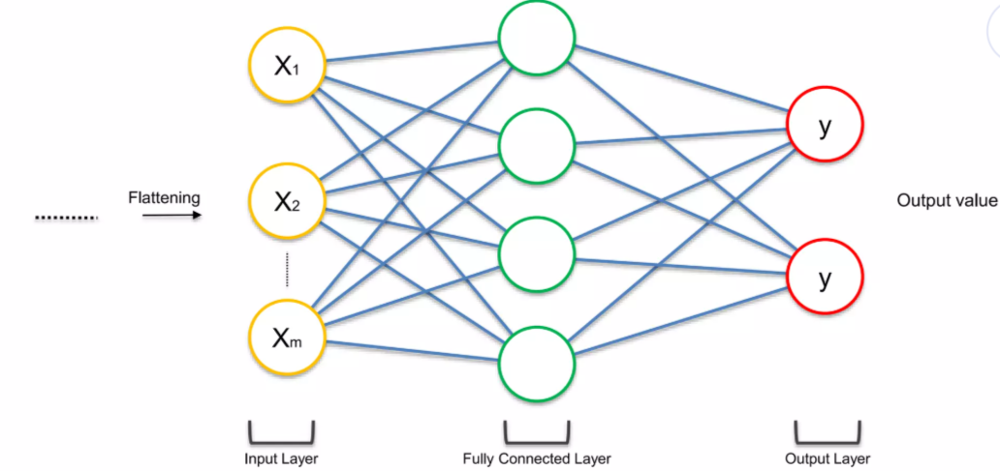
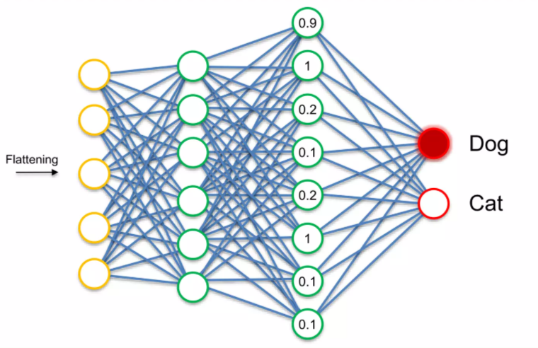
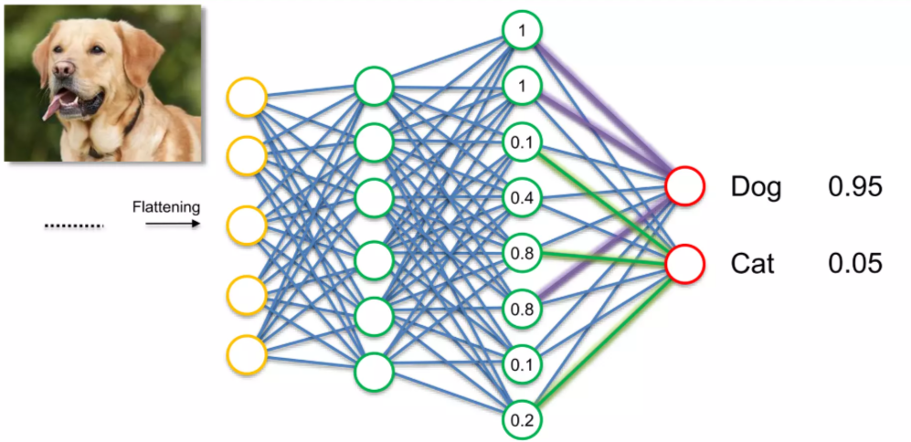

# 🧠 CNN Step 4: Fully Connected Layer 쉽게 이해하기

지금까지 CNN은 다음 과정을 거쳤다.

- Convolution → 특징을 찾고
- ReLU → 중요한 정보만 남기고
- Pooling → 정보를 압축하고
- Flatten → 데이터를 1차원으로 펼쳤다

이제 마지막 단계는
👉 **이 특징들을 이용해서 “정답을 판단하는 것”**이다

이 역할을 하는 것이 바로
👉 **Fully Connected Layer (완전 연결층)**이다

------

# 1. Fully Connected란 무엇인가?

Fully Connected Layer는
👉 우리가 기존에 배웠던 **일반 인공 신경망(ANN)**이다



------

즉,

👉 CNN 앞부분 = 특징 추출
👉 Fully Connected = 최종 판단

------

👉 한 줄 정리
→ “특징을 가지고 최종 결론을 내리는 단계”

------

# 2. Flatten 이후 데이터의 상태

Flatten을 통해 우리는

👉 하나의 긴 벡터를 얻었다

이 벡터에는

👉 **이미지에서 추출된 특징들이 숫자로 담겨 있다**

------

예를 들어

- 특정 값 ↑ → 어떤 특징이 강하게 존재
- 값 ↓ → 해당 특징이 약함

------

👉 이 값들이 그대로
👉 Fully Connected Layer의 입력이 된다

------

# 3. Fully Connected의 역할

Fully Connected Layer는

👉 이 특징들을 조합해서
👉 **어떤 클래스인지 판단한다**



------

예를 들어 (직관적으로)

- 귀 모양
- 눈 형태
- 얼굴 패턴

이런 특징들이 조합되면

👉 “이건 강아지다”
👉 “이건 고양이다”

라고 판단하게 된다

------

👉 한 줄 정리
→ “특징을 조합해서 정답을 만든다”

------

# 4. 출력층 (Output Layer)

마지막에는 결과가 나온다

------

## ✔ 분류 문제의 특징

클래스마다 출력 뉴런이 존재한다

예:

- 강아지 → 하나
- 고양이 → 하나

------

👉 출력값은 확률 형태로 나온다

예:

- 강아지: 0.8
- 고양이: 0.2



------

👉 가장 높은 값이 최종 결과

------

👉 한 줄 정리
→ “각 클래스의 확률을 계산한다”

------

# 5. 학습 과정 (핵심)

Fully Connected Layer는
👉 그냥 계산만 하는 게 아니다

👉 **학습을 통해 점점 더 정확해진다**

------

## ✔ 학습 흐름

1. 예측 수행
2. 실제 정답과 비교
3. 오차 계산 (Loss)
4. 역전파 (Backpropagation)
5. 가중치 수정

------

👉 이 과정을 반복하면서

👉 모델이 점점 더 정확해진다

------

👉 한 줄 정리
→ “틀린 만큼 수정하면서 배우는 과정”

------

# 6. 중요한 포인트 (중요)

CNN에서는

👉 **두 가지가 동시에 학습된다**

------

## ✔ ① Fully Connected 가중치

- 어떤 특징이 중요한지 학습

------

## ✔ ② Convolution 필터

- 어떤 특징을 찾아야 하는지 학습

------

👉 즉

👉 “무엇을 볼지 + 어떻게 판단할지” 둘 다 학습한다

------

👉 이게 CNN이 강력한 이유다

------

# 7. 직관적으로 이해하기

Fully Connected Layer를 사람으로 비유하면

------

- 앞 단계 → 정보 수집
- Fully Connected → 최종 판단

------

예:

👉 “귀 + 털 + 얼굴 구조” → 강아지
👉 “수염 + 눈 + 얼굴 구조” → 고양이

------

👉 특징들을 조합해서 결론을 내리는 과정

------

# 8. 예측 과정 (추론)

학습이 끝난 후에는

👉 새로운 이미지를 넣는다

------

그럼

- 특징 추출
- 특징 조합
- 확률 계산

------

👉 최종 결과 출력

------

예:

- 강아지: 95%
- 고양이: 5%

👉 “강아지”

------

# 9. 핵심 요약

- Fully Connected는 일반 신경망이다
- Flatten 결과를 입력으로 받는다
- 특징을 조합하여 최종 판단을 수행한다
- 학습 과정에서 가중치가 계속 업데이트된다

------

# 🎯 한 줄 정리

👉 **“Fully Connected Layer는 추출된 특징을 조합하여 최종 결과를 결정하는 단계이다.”**

------

# 💡 CNN 전체 흐름 (완성)

이제 전체 흐름이 완성된다

```id="cnnfull"
이미지
→ Convolution (특징 찾기)
→ ReLU (정리)
→ Pooling (압축)
→ Flatten (펼치기)
→ Fully Connected (판단)
→ Output (결과)
```

