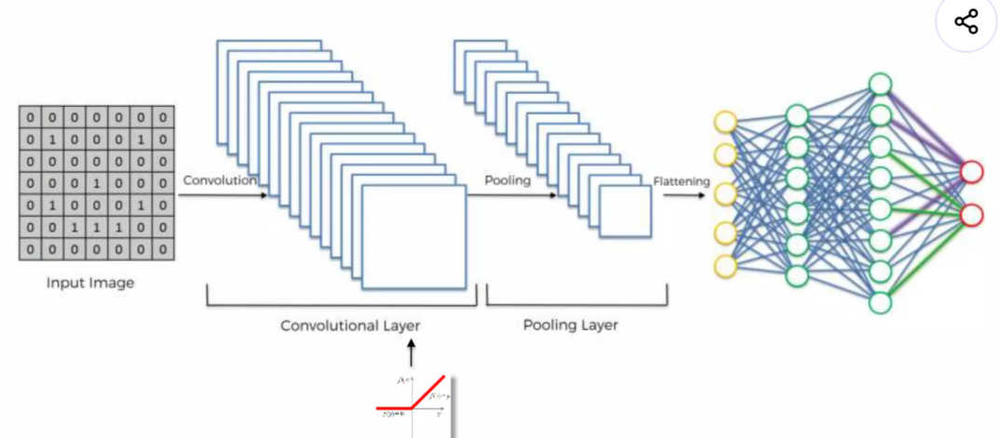

좋아 👍 이건 **CNN 전체 마무리 요약**이니까
👉 블로그용으로 **깔끔 + 이해 중심 + 정리형**으로 만들어줄게

------

# 🧠 CNN 전체 흐름 정리 (최종 요약)

이번 섹션에서는
👉 Convolutional Neural Network(CNN)의 전체 구조와 동작 과정을 학습했다.

이 글에서는 지금까지 배운 내용을
👉 **전체 흐름 중심으로 한 번에 정리**해본다.

------

# 1. CNN 전체 구조

CNN은 다음과 같은 단계로 이루어진다.



```id="cnnsummary"
Input Image
→ Convolution
→ ReLU
→ Pooling
→ Flatten
→ Fully Connected
→ Output
```

------

👉 크게 보면

- 앞부분 → 특징 추출
- 뒷부분 → 분류

------

👉 한 줄 정리
→ “특징을 뽑고, 그걸로 판단한다”

------

# 2. 단계별 역할 정리

## ① Convolution (합성곱)

이미지에 필터를 적용하여
👉 **특징(feature)을 추출하는 단계**

- 엣지, 패턴 등 탐지
- Feature Map 생성

------

👉 핵심
→ “이미지에서 의미 있는 정보 찾기”

------

## ② ReLU

Convolution 결과에 적용하여
👉 **비선형성을 추가하는 단계**

- 음수 제거
- 중요한 값만 유지

------

👉 핵심
→ “복잡한 패턴 학습 가능하게 만들기”

------

## ③ Pooling

Feature Map을 줄이면서
👉 **핵심 정보만 유지하는 단계**

------

### ✔ 주요 효과

- 위치 변화에 강해짐 (Spatial Invariance)
- 데이터 크기 감소
- 과적합 방지

------

👉 핵심
→ “정보는 유지하면서 크기 줄이기”

------

## ④ Flatten

2차원 데이터를
👉 **1차원 벡터로 변환**

------

👉 이유
→ Fully Connected Layer에 넣기 위해

------

👉 핵심
→ “데이터 형태 변환”

------

## ⑤ Fully Connected Layer

추출된 특징을 조합하여
👉 **최종 결과를 판단하는 단계**

------

### ✔ 특징

- 일반 신경망 구조
- 각 클래스 확률 계산

------

👉 핵심
→ “특징을 종합해서 결론 도출”

------

# 3. CNN 학습 과정

CNN은 단순히 계산만 하는 것이 아니라
👉 **학습을 통해 성능이 개선된다**

------

## ✔ 학습 흐름

1. 입력 이미지 전달
2. 예측 수행
3. 정답과 비교
4. 오차 계산 (Loss)
5. 역전파 (Backpropagation)
6. 가중치 업데이트

------

👉 이 과정이 반복되면서
👉 모델이 점점 더 정확해진다

------

# 4. 중요한 포인트 (진짜 핵심)

CNN에서는 두 가지가 동시에 학습된다.

------

## ✔ ① 가중치 (Fully Connected)

→ 어떤 특징이 중요한지 학습

------

## ✔ ② 필터 (Convolution)

→ 어떤 특징을 찾아야 하는지 학습

------

👉 결과

👉 **특징 추출 + 판단 기준을 동시에 최적화**

------

👉 한 줄 정리
→ “무엇을 볼지 + 어떻게 판단할지 같이 배운다”

------

# 5. CNN의 핵심 장점

## ✔ 특징 자동 추출

- 사람이 특징을 정의할 필요 없음

------

## ✔ 위치 변화에 강함

- Pooling 덕분에 다양한 형태 인식 가능

------

## ✔ 높은 성능

- 이미지 인식 분야에서 매우 강력

------

# 6. CNN의 본질

CNN을 한 문장으로 표현하면

👉 **이미지를 숫자로 보고, 특징을 찾고, 그 특징으로 판단하는 구조**

------

# 🎯 최종 한 줄 정리

👉 **“CNN은 이미지에서 특징을 추출하고, 그 특징을 이용해 무엇인지 분류하는 모델이다.”**

