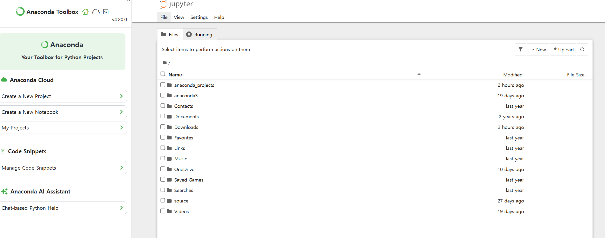

# 📌 CNN 실행 환경 구축 (Jupyter Notebook 실행)

👉 지금까지는 코드만 작성했지만
👉 이제는 **실제 환경에서 실행하는 단계**

------

# 📌 왜 Jupyter Notebook을 쓰냐?

👉 이유 2가지

1. **데이터셋 용량이 큼** → Colab에서 처리 어려움
2. **로컬에서 안정적으로 실행 가능**

------

# 📌 1. Anaconda 설치

👉 Anaconda는

👉 **Python + 라이브러리 + 개발환경을 한번에 제공하는 플랫폼**

------

## ✔ 설치 방법 (요약)

1. “Anaconda” 검색
2. 공식 사이트 접속
3. OS에 맞게 다운로드
4. 설치 진행 (Next 계속 누르면 됨)

------

# 📌 2. 필수 라이브러리 설치

터미널(또는 Anaconda Prompt)에서 실행:

```bash
pip install tensorflow
pip install keras
```

------

## ✔ 의미

- TensorFlow → 딥러닝 엔진
- Keras → 모델 만들기 쉽게 해주는 라이브러리

------

# 📌 3. Jupyter Notebook 실행

👉 Anaconda 실행 후

👉 “Jupyter Notebook” 클릭

------

## ✔ 실행 결과

👉 브라우저에서 이런 화면 열림



- 내 컴퓨터 폴더 구조 보임
- 코드 실행 가능

------

# 📌 4. 중요한 포인트 (🔥)

👉 **데이터셋과 코드 파일을 같은 폴더에 둬야 함**

------

## ✔ 이유

```python
'dataset/...'
```

👉 상대경로 사용하기 때문

------

# 📌 5. 실행 방법

1. `.ipynb` 파일 열기
2. 위에서부터 셀 하나씩 실행

------

## ✔ 실행 순서

```text
1. 데이터 전처리
2. CNN 모델 생성
3. CNN 학습
4. 예측
```

------

# 📌 6. 학습 과정 이해 (🔥 중요)

👉 로그에 이런 거 나옴:

```text
250/250
```

------

## ✔ 의미

👉 한 epoch에 250번 학습

------

## ✔ 이유

```text
8000개 이미지 / batch_size(32) ≈ 250
```

------

# 📌 7. 결과 해석

👉 예시 결과

- Train accuracy: 89%
- Test accuracy: 80%

------

## ✔ 의미

👉 10개 중 8개 맞춤

------

# 📌 8. 데이터 증강 왜 중요했냐?

👉 안 하면:

- Train: 99%
- Test: 70%

👉 → 과적합 발생

------

👉 그래서

👉 **이미지 증강 필수**

------

# 📌 9. 단일 이미지 테스트

👉 학습 끝나면

👉 새로운 이미지 넣어서 테스트

------

## ✔ 결과 예시

- dog 이미지 → dog 예측 ✔
- cat 이미지 → cat 예측 ✔

------

# 📌 10. 핵심 흐름 정리

```text
환경 설정 → 데이터 준비 → 모델 학습 → 성능 확인 → 실제 이미지 테스트
```

------

# 📌 한 줄 핵심

👉
“CNN 모델은 로컬 환경(Jupyter)에서 학습 후, 새로운 이미지에 적용하여 실제 예측에 사용된다”
