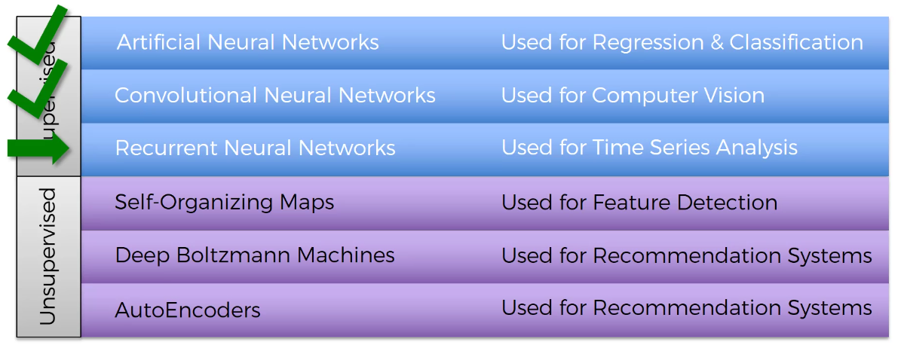
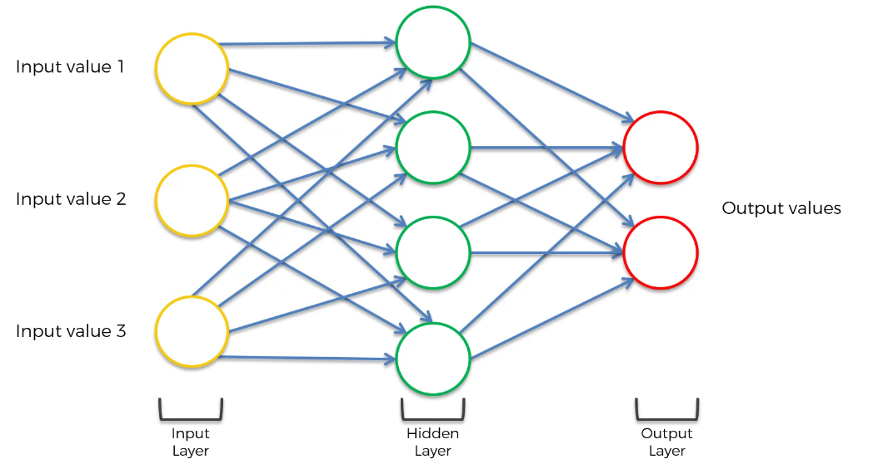
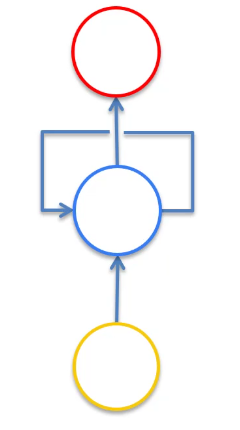
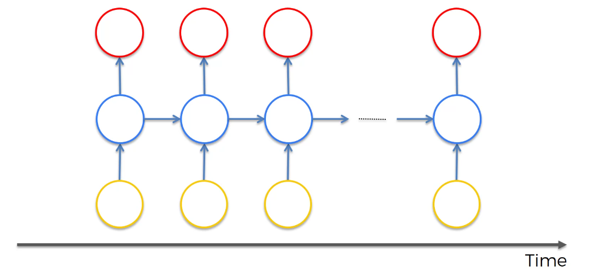
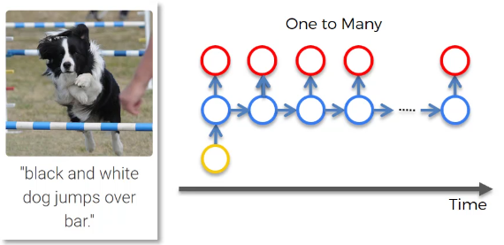
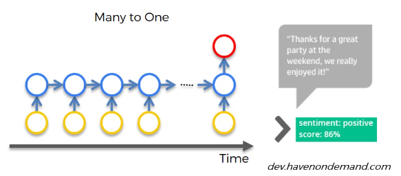
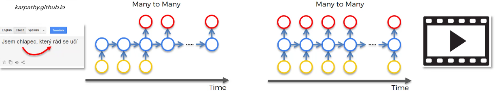

# 📌 RNN - 직관 & 활용 (심화 이해)

앞에서 RNN의 기본 개념을 배웠다면
이번에는

👉 **RNN이 왜 필요한지 + 실제로 어떻게 쓰이는지**
👉 **사람의 뇌와 비교해서 직관적으로 이해**

하는 단계다.

------

# 1. 딥러닝 전체에서 RNN의 위치

딥러닝은 크게 두 가지로 나뉜다.

- 지도 학습 (Supervised Learning)
- 비지도 학습 (Unsupervised Learning)

우리가 지금 배우는 것은 지도 학습 쪽이다.

------

## ✔ 주요 모델 흐름

- ANN → 기본 신경망
- CNN → 이미지 처리
- RNN → 순서 데이터 처리

------

👉 한 줄 정리
→ **RNN은 “순서 데이터 담당” 모델이다**

------

# 2. 딥러닝과 인간의 뇌 비교

딥러닝의 핵심 아이디어는

👉 **인간의 뇌를 흉내내는 것**

이다.

그래서 각 모델을 뇌와 비교하면 이해가 훨씬 쉬워진다.

------

## ✔ 뇌의 주요 영역

- Temporal Lobe → 장기 기억
- Occipital Lobe → 시각 처리
- Frontal Lobe → 단기 기억

------

## ✔ 딥러닝 모델과 대응

- ANN → 장기 기억 (가중치)
- CNN → 시각 처리
- RNN → 단기 기억

------

## ✔ 핵심 포인트

👉 ANN의 가중치는 “장기 기억”이다

- 학습된 상태 유지됨
- 꺼도 다시 그대로 동작

👉 RNN은 “단기 기억”이다

- 바로 직전 정보 기억
- 흐름을 따라가며 판단

------

👉 한 줄 정리
→ **ANN = 장기 기억 / RNN = 단기 기억**

------

# 3. RNN의 진짜 핵심 구조 (직관)

기존 신경망은 이렇게 동작한다.

👉 입력 → 출력 (끝)

------

하지만 RNN은 다르다. 기존 신경망에서 새로운 차원을 추가해 위에서 본다고 생각하자. 기존 신경망과 뉴런의 개수는 같다.

👉 출력 일부가 다시 자기 자신에게 들어간다

------

## ✔ 핵심 구조

👉 “자기 자신으로 돌아오는 연결”

이걸 **temporal loop (시간 루프)** 라고 한다.

------

## ✔ 의미

- 이전 상태를 기억
- 다음 계산에 활용

------

👉 한 줄 정리
→ **RNN은 자기 자신을 참고하면서 계산한다**

------

# 4. Unrolling (시간으로 펼치기)

RNN을 이해하는 가장 중요한 방법은

👉 **시간축으로 펼쳐 보는 것**

이다.

------

## ✔ 원래 모습 (압축)

- 하나의 네트워크처럼 보임
- 

------

## ✔ 펼친 모습

- t=1
- t=2
- t=3
- ...

각 시점마다 같은 구조가 반복된다.

------

## ✔ 핵심

👉 **같은 네트워크가 시간에 따라 반복된다**

👉 **이전 결과가 다음 입력에 포함된다**

------

👉 한 줄 정리
→ **RNN은 시간에 따라 이어지는 신경망이다**

------

# 5. RNN이 기억하는 방식 (직관)

RNN은 사람처럼 동작한다.

------

## ✔ 예시

강의를 듣는 상황을 생각해보자.

- 이전 강의 기억 → 현재 이해에 사용

------

만약 기억이 없다면?

👉 매번 처음부터 시작해야 함

------

## ✔ RNN도 동일

- 이전 상태 기억
- 현재 판단에 사용

------

👉 한 줄 정리
→ **기억이 없으면 이해도 없다**

------

# 6. RNN의 대표 구조 유형

RNN은 입력과 출력 구조에 따라 나뉜다.

------

## ① One-to-Many

👉 하나 입력 → 여러 출력

### 예시

- 이미지 → 문장 생성

👉 CNN + RNN 구조

------

## ✔ 설명

- 이미지 입력
- RNN이 단어 하나씩 생성

------

👉 한 줄 정리
→ **하나의 정보로 여러 결과 생성**

------

## ② Many-to-One

👉 여러 입력 → 하나 출력

### 예시

- 문장 → 감정 분석

------

## ✔ 설명

- 텍스트 전체를 보고
- 긍정/부정 판단

------

👉 한 줄 정리
→ **전체를 보고 하나로 판단**

------

## ③ Many-to-Many

👉 여러 입력 → 여러 출력

### 예시

- 번역
- 자막 생성

------

## ✔ 설명

- 문장을 입력받고
- 문장을 출력

------

👉 한 줄 정리
→ **흐름 전체를 변환**

------

# 7. 번역 예제로 보는 RNN의 힘

번역은 단순 문제가 아니다.

👉 단어 하나씩 번역하면 틀린다

------

## ✔ 이유

👉 **앞 단어가 뒤 단어에 영향 줌**

------

예:

- 성별 정보
- 문맥
- 문법 구조

------

## ✔ 핵심

👉 다음 단어는 이전 단어에 의존

------

👉 한 줄 정리
→ **문장은 연결되어 있다**

------

# 8. RNN의 강력한 활용 예시

RNN은 다양한 곳에서 쓰인다.

------

## ✔ 대표 활용

- 이미지 설명 생성
- 감정 분석
- 번역
- 음성 인식
- 자막 생성

------

## ✔ 영화 예시 (재밌는 사례)

👉 AI가 시나리오를 만든 영화 존재

- 문장은 그럴듯함
- 하지만 전체 스토리는 어색

------

## ✔ 이유

👉 **장기 흐름 이해 부족**

------

👉 한 줄 정리
→ **문장은 잘 만들지만 이야기 흐름은 약함**

------

# 9. RNN의 한계 (중요)

RNN은 강력하지만 완벽하지 않다.

------

## ✔ 문제

- 긴 문맥 이해 어려움
- 앞 정보 점점 사라짐

------

👉 그래서 등장한 것이

👉 **LSTM**

------

👉 한 줄 정리
→ **RNN은 짧은 기억만 잘한다**

------

# 10. RNN의 진짜 의미

RNN의 본질은 단순한 구조가 아니다.

------

👉 핵심은 이것이다

- 시간 흐름을 이해하고
- 이전 정보를 활용하고
- 문맥을 반영한다

------

CNN이 “공간”을 이해한다면
RNN은 “시간”을 이해한다.

------

👉 한 줄 정리
→ **RNN은 시간 흐름을 이해하는 모델이다**

------

# 🎯 최종 핵심 정리

- RNN은 순서 데이터를 처리하는 모델이다
- 이전 정보를 기억하며 현재를 계산한다
- 다양한 구조 (one-many, many-one 등)가 존재한다
- 번역, 음성, 텍스트 등에서 핵심 역할을 한다
- 하지만 긴 기억은 어려워 LSTM이 필요하다

------

# 🔥 한 줄 최종 정리

👉 **“RNN은 과거 정보를 기억하며 시간 흐름을 따라 데이터를 이해하는 모델이다.”**
