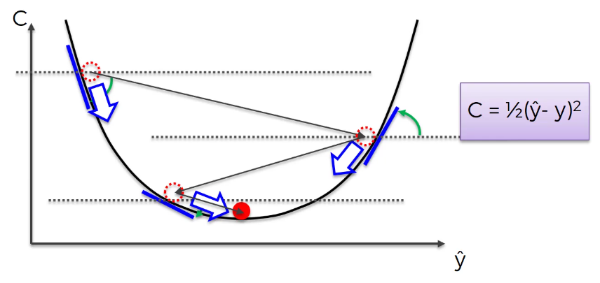
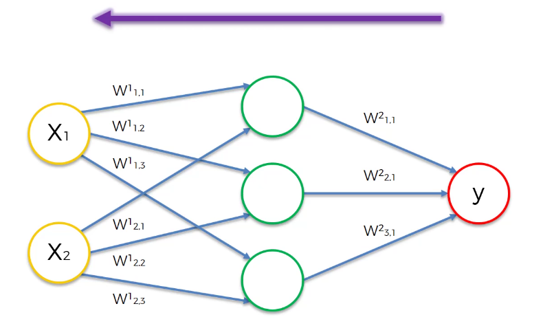
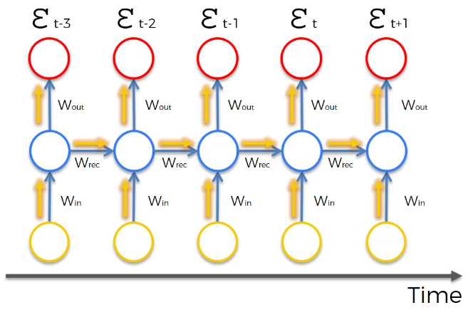
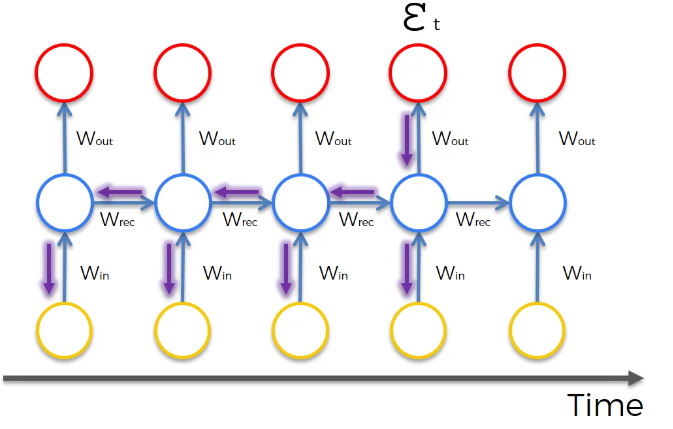
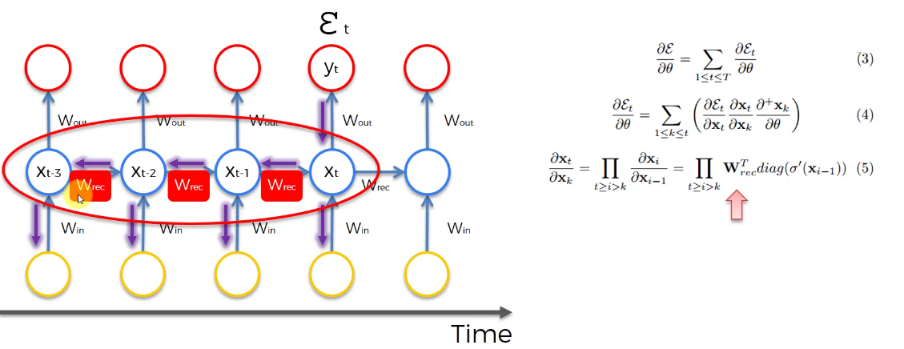

# 📌 Vanishing Gradient Problem (기울기 소실 문제)

RNN은 매우 강력한 모델이지만
👉 치명적인 문제가 하나 존재한다.

그게 바로

👉 **Vanishing Gradient Problem**이다.

------

# 1. 기울기(Gradient)란 무엇인가?

신경망은 학습할 때 이렇게 동작한다.

------

## ✔ 기본 흐름

1. 입력 → 출력 계산
2. 실제 값과 비교 → 오차 발생
3. 오차를 뒤로 전달 (Backpropagation)
4. 가중치 업데이트

------

👉 이때 사용되는 것이 **Gradient(기울기)**

------

## ✔ 역할

👉 “얼마나, 어떤 방향으로 가중치를 바꿀지” 알려주는 값

------

👉 한 줄 정리
→ **Gradient는 학습 방향을 알려주는 신호다**

------

# 2. RNN에서 문제가 발생하는 이유

일반 신경망은 층이 깊어도 몇 단계다.

하지만 RNN은 다르다.

------

## ✔ RNN의 특징

👉 시간축으로 계속 이어짐

예:

- t=1
- t=2
- t=3
- t=... (길어짐)

------

👉 즉,

👉 **엄청 깊은 네트워크가 되는 것과 같다**

------

## ✔ 문제 발생

오차를 뒤로 전달할 때

👉 과거까지 계속 전달해야 한다

------

👉 한 줄 정리
→ **RNN은 “시간 방향으로 깊은 네트워크”다**

------

# 3. Vanishing Gradient가 발생하는 원리

핵심은 이것이다.

👉 **값을 계속 곱한다**

------

## ✔ 왜 곱하냐?

각 단계에서

👉 이전 값 × 가중치

------

즉,

- t → t-1 → t-2 → t-3 ...

이렇게 갈 때마다

👉 계속 곱하기 발생

------

## ✔ 문제 상황

가중치가 보통

👉 1보다 작은 값 (예: 0.5, 0.8)

------

## ✔ 결과

0.5 × 0.5 × 0.5 × 0.5 ...

👉 점점 작아짐

👉 결국 거의 0

------

👉 이것이 바로

👉 **Vanishing (사라짐)**

------

👉 한 줄 정리
→ **곱하기가 반복되면서 값이 0에 가까워진다**

------

# 4. 왜 이게 문제인가?

Gradient가 작아지면 어떻게 될까?

------

## ✔ 핵심 문제

👉 가중치 업데이트가 거의 안됨

------

## ✔ 결과

- 앞쪽 레이어 → 거의 학습 안됨
- 뒤쪽 레이어 → 학습됨

------

👉 즉

👉 **네트워크 일부만 학습됨**

------

## ✔ 더 심각한 문제

👉 잘못된 값으로 계속 학습

------

왜냐하면

- 앞쪽이 제대로 학습 안됨
- 그 출력이 뒤로 전달됨

------

👉 결국

👉 전체 네트워크가 망가짐

------

👉 한 줄 정리
→ **앞부분이 학습 안 되면 전체가 무너진다**

------

# 5. 직관적인 비유

이걸 쉽게 이해하려면 이렇게 보면 된다.

------

## ✔ 소문 전달 게임

- 처음 사람이 큰 목소리로 말함
- 다음 사람이 조금 작게 전달
- 계속 반복

------

👉 결국 마지막에는

👉 거의 안 들림

------

👉 RNN도 똑같다

------

👉 한 줄 정리
→ **정보가 뒤로 갈수록 약해진다**

------

# 6. Exploding Gradient (반대 문제)

반대로 이런 경우도 있다.

------

## ✔ 가중치가 큰 경우

예:

👉 2 × 2 × 2 × 2 ...

------

👉 값이 폭발적으로 증가

------

👉 이것을

👉 **Exploding Gradient**라고 한다

------

## ✔ 결과

- 값이 너무 커짐
- 학습 불안정
- NaN 발생 가능

------

👉 한 줄 정리
→ **너무 크면 폭발한다**

------

# 7. 왜 RNN에서 특히 심한가?

일반 신경망:

👉 깊이 제한 있음

------

RNN:

👉 시간만큼 계속 깊어짐

------

예:

- 10단어 문장 → 10단계
- 100단어 문장 → 100단계

------

👉 곱하기 횟수 증가

👉 문제 심화

------

👉 한 줄 정리
→ **길어질수록 문제 심해진다**

------

# 8. 해결 방법 (간단 정리)

이 문제를 해결하려고 여러 방법이 등장했다.

------

## ✔ 1. Gradient Clipping

👉 값이 너무 크면 잘라버림

------

## ✔ 2. Weight Initialization

👉 초기값을 잘 설정

------

## ✔ 3. Truncated BPTT

👉 일정 길이까지만 역전파

------

## ✔ 4. 핵심 해결책

👉 **LSTM**

------

👉 한 줄 정리
→ **결국 LSTM이 핵심 해결책이다**

------

# 9. 핵심 요약

- RNN은 시간 방향으로 깊은 구조
- 역전파 시 값이 계속 곱해짐
- 값이 작으면 → 0으로 수렴 (Vanishing)
- 값이 크면 → 폭발 (Exploding)
- 결과적으로 학습이 제대로 안됨
- 이를 해결하기 위해 LSTM 등장

------

# 🎯 한 줄 핵심 정리

👉 **“RNN은 역전파 과정에서 기울기가 점점 작아져 앞쪽이 학습되지 않는 문제가 있다.”**

------

🔥 이건 진짜 중요 포인트라서 기억해

👉 RNN → 문제 → Vanishing Gradient
👉 해결 → LSTM

------

원하면 다음 단계로
👉 **“LSTM이 어떻게 이 문제를 해결하는지 (게이트 수식 없이 직관 설명)”**
👉 **“면접에서 100% 나오는 답변 템플릿”**

까지 이어서 만들어줄게 👍
