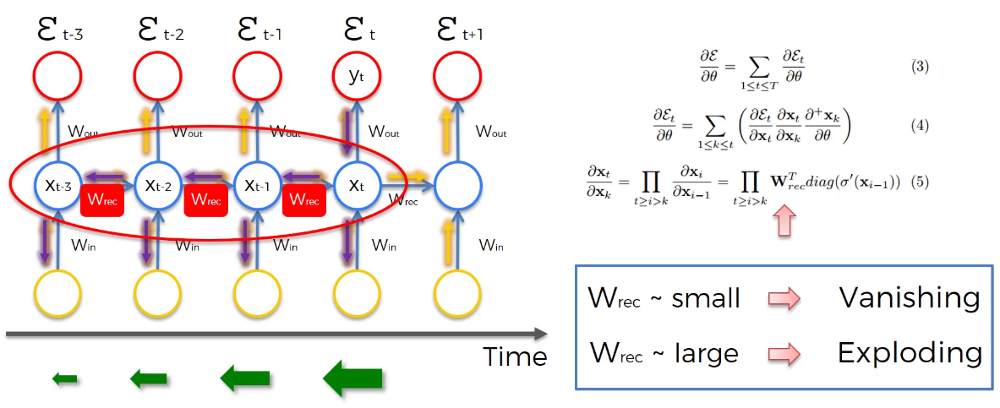
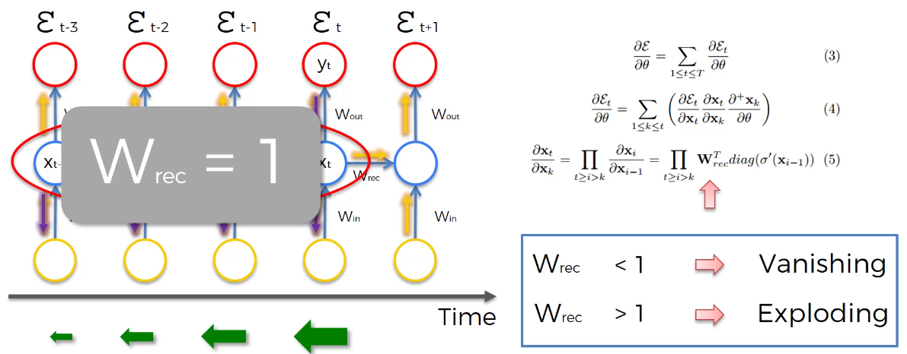
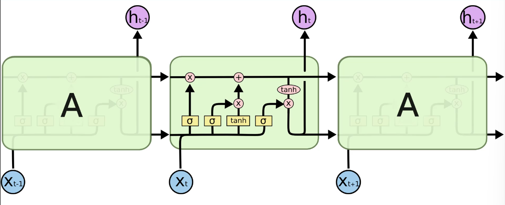
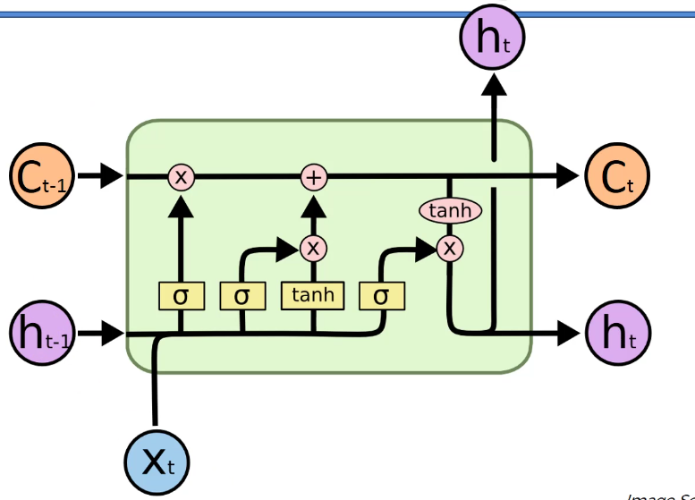
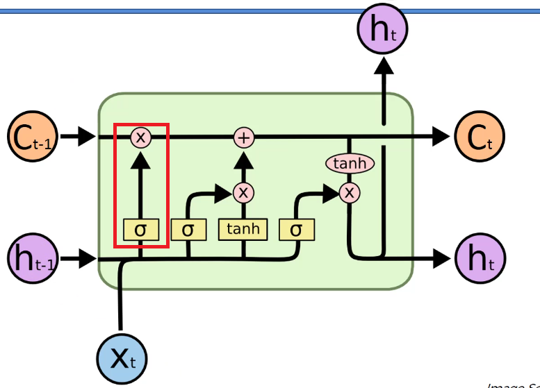
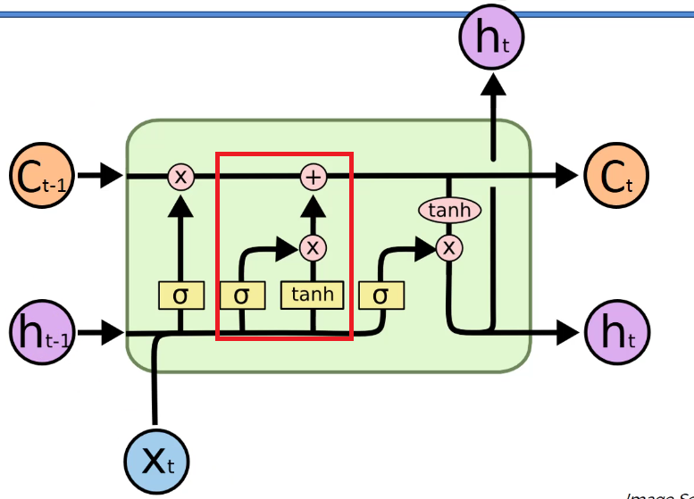
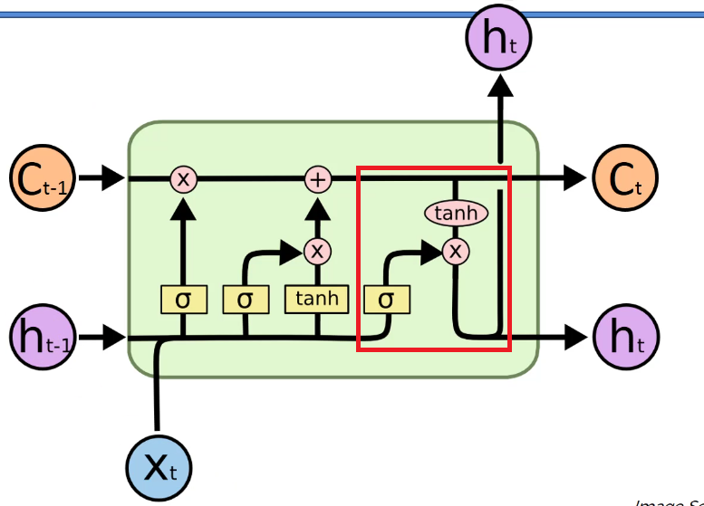

# 📌 LSTM (Long Short-Term Memory)

RNN의 가장 큰 문제는

👉 **기울기 소실 (Vanishing Gradient)**

이었다.



------

그래서 등장한 것이

👉 **LSTM**

------

👉 한 줄 정리
→ **LSTM은 RNN의 기억 문제를 해결한 모델이다**

------

# 1. LSTM의 핵심 아이디어

문제를 다시 생각해보자.

------

## ✔ 문제

- 값을 계속 곱함
- → gradient가 사라짐

------

## ✔ 해결 아이디어

👉 “곱하지 말고 그냥 흘려보내면 되지 않을까?”

------

👉 핵심

👉 **W = 1처럼 만들어버리자**



------

즉,

👉 **값을 유지하는 통로를 만들자**

------

👉 이것이 바로

👉 **Memory Cell (기억 통로)**

------

👉 한 줄 정리
→ **LSTM은 정보를 “흘려보내는 길”을 만든다**

------

# 2. LSTM 구조 한눈에 보기

LSTM은 기존 RNN보다 복잡하다.

하지만 핵심은 딱 하나다.



------

👉 **위쪽에 있는 직선 라인**

👉 이게 핵심이다

------

## ✔ 의미

👉 **기억이 거의 변하지 않고 흐른다**

------

## ✔ 결과

👉 gradient가 사라지지 않음

------

👉 한 줄 정리
→ **기억이 끊기지 않고 이어진다**

------

# 3. LSTM의 구성 요소

LSTM은 3개의 핵심 요소로 이루어진다.



------

## ✔ 입력

- 현재 입력 (X_t)
- 이전 출력 (H_{t-1})
- 이전 기억 (C_{t-1})

즉 **C는 기억을 저장하는 통로이고, H는 그 기억을 기반으로 만들어진 현재 출력이다**

------

## ✔ 출력

- 현재 출력 (H_t)
- 현재 기억 (C_t)

------

👉 핵심

👉 **C (Cell State)가 진짜 기억이다**

------

👉 한 줄 정리
→ **LSTM은 C라는 별도의 기억 공간을 가진다**

------

# 4. LSTM의 핵심 구조: 게이트 (Gate)

LSTM은 기억을 그냥 두지 않는다.

👉 **선택적으로 관리한다**

------

그래서 등장한 것이

👉 **Gate (문)**

------

# 5. Forget Gate (망각 게이트)



👉 “이거 기억 계속 유지할까?”

Ct-1 에서 들어오는 기억들을 망각게이트를 거쳐 기억할지 막을지 결정한다.

```
C_{t-1} × Forget 값
```

- 1 -> 유지
- 0 -> 삭제

------

## ✔ 역할

- 필요 없는 정보 제거

------

## ✔ 동작

- 1 → 유지
- 0 → 삭제

------

👉 한 줄 정리
→ **쓸모없는 기억은 버린다**

------

# 6. Input Gate (입력 게이트)



👉 “새로운 정보 저장할까?”

------

## ✔ 역할

- 현재 정보 중 중요한 것만 기억에 추가

------

## ✔ 특징

- 모든 정보 저장 X
- 선택적으로 저장

```
(저장할 양) × (저장할 내용)
```

------

👉 한 줄 정리
→ **중요한 정보만 저장한다**

------

# 7. Output Gate (출력 게이트)



👉 “지금 어떤 정보를 꺼낼까?”

------

## ✔ 역할

- 기억 중 일부만 출력

------

## ✔ 이유

- 모든 정보가 필요하지 않음

## ✔ 흐름

### ① tanh(C_t)

👉 기억을 압축해서 표현

------

### ② σ

👉 얼마나 출력할지 결정

------

### ③ ×

👉 둘을 곱해서 최종 출력

------

👉 한 줄 정리
→ **필요한 정보만 꺼낸다**

------

# 8. 핵심 포인트 (진짜 중요)

LSTM의 진짜 핵심은 이것이다.

------

👉 기억이 흐르는 길이 따로 있다

👉 그 길은 거의 변화하지 않는다

------

## ✔ 결과

- gradient 유지
- 장기 기억 가능

------

👉 한 줄 정리
→ **기억이 끊기지 않는다**

------

# 9. 번역 예제로 이해하기

문장:

👉 “I am a boy who likes to learn”

------

## ✔ 핵심

👉 “boy” 정보가 중요

------

## ✔ LSTM 동작

- “boy” → 기억 저장
- 이후 단어 처리할 때 계속 사용

------

## ✔ 만약 바뀌면?

👉 “girl”

- 기존 기억 삭제
- 새로운 정보 저장

------

👉 한 줄 정리
→ **중요한 정보는 계속 유지된다**

------

# 11. LSTM의 직관적인 비유

LSTM은 사람 기억과 같다.

------

## ✔ 사람의 기억

- 중요한 것 → 오래 기억
- 필요 없는 것 → 버림
- 필요할 때 → 꺼냄

------

## ✔ LSTM

- Forget → 버림
- Input → 저장
- Output → 꺼냄

------

👉 한 줄 정리
→ **사람처럼 기억한다**

------

# 12. 왜 LSTM이 중요한가?

기존 RNN:

👉 짧은 기억만 가능

------

LSTM:

👉 긴 기억 가능

------

## ✔ 결과

- 번역 가능
- 문장 이해 가능
- 시계열 분석 가능

------

👉 한 줄 정리
→ **긴 문맥을 이해할 수 있다**

------

# 13. 핵심 요약

- RNN은 기울기 소실 문제 존재
- LSTM은 이를 해결하기 위해 등장
- Memory Cell로 정보 유지
- Gate로 정보 선택
- 긴 시퀀스 처리 가능

------

# 🎯 최종 한 줄 정리

👉 **“LSTM은 기억을 유지하면서 필요한 정보만 선택적으로 관리하는 RNN이다.”**
