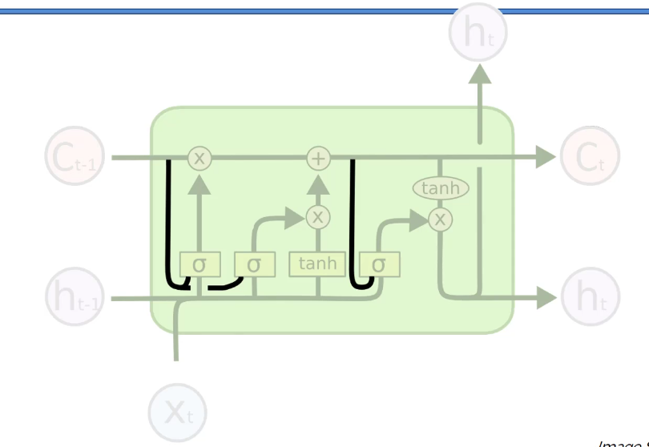
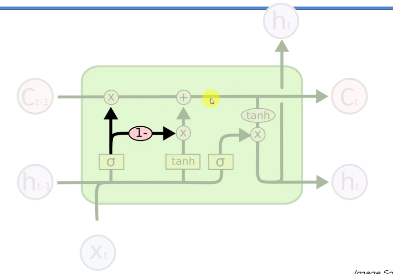
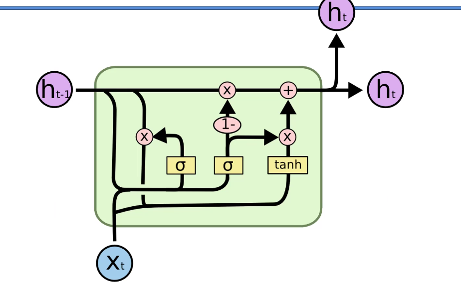

# 📌 LSTM Variations (LSTM 변형 구조)

우리가 지금까지 본 것은
👉 **기본 LSTM**

------

하지만 실제로는

👉 다양한 변형들이 존재한다

------

👉 이유

- 성능 개선
- 계산 효율
- 구조 단순화

------

👉 한 줄 정리
→ **LSTM은 하나가 아니라 여러 버전이 있다**

------

# 1. Peephole LSTM (피프홀 LSTM)

## ✔ 개념

👉 “게이트가 기억을 직접 본다”

------

## ✔ 기존 LSTM

- 게이트 결정 시
  👉 입력 + 이전 출력만 사용

------

## ✔ Peephole 추가

👉 **Memory Cell(C값)을 게이트가 직접 참고**

------

## ✔ 의미

- 더 정확한 판단 가능
- 기억 상태 기반으로 제어

------

## ✔ 직관

👉 “지금 기억 상태를 보고 판단”

------

👉 한 줄 정리
→ **기억을 보면서 게이트를 결정한다**

------

# 2. Coupled Gate LSTM

## ✔ 개념

👉 Forget Gate + Input Gate를 하나로 합침

------

## ✔ 기존

- Forget Gate → 삭제
- Input Gate → 추가

👉 따로 결정

------

## ✔ 변경

👉 하나의 게이트로 동시에 결정

------

## ✔ 동작

- 많이 지우면 → 많이 추가
- 적게 지우면 → 적게 추가

------

## ✔ 장점

- 구조 단순
- 계산량 감소

------

👉 한 줄 정리
→ **삭제와 추가를 하나로 묶는다**

------

# 3. GRU (Gated Recurrent Unit)

👉 가장 중요한 변형 🔥

------

## ✔ 핵심 아이디어

👉 **Memory Cell 제거**

------

## ✔ 기존 LSTM

- C (기억)
- H (출력)

👉 두 개 존재

------

## ✔ GRU

👉 **C와 H를 하나로 합침**

------

## ✔ 결과

- 구조 단순
- 계산 빠름

------

👉 한 줄 정리
→ **기억과 출력을 하나로 합친 구조**

------

## ✔ GRU의 구성

- Update Gate
- Reset Gate

------

## ✔ 역할

👉 Update Gate

- 얼마나 기억 유지할지

👉 Reset Gate

- 얼마나 과거 무시할지

------

👉 한 줄 정리
→ **GRU는 더 단순한 LSTM이다**

------

# 4. LSTM vs GRU (핵심 비교)

이건 진짜 중요 🔥

------

## ✔ LSTM

- 구조 복잡
- 성능 안정적
- 긴 문장에 강함

------

## ✔ GRU

- 구조 단순
- 빠름
- 적은 데이터에 강함

------

👉 한 줄 정리
→ **LSTM = 정교 / GRU = 효율**

------

# 5. 왜 이렇게 많은 변형이 있을까?

👉 이유는 단 하나

------

## ✔ Trade-off

- 성능 vs 속도
- 정확도 vs 단순성

------

👉 상황에 따라 선택

------

👉 한 줄 정리
→ **상황에 맞게 선택한다**

------

# 6. 전체 구조 흐름 정리

지금까지 전체 흐름:

------

## ✔ 1단계

RNN
👉 순서 처리

------

## ✔ 2단계

문제
👉 Vanishing Gradient

------

## ✔ 3단계

LSTM
👉 해결

------

## ✔ 4단계

실제 동작
👉 패턴 학습

------

## ✔ 5단계

Variations
👉 구조 개선

------

# 🎯 최종 한 줄 정리

👉 **“LSTM은 다양한 변형을 통해 성능과 효율을 개선한 RNN 구조이다.”**
