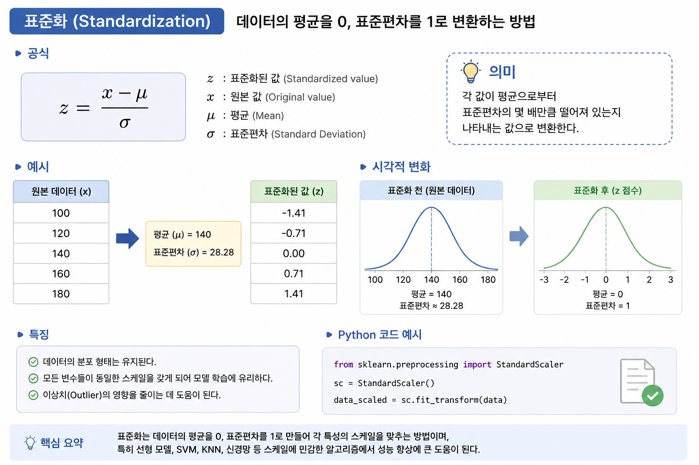
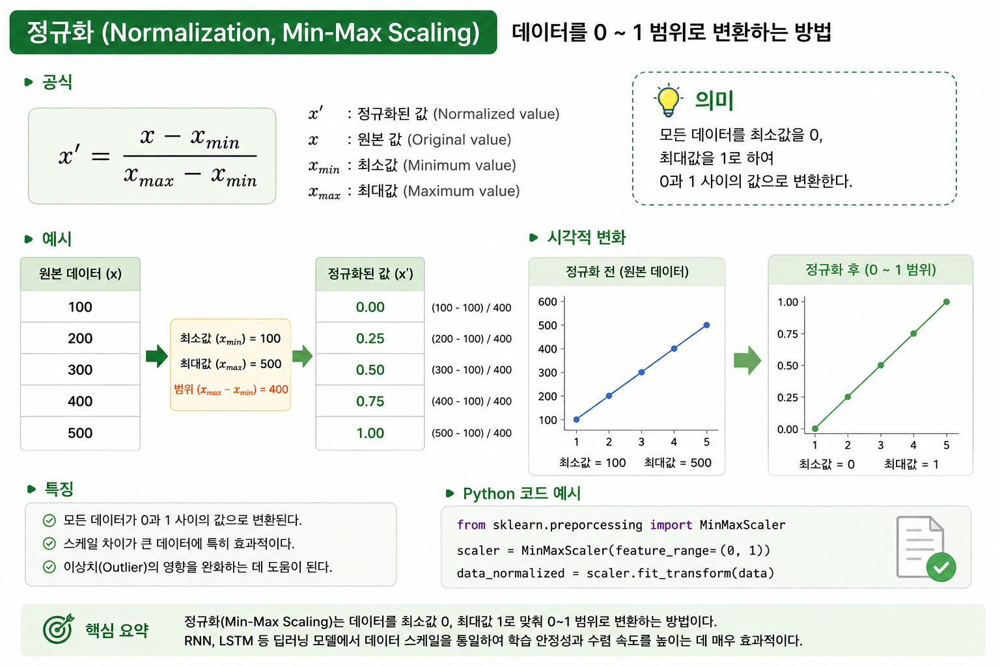

# 📌 RNN 데이터 전처리 - Feature Scaling 정리

## 1. 이번 단계의 목표

이번 단계에서는 RNN 학습 전에 반드시 필요한:

- **Feature Scaling**
- 즉 데이터 값 범위를 조정하는 작업을 수행한다.

특히 이번 실습에서는:

> **Normalization(Min-Max Scaling)**

방식을 사용한다.

------

# 2. 왜 Feature Scaling이 필요한가?

RNN은 숫자의 크기에 매우 민감하다.

예를 들어:

| 데이터 |
| ------ |
| 100    |
| 1000   |
| 5000   |

처럼 값 차이가 너무 크면:

- 학습이 불안정해지고
- Gradient 계산이 어려워지고
- 학습 속도가 느려질 수 있다.

따라서:

> 데이터 범위를 일정하게 맞춰주는 작업이 필요하다.

------

# 3. Feature Scaling 대표 방법

## ① Standardization (표준화)



------

## ✔ 특징

변환 후:

- 평균 ≈ 0
- 표준편차 ≈ 1

형태가 된다.

------

# ② Normalization (정규화)



------

## ✔ 예시

| 값           | 결과 |
| ------------ | ---- |
| 최소값 = 100 | 0    |
| 최대값 = 500 | 1    |
| 현재값 = 300 | 0.5  |

즉:

> 모든 데이터가 0~1 사이 값으로 변환된다.

------

# 4. 왜 RNN에서는 Normalization을 많이 사용하는가?

특히 RNN/LSTM에서:

- 출력층 activation function이 sigmoid인 경우
- Normalization이 훨씬 안정적이다.

------

## ✔ sigmoid 함수 특징


sigmoid 출력 범위는:

```python
0 ~ 1
```

이다.

------

## ✔ 따라서

입력 데이터도:

```python
0 ~ 1
```

범위로 맞춰주면:

- 학습 안정성 증가
- Gradient 문제 감소
- 수렴 속도 향상

효과가 있다.

------

# 5. MinMaxScaler 사용

## ✔ import

```python
from sklearn.preprocessing import MinMaxScaler
```

Scikit-Learn의 전처리 도구 사용

------

# 6. Scaler 객체 생성

## ✔ 코드

```python
sc = MinMaxScaler(feature_range = (0, 1))
```

------

## ✔ 의미

데이터를:

```python
0 ~ 1
```

범위로 변환하겠다는 뜻이다.

------

# 7. 데이터 정규화 수행

## ✔ 코드

```python
training_set_scaled = sc.fit_transform(training_set)
```

------

# 8. fit_transform 구조 이해

이 부분이 매우 중요하다.

------

## ✔ fit()

데이터를 분석한다.

즉:

- 최소값(min)
- 최대값(max)

을 찾는다.

예:

| 값        |
| --------- |
| min = 100 |
| max = 500 |

------

## ✔ transform()

실제로 공식 적용

예:

| 원본 | 변환 |
| ---- | ---- |
| 100  | 0    |
| 300  | 0.5  |
| 500  | 1    |

------

## ✔ fit_transform()

두 작업을 한 번에 수행

```python
fit + transform
```

이다.

------

# 9. 왜 새로운 변수에 저장하는가?

## ✔ 코드

```python
training_set_scaled
```

를 새로 만든 이유는:

원본 데이터:

```python
training_set
```

을 보존하기 위해서다.

------

## ✔ 실무에서도 중요

원본 데이터를 유지해야:

- inverse_transform()
- 디버깅
- 시각화
- 결과 비교

가 가능하다.

------

# 10. 결과 데이터 형태

정규화 후에도 shape은 유지된다.

## ✔ 결과

```python
(1258, 1)
```

------

## ✔ 의미

| 값   | 의미                 |
| ---- | -------------------- |
| 1258 | 데이터 개수(samples) |
| 1    | feature(Open Price)  |

------

# 11. 실제 데이터 변화 예시

## ✔ 정규화 전

```python
[[325.25],
 [330.10],
 [340.50]]
```

------

## ✔ 정규화 후

```python
[[0.12],
 [0.14],
 [0.18]]
```

즉:

> 숫자 크기는 줄었지만 데이터 패턴은 유지된다.

------

# 12. 이번 단계의 핵심 목적

이번 단계의 진짜 목적은:

> RNN이 안정적으로 학습 가능한 입력 범위를 만드는 것

이다.

즉:

- 데이터 범위 통일
- 학습 안정화
- sigmoid와 출력 범위 맞춤

과정을 수행한 것이다.

------

# 🎯 최종 핵심 정리

- RNN은 입력 데이터 크기에 민감하다.
- 따라서 Feature Scaling이 필요하다.
- 이번 실습에서는 Normalization(Min-Max Scaling)을 사용한다.
- `MinMaxScaler` 로 데이터를 0~1 범위로 변환한다.
- `fit()` 은 min/max를 찾고
- `transform()` 은 실제 변환을 수행한다.
- 최종 데이터 shape은 `(1258, 1)` 그대로 유지된다.

------

# 🔥 한 줄 최종 정리

> 이번 단계는 Google 주가 데이터를 0~1 범위로 정규화하여 RNN이 안정적으로 학습할 수 있는 형태로 만드는 과정이다.
