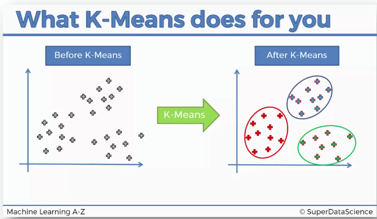
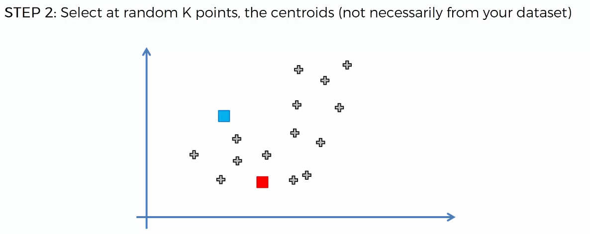
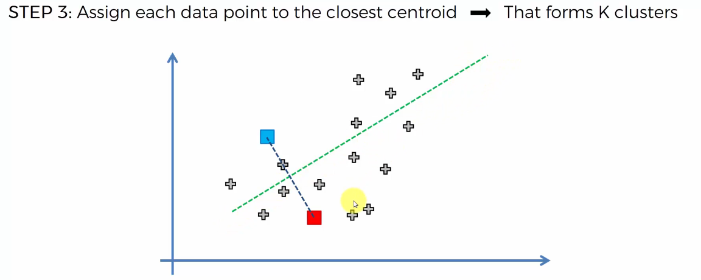
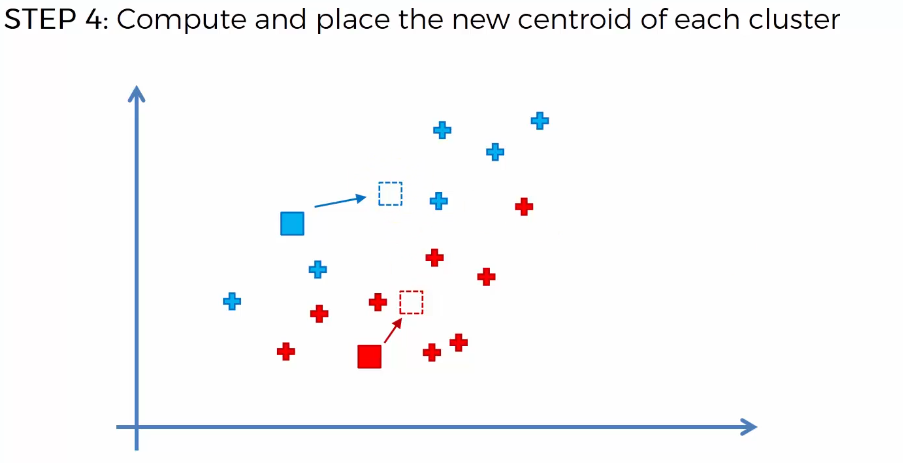
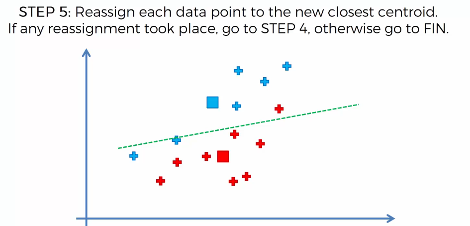

# 1. 이번 강의에서 배우는 것

이번 강의의 목표는: **K-Means를 직관적으로 이해하는 것**이다.

------

# 2. K-Means란?

K-Means는 데이터를 **비슷한 것끼리 묶어주는 알고리즘**이다.



이렇게 묶인 그룹을: **Cluster**라고 한다.

즉:

```text
비슷한 데이터들의 묶음 = Cluster
```

👉 핵심:

K-Means는 데이터 안에서
우리가 직접 생각하지 못했던 그룹을 찾아준다.

------

# 3. 예시: 산점도

두 개의 변수가 있다고 해보자.

그래서 하나는 X축, 다른 하나는 Y축에 놓는다. 그러면 데이터들이 점처럼 찍힌다.

이걸: **Scatter Plot**, 즉 **산점도** 라고 한다.

------

# 4. 여기서 생기는 질문

산점도를 보면 이런 질문이 생긴다.

👉 “이 데이터 안에 그룹이 있을까?”

예를 들면:

- 2개의 그룹인가?
- 3개의 그룹인가?
- 4개의 그룹인가?
- 5개의 그룹인가?

또는:

👉 “어떤 점들이 같은 그룹일까?”

이걸 사람이 직접 판단하기는 애매하다.

------

# 5. K-Means가 해주는 일

K-Means는 이 복잡한 판단을 대신 해준다.

즉:

- 몇 개의 그룹으로 나눌지 정하고
- 각 데이터가 어느 그룹에 가까운지 계산하고
- 비슷한 데이터끼리 묶는다

결과적으로 데이터 안의
**Cluster**를 찾아준다.

------

# 6. 2차원 예시는 단순한 예시일 뿐

강의에서는 이해를 쉽게 하기 위해
2차원 산점도를 사용한다.

즉:

```text
변수 2개 → X축, Y축에 표시
```

하지만 실제 K-Means는
2차원에서만 쓰는 것이 아니다.

K-Means는:

- 3차원
- 4차원
- 5차원
- 10차원
- 100차원

같은 데이터에도 사용할 수 있다.

👉 단지 화면에 그려서 보여주기 어렵기 때문에
강의에서는 2차원 예시로 설명하는 것이다.

------

# 7. K-Means의 전체 과정

K-Means는 다음 순서로 동작한다.

1. Cluster 개수 K를 정한다
2. K개의 중심점 Centroid를 랜덤으로 선택한다
3. 각 데이터를 가장 가까운 Centroid에 배정한다
4. 각 Cluster의 새로운 Centroid를 계산한다
5. 다시 각 데이터를 가장 가까운 Centroid에 배정한다
6. 더 이상 바뀌지 않을 때까지 반복한다

------

# 8. Step 1. Cluster 개수 K 정하기

첫 번째 단계는 Cluster 개수 K를 정하는 것이다.

예를 들어:

```text
K = 2
```

라고 정하면 데이터를 2개의 그룹으로 나누겠다는 뜻이다.

```text
K = 3
```

이면 3개의 그룹으로 나누겠다는 뜻이다.

👉 여기서 K는
**Cluster의 개수**이다.

------

# 9. Step 2. Centroid 선택하기



두 번째 단계는 K개의 중심점을 랜덤으로 선택하는 것이다.

이 중심점을: **Centroid** 라고 한다.

Centroid는 반드시 실제 데이터 점일 필요는 없다.

즉:

- 실제 데이터 중 하나여도 되고
- 산점도 위의 아무 위치여도 된다

중요한 것은:

👉 K개만큼 중심점을 선택한다는 것

이다.

------

# 10. Step 3. 가까운 Centroid에 데이터 배정

세 번째 단계는
각 데이터 점을 가장 가까운 Centroid에 배정하는 것이다.

예를 들어 Centroid가 두 개라면:

- 파란 Centroid
- 빨간 Centroid

가 있다고 해보자.

각 데이터 점은 둘 중 더 가까운 Centroid 쪽으로 배정된다.

즉:

```text
파란 Centroid에 가까움 → 파란 Cluster
빨간 Centroid에 가까움 → 빨간 Cluster
```

------

# 11. 여기서 “가깝다”의 의미

여기서 중요한 점이 있다. **가깝다**라는 말은 생각보다 애매하다.

왜냐하면 거리 계산 방법이 여러 가지이기 때문이다.

강의에서는 가장 기본적인 거리인:

**Euclidean Distance** 를 사용한다.

쉽게 말하면: **두 점 사이의 직선 거리**이다.

👉 우리가 일반적으로 생각하는 기하학적 거리라고 보면 된다.

------

# 12. 빠르게 나누는 방법



두 Centroid가 있을 때 각 점을 하나씩 계산해도 된다.

하지만 2차원에서는 더 쉽게 볼 수 있다.

방법은:

1. 두 Centroid를 선으로 연결
2. 그 선의 가운데 지점을 찾음
3. 가운데를 지나면서 수직인 선을 그림

이 수직선을 기준으로 양쪽 영역이 나뉜다.

👉 이 선 위의 점들은 두 Centroid까지의 거리가 같다.

그래서:

- 선 위쪽 점들은 파란 Centroid에 더 가까움
- 선 아래쪽 점들은 빨간 Centroid에 더 가까움

이런 식으로 빠르게 나눌 수 있다.

------

# 13. Step 4. 새로운 Centroid 계산



이제 각 Cluster가 만들어졌다.

그다음에는 각 Cluster의 새로운 중심점을 계산한다.

쉽게 말하면: **각 Cluster에 속한 점들의 평균 위치를 찾는 것** 이다.

비유하면:

각 데이터 점이 무게를 가진다고 생각한다.

그러면 그 점들의 무게 중심이 생긴다.

그 무게 중심이 바로 새로운 Centroid가 된다.

------

# 14. 2차원에서 Centroid 계산 느낌

2차원에서는 X좌표와 Y좌표가 있다.

새로운 Centroid는:

- Cluster에 속한 점들의 X좌표 평균
- Cluster에 속한 점들의 Y좌표 평균

으로 구할 수 있다.

즉:

```text
새 Centroid = 점들의 평균 위치
```

이다.

------

# 15. Step 5. 다시 가까운 Centroid에 배정



Centroid 위치가 바뀌었으므로
각 데이터 점이 속해야 할 Cluster도 바뀔 수 있다.

그래서 다시 확인한다.

👉 “이 점은 이제 어느 Centroid에 더 가까운가?”

만약 더 가까운 Centroid가 바뀌었다면
그 점은 다른 Cluster로 재배정된다.

------

# 16. 반복 과정

K-Means는 여기서 끝나지 않는다.

다음 과정을 반복한다.

```text
새 Centroid 계산
→ 데이터 재배정
→ 새 Centroid 계산
→ 데이터 재배정
→ ...
```

이 과정을 계속 반복한다.

------

# 17. 언제 멈출까?

더 이상 데이터 점들이
다른 Cluster로 이동하지 않으면 멈춘다.

즉:

```text
재배정되는 데이터가 없음
```

이 상태가 되면
알고리즘이 수렴했다고 말한다.

영어로는: **Converged** 라고 한다.

------

# 18. 최종 결과

수렴하면 최종 Cluster가 결정된다.

이제 각 데이터는
자신에게 가장 적절한 Cluster에 속하게 된다.

결과적으로 K-Means는
데이터를 K개의 그룹으로 나눈다.

------

# 19. 중요한 점

K-Means 결과가 항상
사람 눈에 처음 보이는 그룹과 같지는 않다.

사람은 이렇게 생각할 수 있다.

- 위쪽 그룹 / 아래쪽 그룹
- 왼쪽 그룹 / 오른쪽 그룹
- 작은 묶음 여러 개

하지만 K-Means는 거리와 중심점을 기준으로 계산한다.

그래서 사람이 예상한 것과 다른 결과가 나올 수도 있다.

------

# 20. 전체 흐름 정리

K-Means의 전체 흐름은 이렇다.

```text
K 정하기
→ K개의 Centroid 랜덤 선택
→ 각 데이터를 가까운 Centroid에 배정
→ Cluster별 평균 위치로 Centroid 이동
→ 다시 데이터 재배정
→ 변화가 없을 때까지 반복
→ 최종 Cluster 완성
```

------

# 21. 한 줄 핵심 정리

👉 K-Means는
**중심점 Centroid를 움직이면서
데이터를 가까운 그룹으로 반복해서 나누는 군집화 알고리즘**이다.
