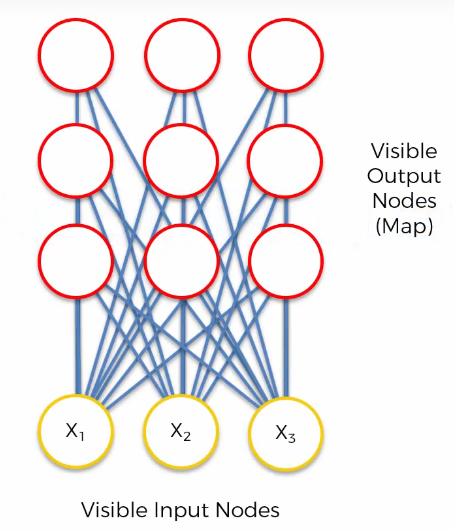
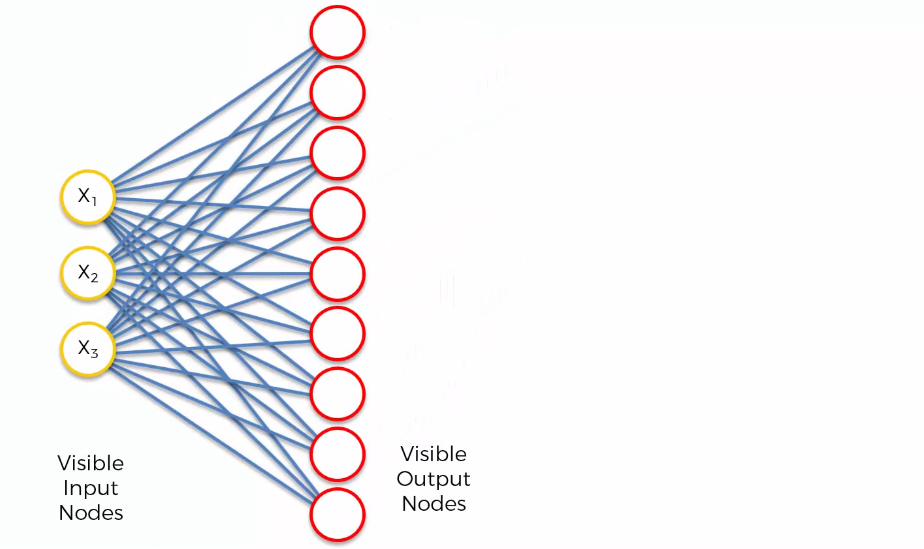
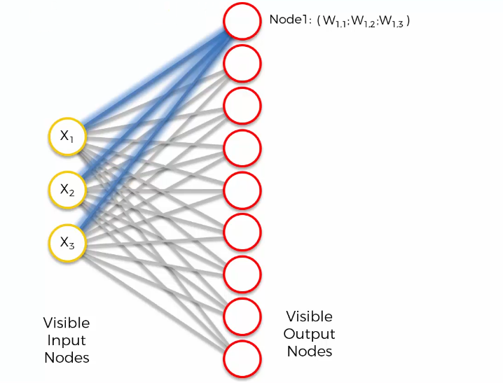
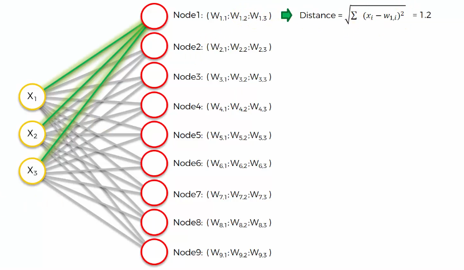
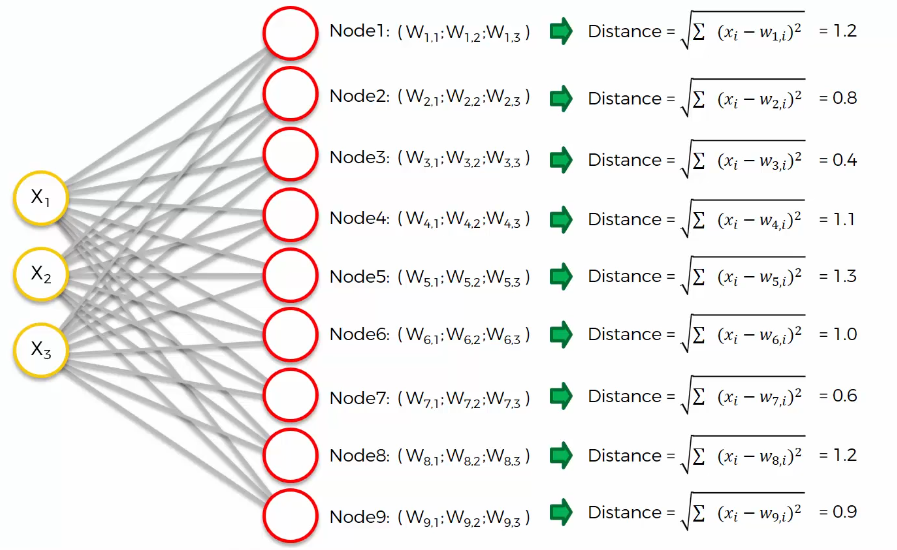
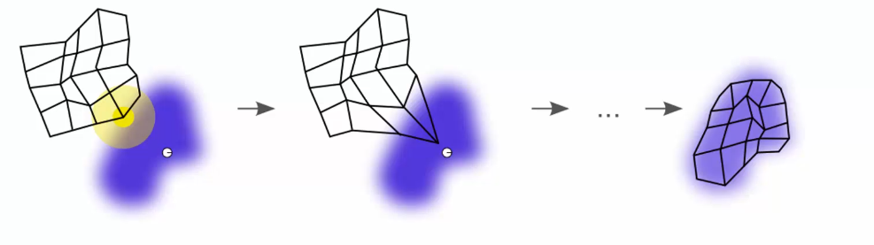
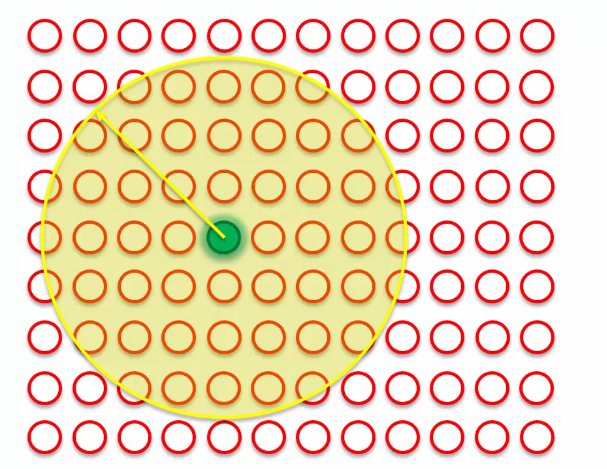
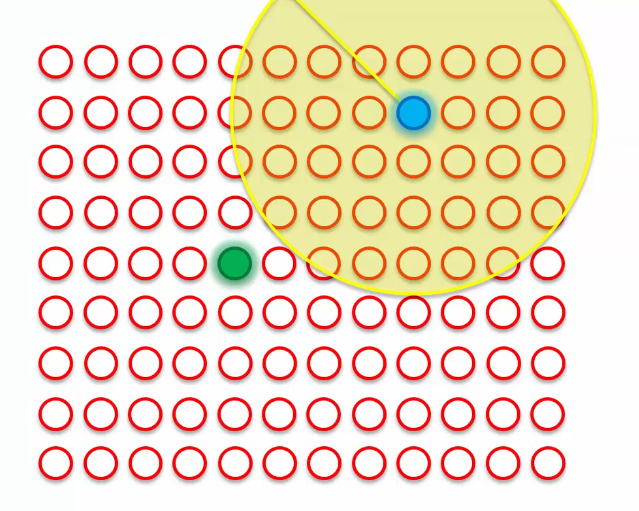
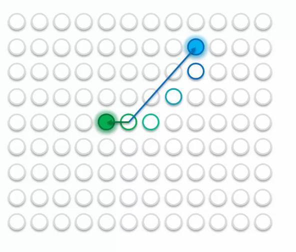

# 1. 이번 강의에서 배우는 것

이전 강의에서는
 **Self-Organizing Map이 어떻게 동작하는지**를 봤다.

이번 강의에서는 

**Self-Organizing Map이 어떻게 학습하는가** 를 배운다. 

------

# 2. 예시 구조

아주 간단한 SOM 예시를 보자.



입력에는 feature가 3개 있다.

즉:

```
X1, X2, X3
```

이렇게 3개의 값이 들어간다. 출력에는 node가 9개 있다.

------

# 3. 그런데 왜 차원 축소일까?

여기서 헷갈릴 수 있다.

입력은 feature가 3개인데,  출력 node는 9개처럼 보인다.

그러면 이렇게 생각할 수 있다.

👉 “입력보다 출력이 더 많은데 왜 차원 축소야?”

하지만 여기서 중요한 건  node 개수가 아니다.

중요한 건: **입력 데이터의 차원과 출력 지도의 차원**이다.

------

# 4. 입력 데이터의 차원

입력 데이터에 feature가 3개라면 각 데이터는 3차원 공간의 한 점이다.

예를 들어:

```
X1, X2, X3
```

이 세 값이 하나의 데이터를 만든다.

즉:

```
하나의 row = 3차원 공간의 한 점
```

이다.

------

# 5. SOM의 출력 차원

SOM의 출력은 항상 **2차원 지도** 형태이다.

즉:

```
3차원 입력 데이터
→ SOM
→ 2차원 지도
```

가 된다.

👉 그래서 SOM은 차원 축소를 한다고 말한다.

------

# 6. 기존 신경망처럼 그려보기

SOM도 그림을 돌려서 보면
 ANN, CNN, RNN에서 봤던 신경망 구조처럼 표현할 수 있다.



입력 node가 있고, 출력 node가 있고, 그 사이에 연결이 있다.

하지만 중요한 점: **그림만 비슷할 뿐, 의미는 다르다.**

------

# 7. SOM은 기존 신경망과 다르다

SOM은 ANN, CNN, RNN과 많이 다르다.

특히 지도학습 신경망과 다르다.

차이는 크게 두 가지이다.

1. SOM은 훨씬 단순하다
2. 같은 용어라도 의미가 다를 수 있다

------

# 8. 조심해야 할 용어

SOM에서도 이런 단어가 나온다.

- weight
- synapse
- node

하지만 ANN에서 배운 의미와
 완전히 같다고 생각하면 헷갈릴 수 있다.

👉 특히 weight의 의미가 다르다.

------

# 9. ANN에서 weight의 의미

ANN에서는 weight가 입력값에 곱해진다.

흐름은 보통 이렇다.

```
입력값 × weight
→ 모두 더함
→ activation function 적용
→ 출력
```

즉, ANN에서 weight는 입력값의 영향력을 조절하는 값이다.

------

# 10. SOM에서 weight의 의미

SOM에서는 activation function이 없다.

그리고 weight는 단순히 곱하는 값이 아니다.

SOM에서 weight는: **출력 node가 입력 공간 안에서 가지는 좌표** 라고 보면 된다.

------

# 11. 쉽게 말하면



입력 데이터가 3차원이라면 각 데이터는 이런 좌표를 가진다.

```
(X1, X2, X3)
```

SOM의 각 node도 자기만의 좌표를 가진다.

그 좌표가 바로 weight이다. 예를 들어 첫 번째 node의 weight가:

```
(W11, W12, W13)
```

라면 이 node는 입력 공간 안에서 하나의 가상 점처럼 존재하는 것이다.

------

# 12. 핵심 비유

SOM의 출력 node는 입력 공간 안에 실제로 존재하는 데이터는 아니다.

하지만 마치 입력 공간 안에 있는 것처럼 자기 위치를 가진다.

👉 그래서 각 node는 **입력 공간 안의 가상의 데이터 포인트** 라고 생각하면 된다.

------

# 13. feature가 많아지면?

입력 feature가 3개면
 각 node는 weight를 3개 가진다.

입력 feature가 20개면
 각 node는 weight를 20개 가진다.

즉:

```
입력 feature 개수 = 각 node가 가지는 weight 개수
```

이다.

------

# 14. 초기 weight

알고리즘이 시작될 때 각 node의 weight는 보통 랜덤으로 정해진다.

대개:

- 0에 가까운 값
- 하지만 정확히 0은 아닌 값

으로 초기화된다.

그래서 처음에는 각 node가 입력 공간 안의 랜덤한 위치에 있다고 보면 된다.

------

# 15. 이제 경쟁이 시작된다

SOM 학습의 핵심은: **node들끼리 경쟁하는 것** 이다.

각 데이터 row를 하나씩 넣고, 그 row와 가장 가까운 node를 찾는다.

------

# 16. 첫 번째 row를 넣어보자

데이터셋의 첫 번째 row가 있다고 하자.

이 row는 feature가 3개이므로:

```
X1, X2, X3
```

값을 가진다.

이제 이 row와 각 SOM node 사이의 거리를 계산한다.

------

# 17. 거리 계산



거리 계산은 보통 **Euclidean Distance**를 사용한다.

쉽게 말하면: **두 점 사이의 직선 거리** 이다.

예를 들어 첫 번째 node와의 거리는:

```
√((X1 - W11)² + (X2 - W12)² + (X3 - W13)²)
```

로 계산한다.

------

# 18. 모든 node와 비교한다

첫 번째 row에 대해모든 node와 거리를 계산한다.



예를 들어:

```
node 1과 거리 = 1.2
node 2와 거리 = 0.8
node 3과 거리 = 0.4
node 4와 거리 = 1.1
...
```

이런 식이다.

가장 거리가 작은 node가 그 row와 가장 비슷한 node이다.

------

# 19. BMU

가장 가까운 node를 **BMU**라고 한다.

BMU는: **Best Matching Unit**의 약자이다.

뜻은 **가장 잘 맞는 node**이다.

👉 즉: 현재 입력 row와 가장 가까운 SOM node이다.

------

# 20. 입력값 스케일링이 필요한 이유

거리 계산을 제대로 하려면 입력값들의 스케일이 비슷해야 한다.

그래서 SOM에 넣기 전에 보통:

- Normalization
- Standardization

을 한다.

특히 입력값을 0과 1 사이로 맞추는 경우가 많다.

👉 이유: feature마다 값의 범위가 다르면 거리 계산이 한쪽 feature에 치우칠 수 있기 때문이다.

------

# 21. BMU를 찾은 다음

BMU를 찾으면 끝이 아니다.

이제 SOM은 weight를 업데이트한다.

여기서 weight 업데이트란: **BMU가 현재 입력 row에 더 가까워지도록 위치를 이동시키는 것**이다.

------

# 22. 왜 weight를 바꿀까?

입력 데이터 자체는 바꿀 수 없다.

우리가 바꿀 수 있는 것은 SOM node의 weight뿐이다.

그래서 BMU의 weight를 조정해서  현재 입력 row에 더 가까워지게 만든다.

------

# 23. 시각적으로 이해하기

입력 row가 하나의 점이라고 하자.

BMU는 그 점과 가장 가까운 SOM node이다.

학습이 일어나면:

👉 BMU가 입력 row 쪽으로 조금 끌려간다.

즉:

```
BMU 위치
→ 입력 데이터 방향으로 이동
```

한다.



------

# 24. 그래서 Self-Organizing Map이다

SOM은 데이터에 맞춰 스스로 구조를 바꾼다.

즉:

- 입력 데이터를 보고
- 가까운 node를 찾고
- 그 node를 데이터 쪽으로 이동시키고
- 주변 node도 함께 이동시킨다

그래서 이름이: **Self-Organizing Map**이다.

스스로 조직화되는 지도라는 뜻이다.

------

# 25. 주변 node도 같이 움직인다

중요한 점:

BMU만 움직이는 것이 아니다.

BMU 주변에 있는 node들도 같이 움직인다.

단, 모두 똑같이 움직이는 것은 아니다.

------

# 26. Radius 개념

BMU 주변에는 일정한 반경이 있다.

이 반경을 **Radius**라고 생각하면 된다.

이 Radius 안에 있는 node들은 BMU와 함께 업데이트된다.

즉:

```
BMU 주변 Radius 안의 node들
→ 현재 입력 row 방향으로 같이 이동
```

한다.



------

# 27. 가까울수록 더 많이 움직인다

Radius 안에 있는 node들도
 BMU와의 거리에 따라 다르게 움직인다.

- BMU에 가까운 node → 많이 이동
- BMU에서 먼 node → 조금 이동

👉 핵심:

BMU에 가까울수록
 현재 입력 데이터의 영향을 더 크게 받는다.

------

# 28. 끌어당기는 느낌

이 과정을 쉽게 생각하면:

**줄로 연결된 점들을 끌어당기는 것**

과 비슷하다.

BMU를 입력 데이터 쪽으로 당기면,
 주변 node들도 같이 따라온다.

하지만 가까운 node는 많이 끌려오고,
 먼 node는 조금만 끌려온다.

------

# 29. 두 번째 row도 반복

이제 두 번째 row를 넣으면 또 다른 BMU가 선택될 수 있다.

그 BMU도 현재 row 쪽으로 이동한다.

그리고 그 주변 Radius 안의 node들도 같이 이동한다.



------

# 30. 여러 BMU가 서로 영향을 준다

각 row마다 BMU가 다를 수 있다.

그러면 SOM의 여러 영역이
 서로 다른 데이터 방향으로 끌려간다.

예를 들어:

- 어떤 node는 첫 번째 BMU에 더 가까움
- 어떤 node는 두 번째 BMU에 더 가까움
- 어떤 node는 둘 다의 영향을 조금씩 받음

이런 식이다.

------

# 31. 그래서 색깔이 나뉘는 느낌

강의에서는 이를 색깔로 설명한다.



예를 들어:

- 파란 BMU에 가까운 node → 파란색에 가까워짐
- 초록 BMU에 가까운 node → 초록색에 가까워짐
- 둘 다 영향을 받는 node → 중간색이 됨

즉, SOM의 각 node는 가까운 데이터들의 영향을 받아
 점점 자기 역할을 갖게 된다.

------

# 32. 전체 흐름 정리

SOM 학습 흐름은 이렇다.

```
입력 row 하나 선택
→ 모든 node와 거리 계산
→ 가장 가까운 node 선택
→ 그 node를 BMU라고 부름
→ BMU를 입력 row 쪽으로 이동
→ BMU 주변 node들도 같이 이동
→ 다음 row에서도 반복
→ 전체 map이 데이터 구조에 맞게 정리됨
```

------

# 33. 한 줄 핵심 정리

👉 SOM은 **입력 데이터와 가장 가까운 node를 찾고, 그 node와 주변 node들을 데이터 쪽으로 조금씩 끌어당기면서 스스로 2차원 지도를 만들어가는 알고리즘**이다.**
