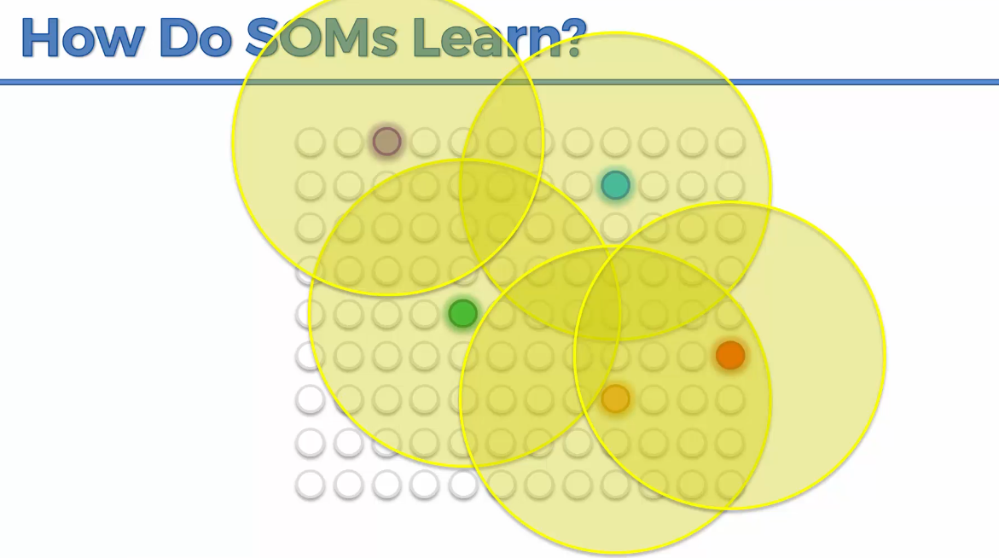

# 1. 이번 강의에서 배우는 것

**Self-Organizing Map이 어떻게 학습하는지**

를 계속 살펴본다.

------

# 2. 이전 강의에서 배운 것

이전에는 다음 내용을 배웠다.

- BMU를 찾는 방법
- BMU의 weight를 업데이트하는 방법
- BMU 주변 node들도 같이 업데이트되는 방법

여기서 BMU는: **Best Matching Unit**

즉: **현재 입력 데이터와 가장 가까운 node** 이다.

------

# 3. 이번에는 BMU가 여러 개 있는 경우

이번에는 조금 더 복잡한 예시를 본다.

예를 들어 BMU가 5개 있다고 해보자.

각 BMU는
자신과 매칭된 데이터 row에 더 가까워지도록 업데이트된다.

즉:

```text
BMU
→ 자신과 가장 잘 맞는 입력 데이터 쪽으로 이동
```

한다.

------

# 4. 각 BMU에는 주변 영역이 있다

각 BMU 주변에는 일정한 영역이 있다.



이 영역은 **Radius**로 정해진다.

즉:

```text
BMU 중심
→ 일정 반경 안의 node들
→ 같이 업데이트
```

되는 구조이다.

------

# 5. Radius 안의 node들도 움직인다

BMU만 움직이는 것이 아니다.

Radius 안에 있는 node들도 BMU와 함께 움직인다.

예를 들어:

- 보라색 BMU 주변 node들 업데이트
- 파란색 BMU 주변 node들 업데이트
- 초록색 BMU 주변 node들 업데이트
- 빨간색 BMU 주변 node들 업데이트
- 주황색 BMU 주변 node들 업데이트

이런 식이다.

------

# 6. 끌어당기는 힘

각 BMU는 자신과 매칭된 데이터 row 쪽으로 움직인다.

그리고 주변 node들도 같이 끌고 간다.

쉽게 말하면:

👉 BMU가 주변 node들을 끌어당긴다.

하지만 여러 BMU가 있으면 서로 다른 방향으로 끌어당긴다.

------

# 7. 서로 밀고 당기는 느낌

예를 들어 어떤 node가 있다고 하자.

이 node는 여러 BMU의 영향을 받을 수 있다.

- 파란 BMU는 한쪽으로 끌어당김
- 주황 BMU는 다른 쪽으로 끌어당김
- 빨간 BMU도 다른 방향으로 끌어당김
- 초록 BMU도 영향을 줌

그래서 SOM 안에서는
약간의 **밀고 당김**이 생긴다.

👉 이것이 SOM이 데이터 구조에 맞게
스스로 정리되는 과정이다.

------

# 8. Epoch가 지나면 Radius가 줄어든다

SOM 학습에서 중요한 특징이 있다.

학습이 진행될수록 Radius가 점점 작아진다.

처음에는 Radius가 크다.

그래서 많은 node들이 함께 움직인다.

하지만 시간이 지나면:

```text
큰 Radius
→ 중간 Radius
→ 작은 Radius
```

이렇게 줄어든다.

------

# 9. 왜 Radius를 줄일까?

처음에는 전체 SOM을
대략적으로 데이터 근처로 가져가야 한다.

그래서 넓은 영역을 같이 움직인다.

즉:

```text
처음: 전체 구조를 대충 맞춤
```

그다음에는 점점 세밀하게 조정한다.

```text
나중: 작은 부분을 정확하게 맞춤
```

👉 그래서 Radius가 줄어드는 것이다.

------

# 10. 처음에는 크게, 나중에는 정밀하게

SOM 학습은 이런 느낌이다.

처음에는:

- 전체 map을 데이터 쪽으로 크게 이동
- 대략적인 구조를 맞춤

나중에는:

- 작은 부분만 조정
- 세부적인 차이를 맞춤
- 더 정확한 map을 만듦

------

# 11. 비유로 이해하기

처음에는 큰 천을 데이터 위에 덮는 느낌이다.

처음에는 대충 전체 모양을 맞춘다.

그다음에는:

- 여기 조금 조정
- 저기 조금 조정
- 튀어나온 부분 맞춤
- 들어간 부분 맞춤

이런 식으로 점점 세밀하게 맞춘다.

👉 그래서 SOM은 데이터의 모양을 따라가는
지도처럼 변한다.

------

# 12. SOM이 학습하면서 만드는 것

반복이 많이 진행되면 SOM은 데이터의 구조를 따라간다.

즉:

```text
입력 데이터의 구조
→ SOM이 따라가며 정리됨
```

결과적으로 SOM은 데이터를 표현하는 2차원 지도가 된다.

------

# 13. 중요한 특징 1: Topology를 보존한다

SOM의 중요한 특징 중 하나는 **입력 데이터의 topology를 보존한다** 는 것이다.

Topology는 쉽게 말하면 **데이터 사이의 위치 관계나 구조** 이다.

즉:

- 가까운 데이터는 지도에서도 가깝게
- 비슷한 데이터는 비슷한 영역에
- 서로 관련 있는 데이터는 연결된 구조로

표현하려고 한다.

------

# 14. 왜 Topology 보존이 중요할까?

데이터 안에는 관계가 있다.

예를 들어:

- 비슷한 고객
- 비슷한 국가
- 비슷한 질병
- 비슷한 장비
- 비슷한 패턴

이런 관계가 있을 수 있다.

SOM은 이런 관계를 2차원 지도 위에 최대한 유지하려고 한다.

👉 그래서 데이터를 이해하기 쉬워진다.

------

# 15. 중요한 특징 2: 숨은 상관관계를 보여준다

SOM은 사람이 쉽게 찾기 어려운
상관관계도 보여줄 수 있다.

예를 들어 데이터에 컬럼이 많으면:

- 20개
- 30개
- 50개
- 100개 이상

사람이 직접 관계를 찾기 어렵다.

하지만 SOM은 이 데이터를 분석해서
지도 위에 정리해준다.

------

# 16. SOM이 유용한 이유

SOM을 사용하면:

- 비슷한 데이터가 어디에 모이는지 볼 수 있음
- 어떤 데이터들이 서로 관련 있는지 볼 수 있음
- 예상하지 못한 패턴을 발견할 수 있음
- 고차원 데이터를 2차원으로 이해할 수 있음

------

# 17. 중요한 특징 3: 정답 없이 분류한다

SOM은 **비지도 학습**이다. 즉, 0**label이 필요 없다.**

예를 들어 CNN에서는:

```text
이건 고양이
이건 강아지
```

처럼 정답 label을 주고 학습한다.

하지만 SOM은 그런 정답이 없다.

그냥 데이터만 보고 스스로 구조를 찾는다.

------

# 18. SOM은 무엇을 찾아낼까?

SOM은 정답 없이도
데이터 안에서 다음을 찾아낼 수 있다.

- 특징
- 의존 관계
- 유사성
- 상관관계
- 숨은 패턴

그래서 SOM은 특히 **무엇을 찾아야 할지 정확히 모를 때** 유용하다.

------

# 19. 중요한 특징 4: Target Vector가 없다

SOM은 target vector가 필요 없다.

Target vector는 쉽게 말하면 **정답 값**이다.

지도학습에서는 입력 데이터와 정답이 같이 있다.

예를 들어:

```text
입력 이미지 → 정답: 고양이
입력 이미지 → 정답: 강아지
```

하지만 SOM은 정답 없이 학습한다.

------

# 20. 중요한 특징 5: Backpropagation이 없다

SOM에는 backpropagation이 없다.

왜냐하면 target vector가 없기 때문이다.

ANN에서는 보통 이렇게 학습한다.

```text
입력
→ 예측값 출력
→ 정답과 비교
→ 오차 계산
→ 오차를 역전파
→ weight 업데이트
```

하지만 SOM은 정답이 없다. 따라서:

```text
정답 없음
→ 오차 계산 없음
→ 역전파 없음
```

이다.

------

# 21. SOM은 어떻게 weight를 업데이트할까?

SOM은 오차를 역전파하지 않는다.

대신:

```text
입력 데이터와 가장 가까운 BMU를 찾음
→ BMU와 주변 node를 입력 데이터 쪽으로 이동
```

하는 방식으로 학습한다.

------

# 22. 중요한 특징 6: 출력 node끼리 직접 연결되지 않는다

SOM 그림을 보면 출력 node들이 격자처럼 연결되어 보일 수 있다.

하지만 실제로는 출력 node들 사이에 신경망식 연결이 있는 것은 아니다.

즉:

- 출력 node끼리 activation function을 주고받지 않음
- 출력 node끼리 직접 계산하지 않음
- lateral connection이 없음

------

# 23. SOM 학습 전체 흐름

SOM 학습은 전체적으로 이렇게 볼 수 있다.

```text
입력 데이터 row 선택
→ 모든 node와 거리 계산
→ BMU 선택
→ BMU와 주변 node 업데이트
→ 다음 row 반복
→ epoch가 지나면서 radius 감소
→ 점점 더 정밀하게 map 조정
→ 최종 SOM 완성
```

------

# 24. SOM의 핵심 장점 정리

SOM의 장점은 다음과 같다.

- 입력 데이터의 구조를 보존한다
- 숨은 상관관계를 보여준다
- 정답 label 없이 학습한다
- target vector가 필요 없다
- backpropagation이 없다
- 고차원 데이터를 2차원 map으로 표현한다
- 사람이 이해하기 쉬운 시각화를 만든다

------

# 25. 추가 학습 자료

SOM을 더 공부하고 싶다면
강의에서는 다음 자료를 추천한다.

**Kohonen's Self Organizing Feature Maps**

Mat Buckland가 작성한 글이다.

SOM의 수학과 프로그래밍을
부드럽게 입문하기 좋은 자료라고 소개한다.

------

# 26. 한 줄 핵심 정리

👉 SOM은 **BMU와 주변 node를 입력 데이터 쪽으로 끌어당기고, 학습이 진행될수록 radius를 줄이면서 처음에는 크게, 나중에는 세밀하게 데이터 구조를 2차원 지도에 정리하는 알고리즘**이다.
