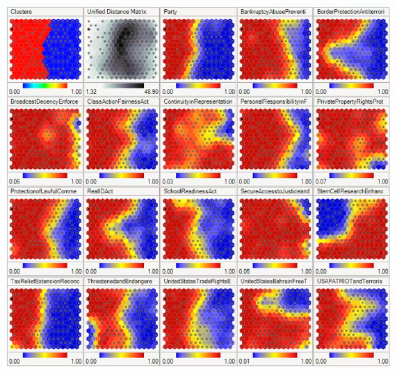
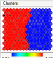
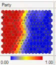
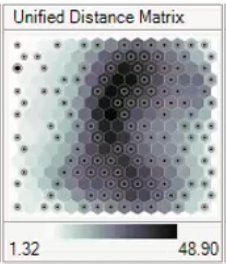
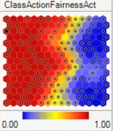

# 1. 이번 강의에서 배우는 것

이번 강의에서는 **고급 Self-Organizing Map을 읽는 방법**을 배운다.

즉:

```text
SOM 결과가 복잡하게 나왔을 때
→ 어떻게 해석해야 하는가?
```

를 보는 강의이다.

------

# 2. 고급 SOM은 왜 복잡해 보일까?

고급 SOM을 보면 한 화면 안에 여러 개의 지도가 같이 있는 것처럼 보일 수 있다.



처음 보면 복잡하다. 하지만 핵심은 간단하다.

👉 같은 SOM 구조 위에 여러 정보를 겹쳐서 보여주는 것이다.

즉:

```text
하나의 SOM
+ 여러 feature별 시각화
+ cluster 정보
+ 거리 정보
```

가 함께 들어있다고 보면 된다.

------

# 3. 예시: 미국 의회 투표 패턴

강의에서는 Wikipedia의 예시를 사용한다.

이 예시는 **미국 의회 의원들의 투표 패턴**을 SOM으로 표현한 것이다.

입력 데이터는 대략 이런 형태이다.

```text
행(row) = 의원
열(column) = 각 투표 안건에 대한 선택
```

각 의원은 여러 안건에 대해:

- 찬성
- 반대
- 기권

중 하나를 선택했다.

SOM은 이 투표 정보를 보고 의원들 사이의 유사성을 찾는다.

------

# 4. SOM이 한 일

SOM은 정답 없이 데이터를 분석했다.

즉, 알고리즘에게:

```text
이 사람은 공화당
이 사람은 민주당
```

이라고 알려준 것이 아니다.

SOM은 단지 투표 결과만 보고:

👉 “이 의원들은 투표 패턴이 비슷하네.”
👉 “이 의원들은 서로 다르네.”
👉 “비슷한 사람끼리 가까이 배치해야겠네.”

라고 판단한 것이다.

------

# 5. 첫 번째 지도: Cluster 구분

첫 번째 지도는
SOM이 의원들을 두 그룹으로 나눈 결과이다.



색깔은 예를 들어:

- 빨간색 cluster
- 파란색 cluster

처럼 표시된다.

여기서 중요한 점 이 색깔이 반드시 공화당 / 민주당을 직접 의미하는 것은 아니다.

SOM은 정당 이름을 보고 나눈 것이 아니라, 투표 패턴을 보고 나눈 것이다.

------

# 6. 그런데 정당 구분과 비슷하게 나온다

흥미로운 점은 SOM이 만든 cluster가 실제 정당 구분과 꽤 비슷하다는 것이다.



즉:

- 한쪽 cluster에는 공화당 의원이 많이 모임
- 다른 쪽 cluster에는 민주당 의원이 많이 모임

이런 식이다.

👉 이것은 투표 패턴만 봐도 정당 성향이 어느 정도 드러난다는 뜻이다.

------

# 7. 중요한 해석 주의점

그래서 이렇게 말하는 게 더 정확하다.

```text
빨간색 = 공화당
파란색 = 민주당
```

이 아니라,

```text
빨간색 cluster = 공화당과 비슷한 투표 패턴이 많은 그룹
파란색 cluster = 민주당과 비슷한 투표 패턴이 많은 그룹
```

이다.

즉, SOM은 정당을 직접 본 게 아니라
투표 패턴을 본 것이다.

------

# 8. 두 번째 지도: U-Matrix

두 번째로 나오는 것은 **U-Matrix** 이다.

정식 이름은 **Unified Distance Matrix**이다.

U-Matrix는 SOM node들 사이의 거리를 보여준다.

------

# 9. U-Matrix 색깔 해석



U-Matrix에서는 색깔이 중요하다.

보통:

- 어두운 색 → node들 사이가 멀다
- 밝은 색 → node들 사이가 가깝다

라고 해석한다.

즉:

```text
어두운 부분 = 서로 다른 성격의 영역
밝은 부분 = 서로 비슷한 영역
```

이다.

------

# 10. 어두운 경계의 의미

U-Matrix에서 어두운 부분은
cluster 사이의 경계처럼 볼 수 있다.

왜냐하면 그 부분은
양쪽 node들이 서로 많이 다르다는 뜻이기 때문이다.

👉 쉽게 말하면:

```text
어두운 선 = 두 그룹이 갈라지는 지점
```

이다.

------

# 11. 투표 결과 지도 읽는 법

그다음에는 각 안건별 투표 결과 지도가 나온다.

예를 들어 색깔이 이렇게 표현될 수 있다.

- 빨간색 = 찬성
- 파란색 = 반대
- 노란색 = 섞여 있음 / 불일치

이런 식이다.

------

# 12. 핵심: Cluster 지도와 겹쳐서 봐야 한다

고급 SOM을 읽을 때 가장 중요한 것은 **기본 cluster 구조를 머릿속에 두고 각 feature 지도를 해석하는 것**이다.

즉:

1. 먼저 전체 cluster가 어떻게 나뉘었는지 본다
2. 그다음 각 투표 안건 지도를 본다
3. 어느 cluster가 찬성/반대했는지 비교한다

------

# 13. 예시: 어떤 법안에 대한 투표

예를 들어 어떤 법안에서 빨간색이 많이 보인다고 하자.

그러면:

```text
대부분 찬성했구나
```

라고 볼 수 있다.

그런데 cluster 경계를 함께 보면 더 자세히 알 수 있다.

예를 들어:

- 공화당 성향 cluster는 대부분 찬성
- 민주당 성향 cluster 일부도 찬성
- 민주당 성향 cluster 일부는 반대

이런 식으로 해석할 수 있다.

------

# 14. 노란색은 왜 생길까?



지도에 노란색이 보일 수 있다.

노란색은 보통 해당 node 안에 서로 다른 투표가 섞여 있다는 뜻이다.

왜 이런 일이 생길까?

이유는:

```text
SOM node 수 < 실제 의원 수
```

일 수 있기 때문이다.

------

# 15. 하나의 node에 여러 사람이 들어갈 수 있다

예를 들어 SOM이 15 × 15 구조라면 node는 총 225개이다.

하지만 미국 의회 의원은 500명 이상이다.

그러면 하나의 node가 의원 한 명만 나타내는 것이 아닐 수 있다.

즉:

```text
하나의 node
→ 여러 의원을 대표할 수 있음
```

이다.

------

# 16. 그래서 색이 섞인다

하나의 node 안에 여러 의원이 있고,
그 의원들의 투표가 서로 다르면 색이 섞인다.

예를 들어:

- 대부분은 찬성
- 일부는 반대

라면 그 node는 중간색처럼 표현될 수 있다.

강의에서는 이런 색을 노란색으로 설명한다.

------

# 17. 안건별 지도 해석 예시

어떤 안건에서는:

- 공화당 성향 cluster 대부분 찬성
- 민주당 성향 cluster 대부분 반대

처럼 나올 수 있다.

또 어떤 안건에서는:

- 양쪽 cluster 모두 찬성
- 일부만 반대

처럼 나올 수 있다.

또 다른 안건에서는:

- 평소와 반대로 민주당 성향 cluster가 찬성
- 공화당 성향 cluster 일부가 반대

처럼 나올 수도 있다.

------

# 18. 중요한 점: 정당보다 cluster가 우선

이 예시에서는 cluster와 정당이 비슷하게 나왔기 때문에 공화당/민주당처럼 설명할 수 있다.

하지만 원칙적으로는:

```text
공화당 cluster / 민주당 cluster
```

라고 부르기보다

```text
Cluster A / Cluster B
왼쪽 cluster / 오른쪽 cluster
빨간 cluster / 파란 cluster
```

라고 부르는 것이 더 정확하다.

👉 이유:

SOM은 정당 정보를 직접 사용한 것이 아니라 투표 데이터만 사용했기 때문이다.

------

# 19. 전체 흐름 정리

고급 SOM을 읽는 흐름은 이렇다.

```text
전체 cluster 확인
→ U-Matrix로 거리와 경계 확인
→ feature별 지도 확인
→ cluster 구조와 feature 지도를 겹쳐서 해석
→ 각 cluster의 특징 파악
```

------

# 20. 한 줄 핵심 정리

👉 고급 SOM은
**하나의 2차원 지도 위에 cluster, 거리, feature 정보를 여러 장으로 나눠 보여주는 결과이며,
읽을 때는 항상 전체 cluster 구조를 기준으로 각 feature 지도를 겹쳐서 해석해야 한다.**
