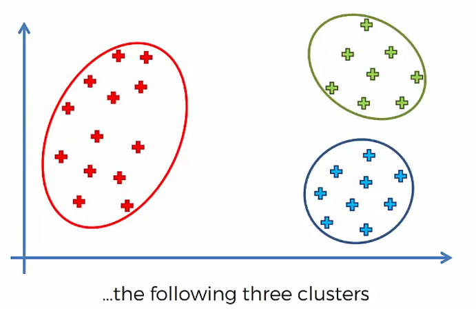
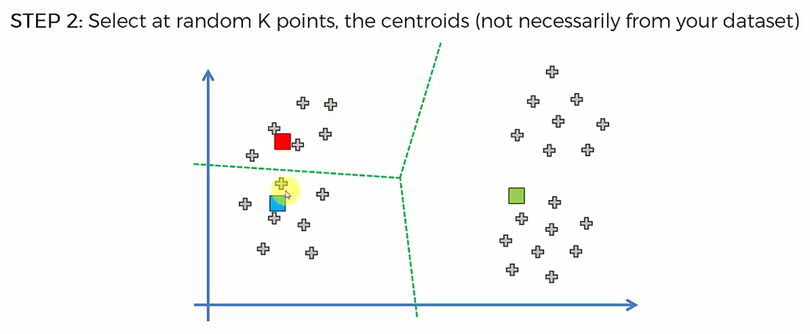
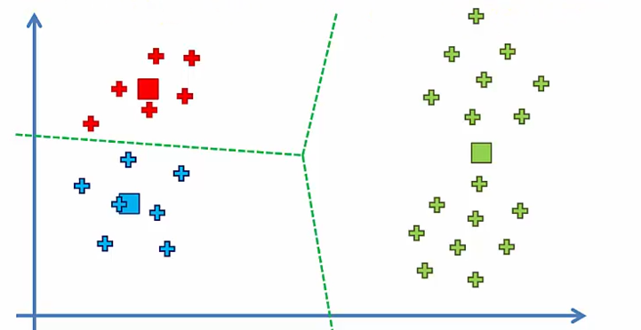

# 1. 이번 강의에서 배우는 것

이번 강의에서는 K-Means 알고리즘의 특정 문제를 배운다.

그 문제는 **Random Initialization Trap**이다.

한국어로는 **랜덤 초기화 함정**이라고 볼 수 있다.

------

# 2. Random Initialization Trap이란?

K-Means는 처음에 centroid를 랜덤으로 선택한다.

Centroid는 **cluster의 중심점**이다.

문제는 여기서 생긴다.

👉 처음 centroid를 어디에 찍느냐에 따라 최종 cluster 결과가 달라질 수 있다.

이 현상을: **Random Initialization Trap**이라고 한다.

------

# 3. 예시 상황

산점도에 데이터가 있다고 하자.



그리고 우리는 cluster 개수를:

```text
K = 3
```

으로 정했다.

눈으로 보면 대략 3개의 cluster가 보인다.

즉:

```text
왼쪽 그룹
가운데 그룹
오른쪽 그룹
```

처럼 자연스럽게 나뉘는 것처럼 보인다.

------

# 4. 좋은 초기화의 경우

만약 처음 centroid를
각 cluster 근처에 잘 배치하면?

K-Means는 쉽게 좋은 결과를 찾는다.

예를 들어:

```text
centroid 1 → 첫 번째 그룹 근처
centroid 2 → 두 번째 그룹 근처
centroid 3 → 세 번째 그룹 근처
```

이렇게 시작하면 알고리즘은 빠르게 수렴한다.

그리고 최종 결과도 사람이 예상한 cluster와 비슷하게 나온다.

------

# 5. 나쁜 초기화의 경우

하지만 centroid를 이상한 위치에 랜덤으로 잡으면?



예를 들어:

- 한쪽에 centroid가 몰리거나
- 실제 cluster 중심과 멀리 떨어져 있거나
- 데이터 구조를 잘 반영하지 못하는 위치에서 시작하면

K-Means가 이상한 결과로 수렴할 수 있다.



👉 즉:

```text
처음 centroid 위치가 나쁨
→ 잘못된 cluster 형성
→ 그대로 수렴
→ 원하지 않는 결과
```

가 될 수 있다.

------

# 6. K-Means 과정 다시 보기

K-Means는 기본적으로 다음 순서로 동작한다.

```text
1. cluster 개수 K 선택
2. K개의 centroid 랜덤 선택
3. 각 데이터를 가장 가까운 centroid에 배정
4. 각 cluster의 새로운 centroid 계산
5. 다시 데이터를 가장 가까운 centroid에 재배정
6. 변화가 없으면 종료
```

------

# 7. 문제는 2번에서 시작된다

여기서 문제가 되는 단계는:

```text
2. K개의 centroid 랜덤 선택
```

이다.

왜냐하면 이 단계가 랜덤이기 때문이다.

즉, 실행할 때마다 초기 centroid 위치가 달라질 수 있다.

그리고 그 결과:

```text
최종 cluster 결과도 달라질 수 있음
```

이다.

------

# 8. 왜 이게 문제일까?

알고리즘은 가능하면 일관된 결과를 내는 것이 좋다.

하지만 K-Means는 초기 centroid 위치에 영향을 받는다.

그래서 같은 데이터, 같은 K값을 사용해도 결과가 다르게 나올 수 있다.

👉 이것은 좋은 상황이 아니다.

------

# 9. 잘못된 결과가 생기는 과정

나쁜 초기화가 일어나면
K-Means는 이런 식으로 진행된다.

```text
centroid를 이상한 위치에 선택
→ 데이터가 이상하게 나뉨
→ 그 나뉜 결과 기준으로 centroid 이동
→ 다시 재배정
→ 변화가 없어짐
→ 잘못된 상태에서 수렴
```

즉, 알고리즘 입장에서는
“더 이상 바뀔 게 없네”라고 판단한다.

하지만 사람 입장에서는
“이건 좋은 cluster가 아닌데?”라고 볼 수 있다.

------

# 10. 수렴했다고 항상 좋은 결과는 아니다

중요한 점 K-Means가 수렴했다고 해서 항상 최선의 cluster를 찾은 것은 아니다.

수렴은 단지:

```text
더 이상 데이터 재배정이 일어나지 않음
```

이라는 뜻이다.

하지만 그 결과가 진짜 좋은 cluster라는 보장은 없다.

------

# 11. True Cluster와 잘못된 Cluster

강의에서는 눈으로 봤을 때 자연스러운 cluster를
**true cluster**처럼 설명한다.

하지만 나쁜 초기화로 인해 K-Means가 다른 방식으로 cluster를 만들 수 있다.

즉:

```text
사람이 기대한 cluster ≠ K-Means가 찾은 cluster
```

가 될 수 있다.


------

# 12. 핵심 문제

Random Initialization Trap의 핵심은 이것이다.

👉 처음 centroid 선택이 최종 결과를 결정해버릴 수 있다.

즉:

```text
초기 centroid 위치
→ cluster 결과에 큰 영향
```

을 준다.

------

# 13. 해결 방법

이 문제를 줄이기 위한 방법이 있다.

그 방법은 **K-Means++**이다.

K-Means++는 초기 centroid를 더 똑똑하게 선택하는 방법이다.

------

# 14. K-Means++의 역할

K-Means++는 centroid를 완전히 아무렇게나 고르지 않는다.

대신:

```text
초기 centroid들이 서로 적절히 떨어지도록 선택
```

하려고 한다.

그래서 나쁜 초기화로 인해 이상한 cluster에 빠질 가능성을 줄여준다.

------

# 15. 직접 구현해야 할까?

보통은 직접 구현할 필요 없다.

왜냐하면 대부분의 도구에서 K-Means++를 기본적으로 지원하기 때문이다.

예를 들어:

- Python
- R
- 여러 머신러닝 라이브러리

에서는 내부적으로 K-Means++를 사용할 수 있다.

------

# 16. 우리가 알아야 할 점

K-Means++의 세부 수학을 반드시 깊게 알 필요는 없다.

하지만 이 문제는 알고 있어야 한다.

👉 K-Means는 초기 centroid 선택에 따라 결과가 달라질 수 있다.

👉 그래서 실무에서는
K-Means++ 같은 초기화 방법을 사용하는 것이 좋다.

------

# 17. 전체 흐름 정리

Random Initialization Trap은 이렇게 이해하면 된다.

```text
K-Means는 centroid를 랜덤으로 시작함
→ 시작 위치가 좋으면 좋은 cluster로 수렴
→ 시작 위치가 나쁘면 이상한 cluster로 수렴
→ 이 문제를 Random Initialization Trap이라고 함
→ K-Means++로 완화할 수 있음
```

------

# 18. 한 줄 핵심 정리

👉 Random Initialization Trap은
**K-Means에서 처음 centroid를 랜덤으로 잘못 잡으면,
알고리즘이 잘못된 cluster 결과로 수렴할 수 있는 문제**이다.
