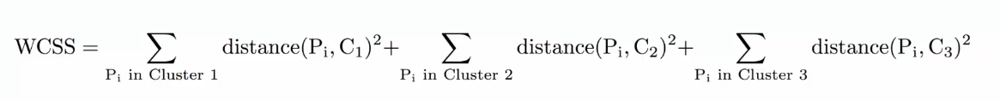
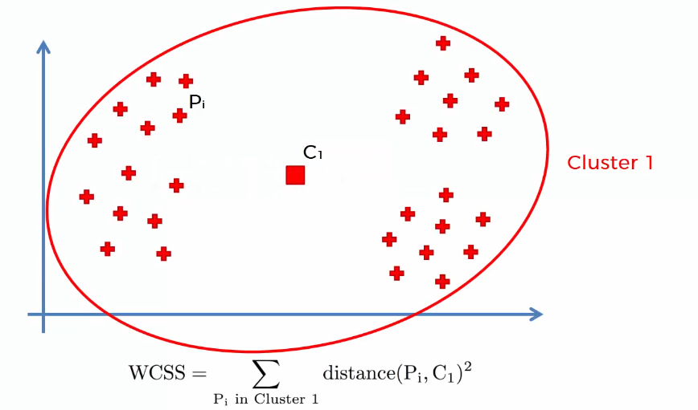
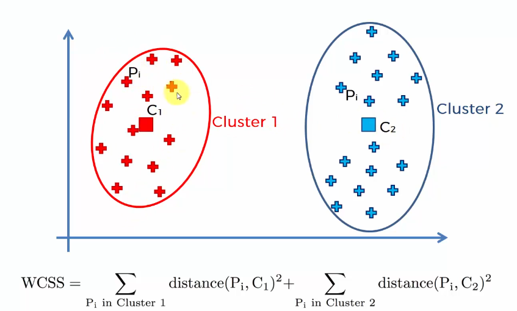
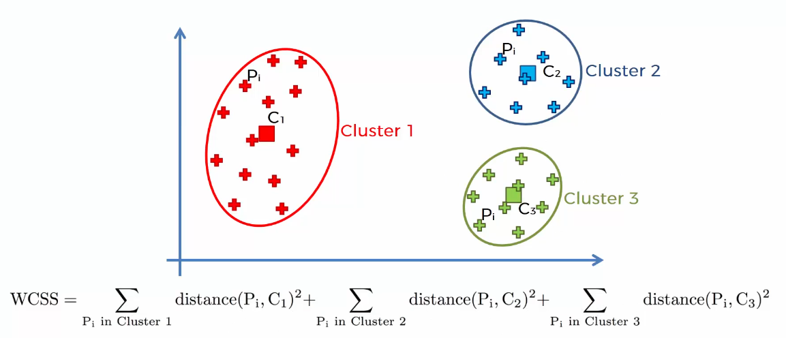
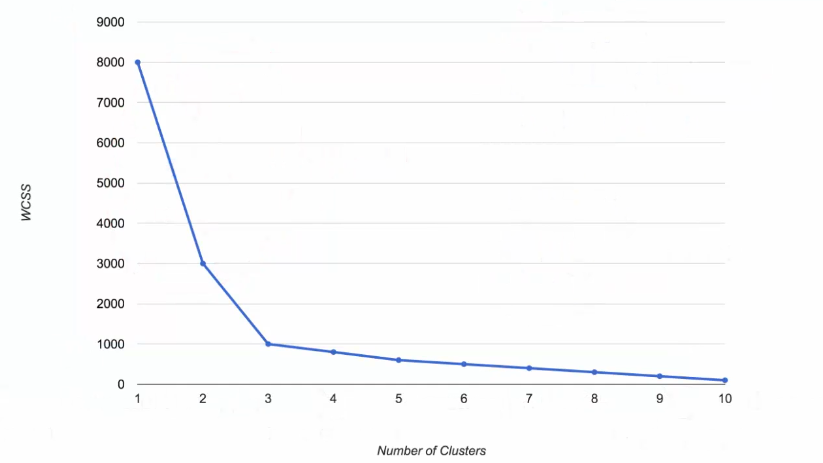
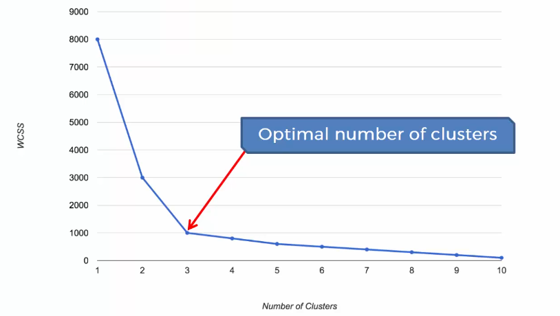

# 1. 이번 강의에서 배우는 것

이전 강의에서는 K-Means에 대해 꽤 많은 내용을 배웠다.

예를 들면:

- K-Means가 어떻게 동작하는지
- 직접 손으로 K-Means를 수행하는 과정
- Random Initialization Trap
- K-Means++가 필요한 이유

를 배웠다.

이번 강의에서는 새로운 질문을 다룬다.

👉 **Cluster 개수 K는 어떻게 정할까?**

------

# 2. 지금까지는 K를 미리 정했다

지금까지 예제에서는 cluster 개수를 미리 정해놓고 시작했다.

예를 들면:

```text
K = 2
```

또는

```text
K = 3
```

처럼 정했다.

하지만 실제 데이터 분석에서는 처음부터 K가 몇 개인지 모르는 경우가 많다.

------

# 3. 이번 강의의 핵심 질문

이번 강의의 핵심은 이것이다.

```text
K-Means에 넣을 K값을 어떻게 결정할까?
```

즉 **데이터를 몇 개의 cluster로 나누는 것이 적절한가?** 를 판단하는 방법을 배운다.

------

# 4. 평가 기준이 필요하다

K가 2개가 좋은지, 3개가 좋은지, 10개가 좋은지 판단하려면 기준이 필요하다.

즉:

```text
K = 2일 때 결과
K = 3일 때 결과
K = 4일 때 결과
```

를 비교할 수 있는 숫자가 필요하다.

이때 사용하는 지표가 있다.

그 지표가 바로 **WCSS**이다.

------

# 5. WCSS란?

WCSS는 **Within-Cluster Sum of Squares**의 약자이다.

한국어로 풀면 **클러스터 내부 제곱합**정도로 볼 수 있다.

쉽게 말하면:

👉 **각 데이터가 자기 cluster 중심에서 얼마나 떨어져 있는지를 모두 더한 값**이다.



------

# 6. WCSS의 핵심 아이디어

좋은 cluster라면 각 데이터가 자기 centroid 근처에 모여 있어야 한다.

즉:

- 데이터들이 centroid와 가까움 → 좋은 cluster
- 데이터들이 centroid와 멀리 퍼져 있음 → 덜 좋은 cluster

라고 볼 수 있다.

그래서 WCSS는 각 데이터와 centroid 사이의 거리를 계산한다.

------

# 7. WCSS 계산 방법

각 cluster 안에서 다음을 계산한다.

```text
각 데이터 point와 centroid 사이의 거리
→ 그 거리를 제곱
→ cluster 안의 모든 point에 대해 더함
```

그리고 이 작업을 모든 cluster에 대해 반복한다.

마지막으로 전체를 더한다.

------

# 8. 예를 들어 K = 3이면

cluster가 3개라면:

```text
cluster 1의 거리 제곱합
+ cluster 2의 거리 제곱합
+ cluster 3의 거리 제곱합
```

이 전체 WCSS가 된다.

------

# 9. 왜 제곱할까?

거리를 제곱하면 멀리 떨어진 점의 영향이 더 커진다.

즉:

```text
centroid에서 멀리 떨어진 데이터
→ WCSS를 크게 증가시킴
```

그래서 cluster가 잘 안 맞으면 WCSS가 커진다.

------

# 10. K = 1일 때



cluster가 1개라면 centroid도 1개이다.

모든 데이터가 하나의 centroid에 묶인다.

그러면 멀리 있는 데이터도 그 하나의 centroid까지 거리를 계산해야 한다.

👉 그래서 WCSS가 크다.

------

# 11. K = 2일 때



cluster를 2개로 늘리면 centroid도 2개가 된다.

그러면 각 데이터는 더 가까운 centroid를 가질 수 있다.

그래서 전체 거리가 줄어든다.

즉:

```text
K 증가
→ centroid 증가
→ 데이터와 centroid 거리 감소
→ WCSS 감소
```

------

# 12. K = 3일 때



cluster를 3개로 늘리면 데이터가 더 세밀하게 나뉜다.

각 데이터는 더 가까운 centroid에 속하게 된다.

그래서 WCSS는 또 줄어든다.

------

# 13. K를 계속 늘리면?

K를 계속 늘리면 WCSS는 계속 줄어든다.

극단적으로 생각해보자. 데이터 point가 50개 있다고 하자.

만약:

```text
K = 50
```

이면 어떻게 될까?

각 데이터 point가 자기만의 cluster를 가진다.

그러면 각 point와 centroid의 거리는:

```text
0
```

이다.

왜냐하면 centroid가 자기 자신 위치에 있기 때문이다.

------

# 14. WCSS의 한계

K를 늘리면 WCSS는 계속 줄어든다.

그래서 단순히:

```text
WCSS가 가장 작은 K를 고르자
```

라고 하면 안 된다. 그러면 결국:

```text
K = 데이터 개수
```

가 되어버린다.

이건 의미 있는 clustering이 아니다.

------

# 15. 그래서 Elbow Method를 쓴다

K를 정할 때 사용하는 대표적인 방법이 **Elbow Method**이다.

한국어로는 **엘보우 방법** 이라고 한다.

------

# 16. Elbow Method의 아이디어

K를 1, 2, 3, 4, 5...로 늘리면서
각 K에 대한 WCSS를 계산한다.

그리고 그래프를 그린다.



```text
x축 = cluster 개수 K
y축 = WCSS
```

그러면 보통 처음에는 WCSS가 크게 줄어든다.

하지만 어느 순간부터 줄어드는 폭이 작아진다.

------

# 17. 팔꿈치 지점

그래프를 보면 꺾이는 지점이 생긴다.

이 지점이 마치 팔꿈치처럼 보인다.

그래서 이름이: **Elbow Method** 이다.

👉 이 팔꿈치 지점의 K를 적절한 cluster 개수로 선택한다.

------

# 18. 예시

예를 들어 WCSS가 이렇게 줄어든다고 하자.

```text
K = 1 → WCSS = 8000
K = 2 → WCSS = 3000
K = 3 → WCSS = 1000
K = 4 → WCSS = 800
K = 5 → WCSS = 600
```

처음에는 크게 줄어든다.

```text
8000 → 3000
3000 → 1000
```

하지만 이후에는 줄어드는 폭이 작아진다.

```text
1000 → 800
800 → 600
```

이 경우 꺾이는 지점은:

```text
K = 3
```

으로 볼 수 있다.

------

# 19. 왜 K = 3이 적절할까?



K = 3까지는 WCSS가 크게 줄어든다.

즉, cluster를 늘리는 효과가 크다.

하지만 K = 4부터는 효과가 상대적으로 작다.

👉 그래서 K = 3이 적절한 선택이라고 볼 수 있다.

------

# 20. Elbow Method는 완벽하지 않다

중요한 점: Elbow Method는 완전히 객관적인 방법은 아니다.

그래프에서 팔꿈치가 명확하지 않을 수도 있다.

어떤 사람은 K = 3을 고르고, 다른 사람은 K = 4를 고를 수도 있다.

------

# 21. 결국 판단이 필요하다

Elbow Method는 K를 고르는 데 도움을 주는 방법이다.

하지만 최종 결정은 분석자가 해야 한다.

즉:

```text
그래프 확인
→ 후보 K값 비교
→ 실제 cluster 결과 확인
→ 분석 목적에 맞는 K 선택
```

이 필요하다.

------

# 22. 실무에서는 어떻게 할까?

실무에서는 보통 이렇게 한다.

```text
K = 2 결과 확인
K = 3 결과 확인
K = 4 결과 확인
```

처럼 여러 개를 비교한다.

그리고 다음을 본다.

- cluster가 해석 가능한가?
- 너무 많이 쪼개지지는 않았는가?
- 너무 크게 뭉쳐 있지는 않은가?
- 분석 목적에 맞는가?

------

# 23. 전체 흐름 정리

Elbow Method 흐름은 이렇다.

```text
여러 K값으로 K-Means 실행
→ 각 K마다 WCSS 계산
→ K-WCSS 그래프 그리기
→ WCSS 감소 폭이 급격히 줄어드는 지점 찾기
→ 그 지점의 K를 선택
```

------

# 24. 한 줄 핵심 정리

👉 Elbow Method는 **K를 늘릴수록 WCSS가 줄어드는 그래프에서, 감소 폭이 갑자기 작아지는 팔꿈치 지점을 찾아 적절한 cluster 개수를 정하는 방법**이다.
